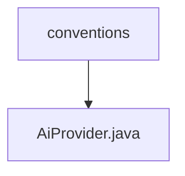

# 基础信息

|      |      |
|------|------|
| 名称 | conventions |
| 编码语言 | .java |
| 代码路径 | spring-ai-alibaba/spring-ai-alibaba-core/src/main/java/com/alibaba/cloud/ai/dashscope/observation/conventions |
| 包名 | spring-ai-alibaba.spring-ai-alibaba-core.src.main.java.com.alibaba.cloud.ai.dashscope.observation.conventions |
| 概述说明 | 信息为空，无法生成概要描述。 |

# 说明

给定的内容为空，无法进行总结描述。请提供具体内容以便生成全面详尽的描述。

### 包内部结构视图

该流程图展示了路径的层级关系，`conventions` 文件夹包含一个文件 `AiProvider.java`。这种结构表明 `AiProvider.java` 是 `conventions` 文件夹下的唯一文件，体现了简单的文件组织结构。

# 文件列表 File List

| 名称   | 类型  | 说明 |
|-------|------|-------------|
| [AiProvider.java](AiProvider.md) | file | 信息为空，无法生成概要描述。 |

