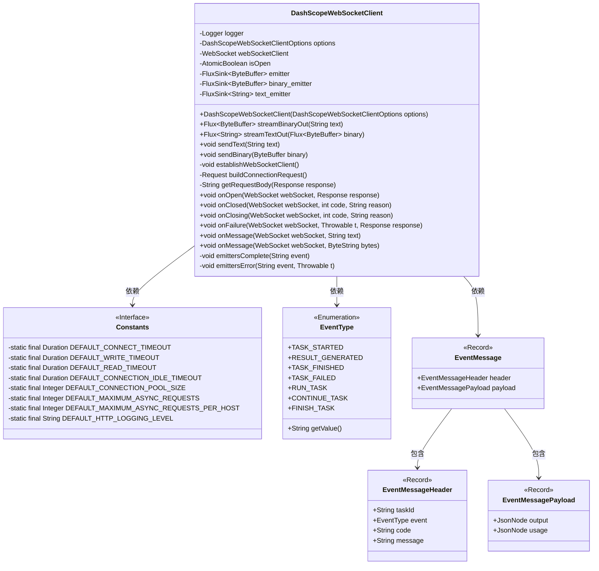

# 基础信息

|      |      |
|------|------|
| 名称 | DashScopeWebSocketClient |
| 编码语言 | .java |
| 代码路径 | spring-ai-alibaba/spring-ai-alibaba-core/src/main/java/com/alibaba/cloud/ai/dashscope/protocol/DashScopeWebSocketClient.java |
| 包名 | com.alibaba.cloud.ai.dashscope.protocol |
| 依赖项 | ['com.alibaba.cloud.ai.dashscope.api.ApiUtils', 'com.fasterxml.jackson.annotation.JsonInclude', 'com.fasterxml.jackson.annotation.JsonProperty', 'com.fasterxml.jackson.databind.DeserializationFeature', 'com.fasterxml.jackson.databind.ObjectMapper', 'okhttp3.OkHttpClient', 'okhttp3.Request', 'okhttp3.Headers', 'okhttp3.Request.Builder', 'okhttp3.Response', 'okhttp3.WebSocket', 'okhttp3.WebSocketListener', 'okhttp3.Dispatcher', 'okhttp3.Protocol', 'okhttp3.ConnectionPool', 'okhttp3.logging.HttpLoggingInterceptor', 'okio.ByteString', 'org.slf4j.Logger', 'org.slf4j.LoggerFactory', 'reactor.core.publisher.Flux', 'reactor.core.publisher.FluxSink', 'com.fasterxml.jackson.databind.JsonNode', 'java.io.IOException', 'java.nio.ByteBuffer', 'java.time.Duration', 'java.util.Collections', 'java.util.concurrent.TimeUnit', 'java.util.concurrent.atomic.AtomicBoolean'] |
| 概述说明 | DashScopeWebSocketClient类支持WebSocket通信，处理连接、消息发送及事件响应。 |

# 说明

DashScopeWebSocketClient类是一个用于实现WebSocket通信的工具，支持文本和二进制数据的传输。该类具备处理连接建立、消息发送以及事件响应的功能，能够有效地管理WebSocket通信的各个环节，确保数据传输的稳定性和可靠性。

# 类列表 Class Summary

| 名称   | 类型  | 说明 |
|-------|------|-------------|
| DashScopeWebSocketClient | class | DashScopeWebSocketClient类实现WebSocket通信，支持文本和二进制数据传输，处理连接、消息发送和事件响应。 |

## 类 DashScopeWebSocketClient

|      |      |
|------|------|
| 访问范围 | public |
| 类型 | class |
| 名称 | DashScopeWebSocketClient |
| 说明 | DashScopeWebSocketClient类实现WebSocket通信，支持文本和二进制数据传输，处理连接、消息发送和事件响应。 |

### UML类图

**描述：**  
`DashScopeWebSocketClient` 类是一个用于处理 WebSocket 通信的客户端，它继承自 `WebSocketListener`，并提供了多种方法来发送和接收文本及二进制数据。该类通过 `FluxSink` 实现了数据流的处理，并能够处理 WebSocket 的各种事件，如连接打开、关闭、失败和消息接收等。`Constants` 类定义了各种常量，`EventType` 枚举类定义了事件类型，`EventMessage` 及其内部类 `EventMessageHeader` 和 `EventMessagePayload` 用于封装事件消息的结构。整个类图展示了这些类之间的依赖关系和层级结构。

### 内部方法调用关系图

```mermaid
graph TD
    A["类DashScopeWebSocketClient"]
    B["属性: Logger logger"]
    C["属性: DashScopeWebSocketClientOptions options"]
    D["属性: WebSocket webSocketClient"]
    E["属性: AtomicBoolean isOpen"]
    F["属性: FluxSink<ByteBuffer> emitter"]
    G["属性: FluxSink<ByteBuffer> binary_emitter"]
    H["属性: FluxSink<String> text_emitter"]
    I["构造方法: DashScopeWebSocketClient(DashScopeWebSocketClientOptions options)"]
    J["方法: Flux<ByteBuffer> streamBinaryOut(String text)"]
    K["方法: Flux<String> streamTextOut(Flux<ByteBuffer> binary)"]
    L["方法: void sendText(String text)"]
    M["方法: void sendBinary(ByteBuffer binary)"]
    N["方法: void establishWebSocketClient()"]
    O["方法: Request buildConnectionRequest()"]
    P["方法: String getRequestBody(Response response)"]
    Q["方法: void onOpen(WebSocket webSocket, Response response)"]
    R["方法: void onClosed(WebSocket webSocket, int code, String reason)"]
    S["方法: void onClosing(WebSocket webSocket, int code, String reason)"]
    T["方法: void onFailure(WebSocket webSocket, Throwable t, Response response)"]
    U["方法: void onMessage(WebSocket webSocket, String text)"]
    V["方法: void onMessage(WebSocket webSocket, ByteString bytes)"]
    W["方法: void emittersComplete(String event)"]
    X["方法: void emittersError(String event, Throwable t)"]
    Y["内部类: Constants"]
    Z["内部枚举: EventType"]
    AA["内部记录类: EventMessage"]

    A --> B
    A --> C
    A --> D
    A --> E
    A --> F
    A --> G
    A --> H
    A --> I
    A --> J
    A --> K
    A --> L
    A --> M
    A --> N
    A --> O
    A --> P
    A --> Q
    A --> R
    A --> S
    A --> T
    A --> U
    A --> V
    A --> W
    A --> X
    A --> Y
    A --> Z
    A --> AA
```

这段代码定义了一个名为 `DashScopeWebSocketClient` 的类，用于处理 WebSocket 通信。该类包含多个属性和方法，用于管理 WebSocket 连接、发送和接收消息，并处理各种 WebSocket 事件。代码还定义了内部类 `Constants`、枚举 `EventType` 和记录类 `EventMessage`，用于存储常量、事件类型和消息结构。流程图展示了类的主要结构及其内部函数调用关系，帮助理解代码的整体逻辑和功能。

### 字段列表 Field List

| 名称  | 类型  | 说明 |
|-------|-------|------|
| text_emitter | FluxSink<String> | FluxSink用于发射字符串类型数据。 |
| webSocketClient | WebSocket | 私有WebSocket客户端实例。 |
| emitter | FluxSink<ByteBuffer> | FluxSink用于发射ByteBuffer数据流。 |
| logger = LoggerFactory.getLogger(DashScopeWebSocketClient.class) | Logger | DashScopeWebSocketClient类中初始化了一个私有的Logger实例。 |
| options | DashScopeWebSocketClientOptions | 私有不可变的DashScopeWebSocketClientOptions对象。 |
| isOpen | AtomicBoolean | 定义了一个线程安全的布尔型原子变量isOpen。 |
| binary_emitter | FluxSink<ByteBuffer> | FluxSink用于发射ByteBuffer数据流。 |

### 方法列表 Method List

| 名称  | 类型  | 说明 |
|-------|-------|------|
| sendText | void | 发送文本前检查WebSocket连接，失败则记录错误日志。 |
| onMessage | void | WebSocket消息处理，解析事件并执行相应操作。 |
| buildConnectionRequest | Request | 构建连接请求，设置头部信息并指定URL。 |
| sendBinary | void | 发送二进制数据，失败时记录错误日志。 |
| onOpen | void | WebSocket连接打开时记录日志并设置状态为打开。 |
| getRequestBody | String | 获取HTTP响应体，处理异常并返回结果。 |
| onClosed | void | WebSocket关闭时记录日志并更新状态。 |
| emittersComplete | void | 检查并完成二进制和文本发射器，记录完成信息。 |
| streamTextOut | Flux<String> | 方法streamTextOut将ByteBuffer流转换为String流，并处理二进制数据。 |
| emittersError | void | 处理事件错误时，二进制和文本发射器均记录并发送错误信息。 |
| establishWebSocketClient | void | 创建WebSocket客户端，配置超时、日志、调度器和连接池，处理异常。 |
| streamBinaryOut | Flux<ByteBuffer> | 该方法创建并返回一个Flux<ByteBuffer>，用于流式输出二进制数据，并发送指定文本。 |
| onFailure | void | WebSocket失败处理：记录错误信息，关闭连接，触发错误事件。 |
| onMessage | void | 接收WebSocket二进制消息，记录日志并触发二进制数据发射器。 |
| onClosing | void | WebSocket关闭时记录日志并完成发射器。 |

