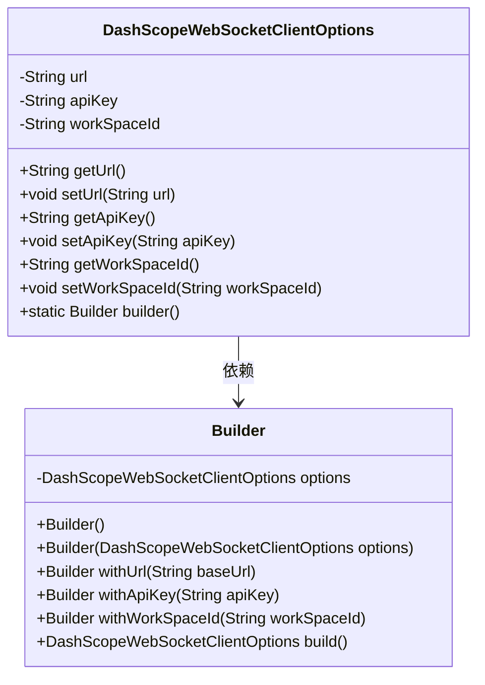
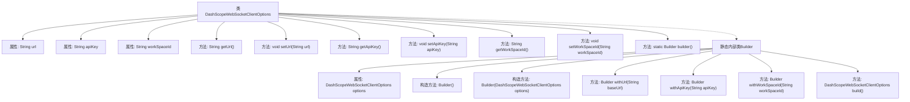

# 基础信息

|      |      |
|------|------|
| 名称 | DashScopeWebSocketClientOptions |
| 编码语言 | .java |
| 代码路径 | spring-ai-alibaba/spring-ai-alibaba-core/src/main/java/com/alibaba/cloud/ai/dashscope/protocol/DashScopeWebSocketClientOptions.java |
| 包名 | com.alibaba.cloud.ai.dashscope.protocol |
| 依赖项 | ['com.alibaba.cloud.ai.dashscope.common.DashScopeApiConstants'] |
| 概述说明 | DashScopeWebSocketClientOptions类配置URL、API密钥和工作空间ID，支持构建器模式。 |

# 说明

DashScopeWebSocketClientOptions类用于配置WebSocket客户端，包含URL、API密钥和工作空间ID等关键参数。该类支持构建器模式，便于灵活设置和调整配置项，确保客户端能够正确连接到指定服务并完成相关操作。

# 类列表 Class Summary

| 名称   | 类型  | 说明 |
|-------|------|-------------|
| DashScopeWebSocketClientOptions | class | DashScopeWebSocketClientOptions类包含URL、API密钥和工作空间ID的配置，支持构建器模式。 |

## 类 DashScopeWebSocketClientOptions

|      |      |
|------|------|
| 访问范围 | public |
| 类型 | class |
| 名称 | DashScopeWebSocketClientOptions |
| 说明 | DashScopeWebSocketClientOptions类包含URL、API密钥和工作空间ID的配置，支持构建器模式。 |

### UML类图

这段代码定义了一个 `DashScopeWebSocketClientOptions` 类，用于配置 WebSocket 客户端的选项，包括 URL、API 密钥和工作空间 ID。该类还包含一个内部静态类 `Builder`，用于以链式调用的方式构建 `DashScopeWebSocketClientOptions` 对象。`Builder` 类提供了设置 URL、API 密钥和工作空间 ID 的方法，并通过 `build` 方法返回配置好的 `DashScopeWebSocketClientOptions` 实例。这种设计模式使得对象的构建过程更加灵活和可读。

### 内部方法调用关系图

这段代码定义了一个名为 `DashScopeWebSocketClientOptions` 的类，用于配置WebSocket客户端的选项。类中包含三个属性：`url`、`apiKey` 和 `workSpaceId`，分别用于存储WebSocket的URL、API密钥和工作空间ID。类提供了对这些属性的getter和setter方法。此外，类还包含一个静态内部类 `Builder`，用于通过链式调用的方式构建 `DashScopeWebSocketClientOptions` 对象。`Builder` 类提供了 `withUrl`、`withApiKey` 和 `withWorkSpaceId` 方法，用于设置相应的属性，并通过 `build` 方法返回最终的配置对象。

### 字段列表 Field List

| 名称  | 类型  | 说明 |
|-------|-------|------|
| url = DashScopeApiConstants.DEFAULT_WEBSOCKET_URL | String | 私有字符串变量url设置为默认WebSocket URL。 |
| apiKey | String | 定义了一个私有字符串变量apiKey。 |
| workSpaceId = null | String | 定义私有字符串变量workSpaceId并初始化为null。 |

### 方法列表 Method List

| 名称  | 类型  | 说明 |
|-------|-------|------|
| setWorkSpaceId | void | 设置工作空间ID的方法。 |
| getWorkSpaceId | String | 获取工作空间ID的方法。 |
| builder | Builder | 创建并返回Builder实例的静态方法。 |
| getUrl | String | 方法返回字符串类型的URL变量值。 |
| setApiKey | void | 设置API密钥的方法，将传入的apiKey赋值给当前对象的apiKey。 |
| getApiKey | String | 获取API密钥的方法，返回值为字符串类型。 |
| setUrl | void | 该方法用于设置URL属性，接受一个字符串参数。 |

