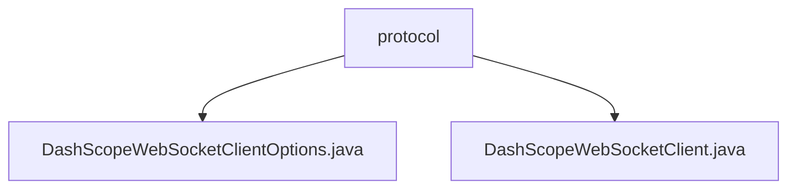

# 基础信息

|      |      |
|------|------|
| 名称 | protocol |
| 编码语言 | .java |
| 代码路径 | spring-ai-alibaba/spring-ai-alibaba-core/src/main/java/com/alibaba/cloud/ai/dashscope/protocol |
| 包名 | spring-ai-alibaba.spring-ai-alibaba-core.src.main.java.com.alibaba.cloud.ai.dashscope.protocol |
| 概述说明 | DashScopeWebSocketClientOptions类配置WebSocket客户端，DashScopeWebSocketClient类实现WebSocket通信。 |

# 说明

## 概述
该代码模块主要提供了与WebSocket通信相关的功能，支持通过WebSocket协议进行文本和二进制数据的传输。模块包含两个核心类：`DashScopeWebSocketClientOptions`和`DashScopeWebSocketClient`。前者用于配置WebSocket客户端的连接参数，如URL、API密钥和工作空间ID等；后者则负责实现WebSocket通信的具体逻辑，包括连接建立、消息发送和事件响应等功能。

## 主要业务场景
1. **WebSocket客户端配置**：通过`DashScopeWebSocketClientOptions`类，用户可以灵活配置WebSocket客户端的连接参数，确保客户端能够正确连接到指定的服务。该类支持构建器模式，便于动态调整配置项。
2. **WebSocket通信管理**：`DashScopeWebSocketClient`类负责管理WebSocket通信的各个环节，包括连接的建立、消息的发送以及事件的处理。该类能够确保数据传输的稳定性和可靠性，适用于需要实时双向通信的业务场景。
3. **数据传输**：该模块支持文本和二进制数据的传输，适用于需要高效、低延迟数据传输的场景，如实时聊天、在线协作、数据同步等。

通过这两个类的协作，该模块能够为开发者提供一套完整的WebSocket通信解决方案，满足多种业务场景的需求。

### 包内部结构视图

该流程图展示了`spring-ai-alibaba`项目中`protocol`目录下的文件层级关系。`protocol`作为根节点，包含两个子节点：`DashScopeWebSocketClientOptions.java`和`DashScopeWebSocketClient.java`。这些文件位于`spring-ai-alibaba-core`模块的`dashscope`协议相关代码中，用于处理WebSocket客户端的配置和实现。

# 文件列表 File List

| 名称   | 类型  | 说明 |
|-------|------|-------------|
| [DashScopeWebSocketClient.java](DashScopeWebSocketClient.md) | file | DashScopeWebSocketClient类支持WebSocket通信，处理连接、消息发送及事件响应。 |
| [DashScopeWebSocketClientOptions.java](DashScopeWebSocketClientOptions.md) | file | DashScopeWebSocketClientOptions类配置URL、API密钥和工作空间ID，支持构建器模式。 |

