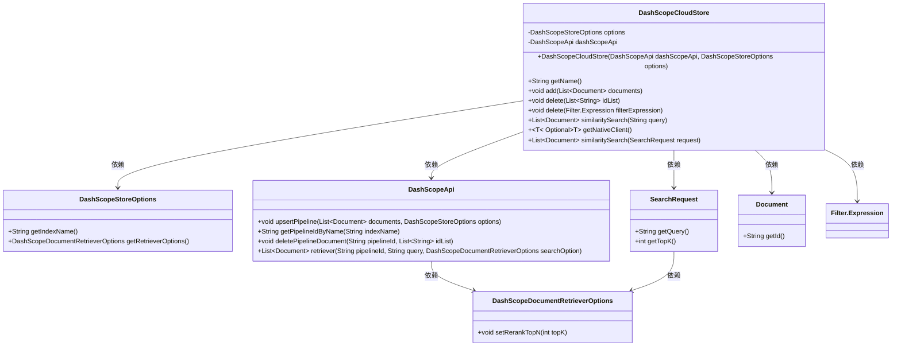
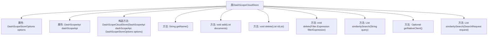

# 基础信息

|      |      |
|------|------|
| 名称 | DashScopeCloudStore |
| 编码语言 | .java |
| 代码路径 | spring-ai-alibaba/spring-ai-alibaba-core/src/main/java/com/alibaba/cloud/ai/dashscope/rag/DashScopeCloudStore.java |
| 包名 | com.alibaba.cloud.ai.dashscope.rag |
| 依赖项 | ['com.alibaba.cloud.ai.dashscope.api.DashScopeApi', 'com.alibaba.cloud.ai.dashscope.common.DashScopeException', 'com.alibaba.cloud.ai.dashscope.image.DashScopeImageOptions', 'org.springframework.ai.document.Document', 'org.springframework.ai.vectorstore.SearchRequest', 'org.springframework.ai.vectorstore.VectorStore', 'org.springframework.ai.vectorstore.filter.Filter', 'org.springframework.util.Assert', 'org.springframework.util.CollectionUtils', 'java.util.List', 'java.util.Optional', 'java.util.stream.Collectors'] |
| 概述说明 | DashScopeCloudStore类实现VectorStore接口，支持文档存储、删除和相似性搜索，依赖DashScopeApi和DashScopeStoreOptions。 |

# 说明

DashScopeCloudStore类实现了VectorStore接口，具备文档存储、删除和相似性搜索功能。该类依赖于DashScopeApi和DashScopeStoreOptions来实现其核心操作，确保与DashScope服务的有效集成和数据管理。

# 类列表 Class Summary

| 名称   | 类型  | 说明 |
|-------|------|-------------|
| DashScopeCloudStore | class | DashScopeCloudStore类实现VectorStore接口，支持文档存储、删除和相似性搜索，依赖DashScopeApi和DashScopeStoreOptions。 |

## 类 DashScopeCloudStore

|      |      |
|------|------|
| 访问范围 | public |
| 类型 | class |
| 名称 | DashScopeCloudStore |
| 说明 | DashScopeCloudStore类实现VectorStore接口，支持文档存储、删除和相似性搜索，依赖DashScopeApi和DashScopeStoreOptions。 |

### UML类图

**描述**：  
`DashScopeCloudStore` 类实现了 `VectorStore` 接口，用于管理文档的存储、删除和相似性搜索。它依赖于 `DashScopeApi` 来执行具体的操作，如上传、删除和检索文档。`DashScopeStoreOptions` 提供了存储配置，如索引名称和检索选项。`DashScopeDocumentRetrieverOptions` 用于设置检索时的参数，如返回的文档数量。`SearchRequest` 封装了搜索请求的查询和返回数量。整个类图展示了 `DashScopeCloudStore` 如何通过依赖其他类来完成其功能。

### 内部方法调用关系图

这段代码定义了一个名为 `DashScopeCloudStore` 的类，该类实现了 `VectorStore` 接口。类中包含两个主要属性：`DashScopeStoreOptions` 和 `DashScopeApi`，分别用于存储配置选项和API调用。类中定义了多个方法，包括文档的添加、删除、相似性搜索等操作。构造方法中进行了参数的非空校验，确保传入的配置选项和API实例不为空。其他方法则分别处理文档的存储、删除和搜索功能，确保操作的有效性和安全性。

### 字段列表 Field List

| 名称  | 类型  | 说明 |
|-------|-------|------|
| options | DashScopeStoreOptions | 私有常量DashScopeStoreOptions类型的变量options。 |
| dashScopeApi | DashScopeApi | 私有变量dashScopeApi为DashScopeApi类型。 |

### 方法列表 Method List

| 名称  | 类型  | 说明 |
|-------|-------|------|
| similaritySearch | List<Document> | 重写方法实现基于查询的相似性搜索功能。 |
| add | void | 检查文档列表和ID，调用API更新管道。 |
| delete | void | 重写删除方法，接受过滤表达式参数。 |
| getName | String | 重写getName方法，调用父类VectorStore的getName方法。 |
| delete | void | 删除指定索引名下的文档列表，若索引不存在则抛出异常。 |
| getNativeClient | Optional<T> | 重写方法，返回VectorStore原生客户端对象。 |
| similaritySearch | List<Document> | 方法通过API获取管道ID并检索相似文档，处理异常和选项设置。 |

