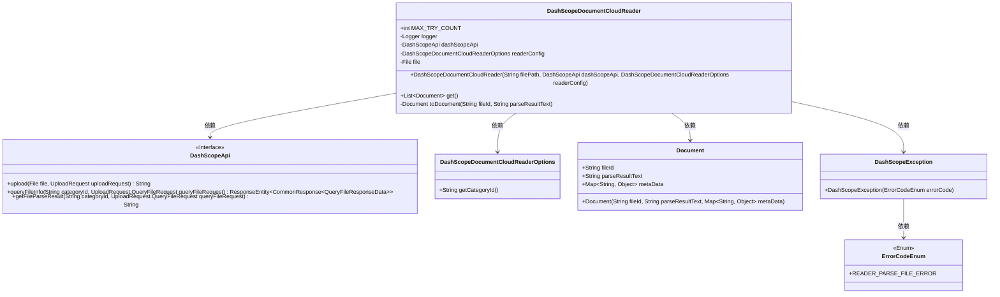
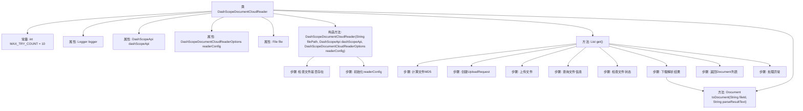

# 基础信息

|      |      |
|------|------|
| 名称 | DashScopeDocumentCloudReader |
| 编码语言 | .java |
| 代码路径 | spring-ai-alibaba/spring-ai-alibaba-core/src/main/java/com/alibaba/cloud/ai/dashscope/rag/DashScopeDocumentCloudReader.java |
| 包名 | com.alibaba.cloud.ai.dashscope.rag |
| 依赖项 | ['java.io.File', 'java.io.FileInputStream', 'java.util.HashMap', 'java.util.List', 'java.util.Map', 'com.alibaba.cloud.ai.dashscope.api.DashScopeApi', 'com.alibaba.cloud.ai.dashscope.common.DashScopeException', 'com.alibaba.cloud.ai.dashscope.common.ErrorCodeEnum', 'org.apache.commons.codec.digest.DigestUtils', 'org.slf4j.Logger', 'org.slf4j.LoggerFactory', 'org.springframework.ai.document.Document', 'org.springframework.ai.document.DocumentReader', 'org.springframework.http.ResponseEntity'] |
| 概述说明 | DashScopeDocumentCloudReader类支持文件上传、查询、解析及处理状态。 |

# 说明

DashScopeDocumentCloudReader类是一个用于文件读取的工具，支持文件的上传、查询和解析功能。该类能够处理文件操作的成功或失败状态，确保用户能够准确获取文件内容并进行后续处理。通过实现这些功能，DashScopeDocumentCloudReader类为文件管理和数据处理提供了全面的支持。

# 类列表 Class Summary

| 名称   | 类型  | 说明 |
|-------|------|-------------|
| DashScopeDocumentCloudReader | class | DashScopeDocumentCloudReader类实现文件读取，支持上传、查询和解析文件，处理成功或失败状态。 |

## 类 DashScopeDocumentCloudReader

|      |      |
|------|------|
| 访问范围 | public |
| 类型 | class |
| 名称 | DashScopeDocumentCloudReader |
| 说明 | DashScopeDocumentCloudReader类实现文件读取，支持上传、查询和解析文件，处理成功或失败状态。 |

### UML类图

### 描述
`DashScopeDocumentCloudReader` 是一个用于读取文档的类，它依赖于 `DashScopeApi` 接口来上传文件、查询文件信息和获取文件解析结果。`DashScopeDocumentCloudReaderOptions` 用于配置读取选项，`Document` 类表示解析后的文档。`DashScopeException` 用于处理解析失败时的异常，`ErrorCodeEnum` 定义了错误代码枚举。整个类图展示了 `DashScopeDocumentCloudReader` 如何通过依赖其他类和接口来实现文档读取功能。

### 内部方法调用关系图

这段代码定义了一个名为`DashScopeDocumentCloudReader`的类，用于读取和处理文档。类中包含一个构造方法和两个主要方法：`get()`和`toDocument()`。`get()`方法负责读取文件、上传文件、查询文件状态并返回解析后的文档列表。`toDocument()`方法用于将解析结果转换为`Document`对象。流程图展示了类的结构及其内部方法的调用关系，以及`get()`方法中的主要步骤，包括文件检查、上传、查询状态、解析结果处理和异常处理。

### 字段列表 Field List

| 名称  | 类型  | 说明 |
|-------|-------|------|
| file | File | 声明了一个私有的文件类型变量file。 |
| MAX_TRY_COUNT = 10 | int | 定义了最大尝试次数常量MAX_TRY_COUNT为10。 |
| readerConfig | DashScopeDocumentCloudReaderOptions | 私有变量readerConfig用于配置DashScope文档云读取选项。 |
| logger = LoggerFactory.getLogger(DashScopeDocumentCloudReader.class) | Logger | DashScopeDocumentCloudReader类中定义了一个静态的日志记录器。 |
| dashScopeApi | DashScopeApi | DashScopeApi对象声明为私有且不可变。 |

### 方法列表 Method List

| 名称  | 类型  | 说明 |
|-------|-------|------|
| toDocument | Document | 将文件ID和解析结果转换为包含元数据的文档对象。 |
| get | List<Document> | 方法获取文件MD5，上传并轮询解析状态，成功返回文档，失败抛出异常。 |

