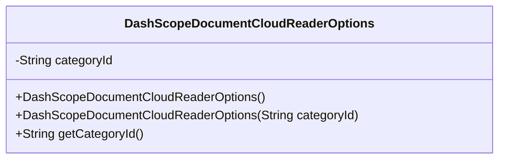
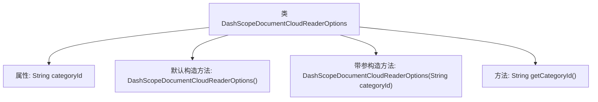

# 基础信息

|      |      |
|------|------|
| 名称 | DashScopeDocumentCloudReaderOptions |
| 编码语言 | .java |
| 代码路径 | spring-ai-alibaba/spring-ai-alibaba-core/src/main/java/com/alibaba/cloud/ai/dashscope/rag/DashScopeDocumentCloudReaderOptions.java |
| 包名 | com.alibaba.cloud.ai.dashscope.rag |
| 依赖项 | ['com.fasterxml.jackson.annotation.JsonInclude', 'com.fasterxml.jackson.annotation.JsonProperty'] |
| 概述说明 | DashScopeDocumentCloudReaderOptions类设置文档云读取选项，默认类目ID为“default”。 |

# 说明

DashScopeDocumentCloudReaderOptions类用于配置文档云读取的相关选项。该类提供了一个默认的类目ID，其值为“default”，用户可以通过此类来设置和管理文档读取时的具体参数和选项，确保读取过程符合需求。

# 类列表 Class Summary

| 名称   | 类型  | 说明 |
|-------|------|-------------|
| DashScopeDocumentCloudReaderOptions | class | DashScopeDocumentCloudReaderOptions类用于设置文档云读取选项，默认类目ID为“default”。 |

## 类 DashScopeDocumentCloudReaderOptions

|      |      |
|------|------|
| 访问范围 | @JsonInclude(JsonInclude.Include.NON_NULL);public |
| 类型 | class |
| 名称 | DashScopeDocumentCloudReaderOptions |
| 说明 | DashScopeDocumentCloudReaderOptions类用于设置文档云读取选项，默认类目ID为“default”。 |

### UML类图

**描述：**  
`DashScopeDocumentCloudReaderOptions` 类用于管理文档云读取器的选项，主要包含一个类目ID字段 `categoryId`。该类提供了两个构造函数，一个默认构造函数将 `categoryId` 初始化为 "default"，另一个构造函数允许传入自定义的 `categoryId`。此外，类中还提供了一个公有方法 `getCategoryId()` 用于获取当前的类目ID。该类通过 `@JsonInclude` 注解确保在序列化时忽略空值字段。

### 内部方法调用关系图

这段代码定义了一个名为 `DashScopeDocumentCloudReaderOptions` 的类，该类包含一个属性 `categoryId`，用于存储类目ID。类中提供了两个构造方法：一个默认构造方法将 `categoryId` 初始化为 "default"，另一个带参构造方法允许传入自定义的 `categoryId`。此外，类中还提供了一个 `getCategoryId` 方法，用于获取 `categoryId` 的值。该类的设计主要用于处理文档云读取器的配置选项。

### 字段列表 Field List

| 名称  | 类型  | 说明 |
|-------|-------|------|
| categoryId | String | 私有属性categoryId，使用JsonProperty注解映射为"category_id"。 |

### 方法列表 Method List

| 名称  | 类型  | 说明 |
|-------|-------|------|
| getCategoryId | String | 获取分类ID的方法，返回字符串类型的categoryId。 |

