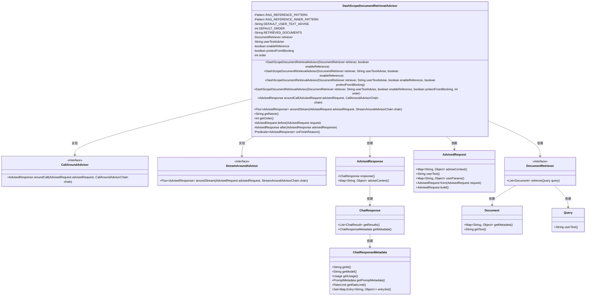

# 基础信息

|      |      |
|------|------|
| 名称 | DashScopeDocumentRetrievalAdvisor |
| 编码语言 | .java |
| 代码路径 | spring-ai-alibaba/spring-ai-alibaba-core/src/main/java/com/alibaba/cloud/ai/dashscope/rag/DashScopeDocumentRetrievalAdvisor.java |
| 包名 | com.alibaba.cloud.ai.dashscope.rag |
| 依赖项 | ['com.alibaba.cloud.ai.dashscope.api.DashScopeApi.ChatCompletionFinishReason', 'org.springframework.ai.chat.client.advisor.api', 'org.springframework.ai.chat.metadata.ChatResponseMetadata', 'org.springframework.ai.chat.model.ChatResponse', 'org.springframework.ai.document.Document', 'org.springframework.ai.rag.Query', 'org.springframework.ai.rag.retrieval.search.DocumentRetriever', 'org.springframework.util.StringUtils', 'reactor.core.publisher.Flux', 'reactor.core.publisher.Mono', 'reactor.core.scheduler.Schedulers', 'java.util', 'java.util.function.Predicate', 'java.util.regex.Matcher', 'java.util.regex.Pattern'] |
| 概述说明 | DashScopeDocumentRetrievalAdvisor实现文档检索与引用，支持同步异步调用，处理元数据。 |

# 说明

DashScopeDocumentRetrievalAdvisor是一个实现文档检索与引用功能的工具，支持同步与异步调用方式。它确保在回答问题时能够准确引用相关文档，并处理文档的元数据，以提高信息的准确性和可靠性。

# 类列表 Class Summary

| 名称   | 类型  | 说明 |
|-------|------|-------------|
| DashScopeDocumentRetrievalAdvisor | class | DashScopeDocumentRetrievalAdvisor实现文档检索与引用功能，支持同步与异步调用，确保回答引用文档并处理元数据。 |

## 类 DashScopeDocumentRetrievalAdvisor

|      |      |
|------|------|
| 访问范围 | public |
| 类型 | class |
| 名称 | DashScopeDocumentRetrievalAdvisor |
| 说明 | DashScopeDocumentRetrievalAdvisor实现文档检索与引用功能，支持同步与异步调用，确保回答引用文档并处理元数据。 |

### UML类图

### 描述
`DashScopeDocumentRetrievalAdvisor` 类实现了 `CallAroundAdvisor` 和 `StreamAroundAdvisor` 接口，用于在请求处理前后执行特定逻辑。它通过 `DocumentRetriever` 检索文档，并根据文档内容生成带有引用的响应。类中包含了多个构造函数，允许自定义文档检索、引用启用、阻塞保护等行为。`aroundCall` 和 `aroundStream` 方法分别处理同步和异步请求，`before` 和 `after` 方法分别在请求前和请求后执行逻辑。该类还提供了对响应元数据的处理，确保引用文档的正确性和完整性。

### 内部方法调用关系图

```mermaid
graph TD
    A["类DashScopeDocumentRetrievalAdvisor"]
    B["属性: Pattern RAG_REFERENCE_PATTERN"]
    C["属性: Pattern RAG_REFERENCE_INNER_PATTERN"]
    D["属性: String DEFAULT_USER_TEXT_ADVISE"]
    E["属性: int DEFAULT_ORDER"]
    F["属性: String RETRIEVED_DOCUMENTS"]
    G["属性: DocumentRetriever retriever"]
    H["属性: String userTextAdvise"]
    I["属性: boolean enableReference"]
    J["属性: boolean protectFromBlocking"]
    K["属性: int order"]
    L["构造方法: DashScopeDocumentRetrievalAdvisor(DocumentRetriever retriever, boolean enableReference)"]
    M["构造方法: DashScopeDocumentRetrievalAdvisor(DocumentRetriever retriever, String userTextAdvise, boolean enableReference)"]
    N["构造方法: DashScopeDocumentRetrievalAdvisor(DocumentRetriever retriever, String userTextAdvise, boolean enableReference, boolean protectFromBlocking)"]
    O["构造方法: DashScopeDocumentRetrievalAdvisor(DocumentRetriever retriever, String userTextAdvise, boolean enableReference, boolean protectFromBlocking, int order)"]
    P["方法: AdvisedResponse aroundCall(AdvisedRequest advisedRequest, CallAroundAdvisorChain chain)"]
    Q["方法: Flux<AdvisedResponse> aroundStream(AdvisedRequest advisedRequest, StreamAroundAdvisorChain chain)"]
    R["方法: String getName()"]
    S["方法: int getOrder()"]
    T["方法: AdvisedRequest before(AdvisedRequest request)"]
    U["方法: AdvisedResponse after(AdvisedResponse advisedResponse)"]
    V["方法: Predicate<AdvisedResponse> onFinishReason()"]

    A --> B
    A --> C
    A --> D
    A --> E
    A --> F
    A --> G
    A --> H
    A --> I
    A --> J
    A --> K
    A --> L
    A --> M
    A --> N
    A --> O
    A --> P
    A --> Q
    A --> R
    A --> S
    A --> T
    A --> U
    A --> V
```

该流程图展示了`DashScopeDocumentRetrievalAdvisor`类的结构，包括其属性、构造方法和主要方法。该类实现了`CallAroundAdvisor`和`StreamAroundAdvisor`接口，用于在请求和响应处理过程中插入自定义逻辑。主要方法包括`aroundCall`和`aroundStream`，分别用于处理同步和异步请求，`before`和`after`方法用于在请求前后执行特定操作，`onFinishReason`方法用于判断是否执行`after`方法。

### 字段列表 Field List

| 名称  | 类型  | 说明 |
|-------|-------|------|
| DEFAULT_ORDER = 0 | int | 定义静态常量DEFAULT_ORDER，默认值为0。 |
| order | int | 私有整型变量order，不可修改。 |
| retriever | DocumentRetriever | 私有文档检索器实例变量。 |
| protectFromBlocking | boolean | 保护防止阻塞的私有布尔变量。 |
| enableReference | boolean | 私有布尔变量enableReference用于控制引用功能。 |
| userTextAdvise | String | 私有不可变的用户文本建议字符串。 |
| RAG_REFERENCE_INNER_PATTERN = Pattern.compile("\\[([0-9]+)(?:[,，]?([0-9]+))*]") | Pattern | 定义正则表达式匹配带数字的方括号内容。 |
| DEFAULT_USER_TEXT_ADVISE = """			# 知识库			请记住以下材料，他们可能对回答问题有帮助。			指令：您需要仅使用提供的搜索文档为给定问题写出高质量的答案，并正确引用它们。 引用多个搜索结果时，请使用<ref>[编号]</ref>格式，注意确保这些引用直接有助于解答问题，编号需与材料原始编号一致且唯一。请注意，每个句子中必须至少引用一个文档。换句话说，你禁止在没有引用任何文献的情况下写句子。此外，您应该在每个句子中添加引用符号，注意在句号之前。			对于每个问题按照下面的推理步骤得到带引用的答案：			步骤1：我判断文档1和文档2与问题相关。			步骤2：根据文档1，我写了一个回答陈述并引用了该文档。			步骤3：根据文档2，我写一个答案声明并引用该文档。			步骤4：我将以上两个答案语句进行合并、排序和连接，以获得流畅连贯的答案。			$$材料：			[1] 【文档名】植物中的光合作用.pdf			【标题】光合作用位置			【正文】光合作用主要在叶绿体中进行，涉及光能到化学能的转化。			[2] 【文档名】光合作用.pdf			【标题】光合作用转化			【正文】光合作用是利用阳光将CO2和H2O转化为氧气和葡萄糖的过程。			$$材料:			{question_answer_context}			""" | String | 默认用户提示：知识库指令，引用文档回答问题，步骤清晰。 |
| RETRIEVED_DOCUMENTS = "question_answer_context" | String | 定义静态字符串变量RETRIEVED_DOCUMENTS，值为"question_answer_context"。 |
| RAG_REFERENCE_PATTERN = Pattern.compile("<ref>(.*?)</ref>") | Pattern | 定义私有静态正则表达式模式，匹配<ref>标签内容。 |

### 方法列表 Method List

| 名称  | 类型  | 说明 |
|-------|-------|------|
| getOrder | int | 重写getOrder方法，返回当前order值。 |
| after | AdvisedResponse | 处理响应，更新上下文，修复元数据丢失，返回新响应。 |
| aroundStream | Flux<AdvisedResponse> | 方法根据线程类型处理请求，保护阻塞线程，最终返回处理后的响应流。 |
| aroundCall | AdvisedResponse | 重写方法处理请求前后逻辑，调用链并返回响应。 |
| onFinishReason | Predicate<AdvisedResponse> | 检查响应结果中是否存在非空且包含结束原因的元数据。 |
| before | AdvisedRequest | 提取文档信息并更新请求上下文。 |
| getName | String | 重写getName方法，返回当前类名。 |

