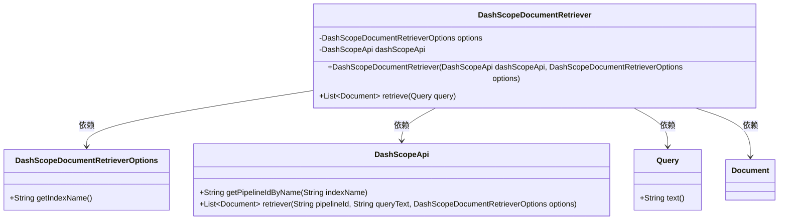
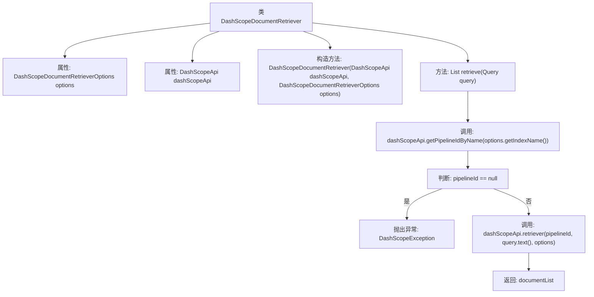

# 基础信息

|      |      |
|------|------|
| 名称 | DashScopeDocumentRetriever |
| 编码语言 | .java |
| 代码路径 | spring-ai-alibaba/spring-ai-alibaba-core/src/main/java/com/alibaba/cloud/ai/dashscope/rag/DashScopeDocumentRetriever.java |
| 包名 | com.alibaba.cloud.ai.dashscope.rag |
| 依赖项 | ['com.alibaba.cloud.ai.dashscope.api.DashScopeApi', 'com.alibaba.cloud.ai.dashscope.common.DashScopeException', 'org.springframework.ai.document.Document', 'org.springframework.ai.rag.Query', 'org.springframework.ai.rag.retrieval.search.DocumentRetriever', 'org.springframework.util.Assert', 'java.util.List'] |
| 概述说明 | DashScopeDocumentRetriever类通过API和配置实现文档检索，确保索引名非空。 |

# 说明

DashScopeDocumentRetriever类用于实现文档检索功能，依赖于DashScopeApi和相关的选项配置。在操作过程中，该类会确保索引名不为空，并通过调用API来检索文档列表，从而完成文档检索任务。

# 类列表 Class Summary

| 名称   | 类型  | 说明 |
|-------|------|-------------|
| DashScopeDocumentRetriever | class | DashScopeDocumentRetriever类实现文档检索，依赖DashScopeApi和选项配置，确保索引名非空，通过API检索文档列表。 |

## 类 DashScopeDocumentRetriever

|      |      |
|------|------|
| 访问范围 | public |
| 类型 | class |
| 名称 | DashScopeDocumentRetriever |
| 说明 | DashScopeDocumentRetriever类实现文档检索，依赖DashScopeApi和选项配置，确保索引名非空，通过API检索文档列表。 |

### UML类图

这段代码定义了一个 `DashScopeDocumentRetriever` 类，该类通过 `DashScopeApi` 和 `DashScopeDocumentRetrieverOptions` 来检索文档。`DashScopeDocumentRetriever` 类包含一个 `retrieve` 方法，该方法根据查询文本从指定的索引中检索文档。`DashScopeApi` 提供了获取管道ID和检索文档的功能，而 `DashScopeDocumentRetrieverOptions` 则包含索引名称等配置信息。`Query` 类用于封装查询文本，`Document` 类表示检索到的文档。

### 内部方法调用关系图

这段代码定义了一个名为 `DashScopeDocumentRetriever` 的类，用于从 `DashScopeApi` 中检索文档。类中包含两个属性：`DashScopeDocumentRetrieverOptions` 和 `DashScopeApi`，并通过构造函数进行初始化。`retrieve` 方法根据传入的查询对象 `Query` 获取文档列表，首先通过 `dashScopeApi.getPipelineIdByName` 获取管道 ID，如果管道 ID 不存在则抛出异常，否则调用 `dashScopeApi.retriever` 方法获取文档并返回。

### 字段列表 Field List

| 名称  | 类型  | 说明 |
|-------|-------|------|
| dashScopeApi | DashScopeApi | 私有变量dashScopeApi类型为DashScopeApi。 |
| options | DashScopeDocumentRetrieverOptions | 私有常量DashScopeDocumentRetrieverOptions类型变量options。 |

### 方法列表 Method List

| 名称  | 类型  | 说明 |
|-------|-------|------|
| retrieve | List<Document> | 根据查询检索文档列表，若索引不存在则抛出异常。 |

