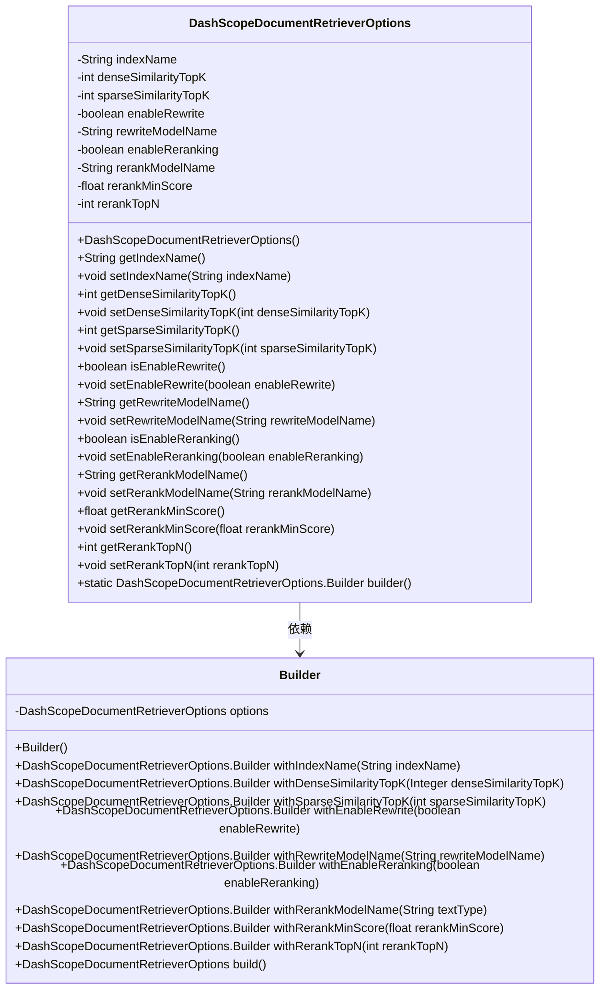

# 基础信息

|      |      |
|------|------|
| 名称 | DashScopeDocumentRetrieverOptions |
| 编码语言 | .java |
| 代码路径 | spring-ai-alibaba/spring-ai-alibaba-core/src/main/java/com/alibaba/cloud/ai/dashscope/rag/DashScopeDocumentRetrieverOptions.java |
| 包名 | com.alibaba.cloud.ai.dashscope.rag |
| 依赖项 | ['com.fasterxml.jackson.annotation.JsonInclude', 'com.fasterxml.jackson.annotation.JsonProperty'] |
| 概述说明 | DashScope文档检索选项类包含索引名、相似度、重写和重排等配置。 |

# 说明

DashScope文档检索选项类是一个用于配置文档检索功能的关键类，包含多个重要参数。这些参数包括索引名，用于指定检索的目标索引；相似度，用于调整检索结果的相关性评分；重写，用于对检索条件进行优化或转换；重排，用于对检索结果进行排序或重新排列。通过这些配置，用户可以灵活控制文档检索的精确度和效率，以满足不同的应用需求。

# 类列表 Class Summary

| 名称   | 类型  | 说明 |
|-------|------|-------------|
| DashScopeDocumentRetrieverOptions | class | DashScope文档检索选项类，包含索引名、相似度、重写、重排等配置。 |

## 类 DashScopeDocumentRetrieverOptions

|      |      |
|------|------|
| 访问范围 | @JsonInclude(JsonInclude.Include.NON_NULL);public |
| 类型 | class |
| 名称 | DashScopeDocumentRetrieverOptions |
| 说明 | DashScope文档检索选项类，包含索引名、相似度、重写、重排等配置。 |

### UML类图

**描述**：`DashScopeDocumentRetrieverOptions`类用于配置文档检索器的选项，包括索引名称、相似性计算参数、重写和重排模型等。该类通过`Builder`模式提供灵活的配置方式，允许用户逐步设置各个参数，并通过`build()`方法生成最终的配置对象。`Builder`类内部持有一个`DashScopeDocumentRetrieverOptions`实例，并通过一系列`with`方法设置其属性。

### 内部方法调用关系图

```mermaid
graph TD
    A["类DashScopeDocumentRetrieverOptions"]
    B["属性: String indexName"]
    C["属性: int denseSimilarityTopK = 100"]
    D["属性: int sparseSimilarityTopK = 100"]
    E["属性: boolean enableRewrite = false"]
    F["属性: String rewriteModelName = 'conv-rewrite-qwen-1.8b'"]
    G["属性: boolean enableReranking = true"]
    H["属性: String rerankModelName = 'gte-rerank-hybrid'"]
    I["属性: float rerankMinScore = 0.01f"]
    J["属性: int rerankTopN = 5"]
    K["方法: builder()"]
    L["方法: getIndexName()"]
    M["方法: setIndexName(String indexName)"]
    N["方法: getDenseSimilarityTopK()"]
    O["方法: setDenseSimilarityTopK(int denseSimilarityTopK)"]
    P["方法: getSparseSimilarityTopK()"]
    Q["方法: setSparseSimilarityTopK(int sparseSimilarityTopK)"]
    R["方法: isEnableRewrite()"]
    S["方法: setEnableRewrite(boolean enableRewrite)"]
    T["方法: getRewriteModelName()"]
    U["方法: setRewriteModelName(String rewriteModelName)"]
    V["方法: isEnableReranking()"]
    W["方法: setEnableReranking(boolean enableReranking)"]
    X["方法: getRerankModelName()"]
    Y["方法: setRerankModelName(String rerankModelName)"]
    Z["方法: getRerankMinScore()"]
    AA["方法: setRerankMinScore(float rerankMinScore)"]
    AB["方法: getRerankTopN()"]
    AC["方法: setRerankTopN(int rerankTopN)"]
    AD["内部类Builder"]
    AE["属性: DashScopeDocumentRetrieverOptions options"]
    AF["方法: Builder()"]
    AG["方法: withIndexName(String indexName)"]
    AH["方法: withDenseSimilarityTopK(Integer denseSimilarityTopK)"]
    AI["方法: withSparseSimilarityTopK(int sparseSimilarityTopK)"]
    AJ["方法: withEnableRewrite(boolean enableRewrite)"]
    AK["方法: withRewriteModelName(String rewriteModelName)"]
    AL["方法: withEnableReranking(boolean enableReranking)"]
    AM["方法: withRerankModelName(String textType)"]
    AN["方法: withRerankMinScore(float rerankMinScore)"]
    AO["方法: withRerankTopN(int rerankTopN)"]
    AP["方法: build()"]

    A --> B
    A --> C
    A --> D
    A --> E
    A --> F
    A --> G
    A --> H
    A --> I
    A --> J
    A --> K
    A --> L
    A --> M
    A --> N
    A --> O
    A --> P
    A --> Q
    A --> R
    A --> S
    A --> T
    A --> U
    A --> V
    A --> W
    A --> X
    A --> Y
    A --> Z
    A --> AA
    A --> AB
    A --> AC
    A -.-> AD
    AD --> AE
    AD --> AF
    AD --> AG
    AD --> AH
    AD --> AI
    AD --> AJ
    AD --> AK
    AD --> AL
    AD --> AM
    AD --> AN
    AD --> AO
    AD --> AP
```

这段代码定义了一个名为`DashScopeDocumentRetrieverOptions`的类，用于配置文档检索器的各种参数。类中包含多个属性，如`indexName`、`denseSimilarityTopK`、`sparseSimilarityTopK`等，并且提供了相应的getter和setter方法。此外，类中还包含一个内部类`Builder`，用于通过链式调用的方式创建和配置`DashScopeDocumentRetrieverOptions`对象。流程图展示了类的属性、方法以及内部类的结构，清晰地展示了各个部分之间的关系。

### 字段列表 Field List

| 名称  | 类型  | 说明 |
|-------|-------|------|
| indexName | String | 定义私有字符串变量indexName，使用JsonProperty注解。 |
| rerankTopN = 5 | int | 私有属性rerankTopN默认值为5。 |
| enableReranking = true | boolean | 启用重新排序功能。 |
| sparseSimilarityTopK = 100 | int | 私有属性sparseSimilarityTopK默认值为100。 |
| denseSimilarityTopK = 100 | int | 私有属性denseSimilarityTopK默认值为100。 |
| enableRewrite = false | boolean | 私有属性enableRewrite，默认值为false。 |
| rerankModelName = "gte-rerank-hybrid" | String | 私有属性rerankModelName默认值为"gte-rerank-hybrid"。 |
| rewriteModelName = "conv-rewrite-qwen-1.8b" | String | 私有字符串变量rewriteModelName赋值为"conv-rewrite-qwen-1.8b"。 |
| rerankMinScore = 0.01f | float | 私有属性rerankMinScore默认值为0.01。 |

### 方法列表 Method List

| 名称  | 类型  | 说明 |
|-------|-------|------|
| getIndexName | String | 获取索引名称的方法。 |
| getSparseSimilarityTopK | int | 返回稀疏相似度的前K个值。 |
| setRewriteModelName | void | 设置重写模型名称的方法。 |
| getRerankTopN | int | 返回rerankTopN的整数值。 |
| setSparseSimilarityTopK | void | 设置稀疏相似度的前K个值。 |
| setEnableReranking | void | 设置重新排序功能的状态。 |
| setRerankModelName | void | 设置重排模型名称的方法。 |
| setEnableRewrite | void | 设置重写功能开关状态。 |
| isEnableRewrite | boolean | 方法返回布尔值enableRewrite的状态。 |
| getRerankMinScore | float | 获取重新排序最小分数的方法。 |
| getRewriteModelName | String | 获取重写模型名称的方法。 |
| setRerankMinScore | void | 设置重新排序的最小分数为指定值。 |
| setDenseSimilarityTopK | void | 设置密集相似度前K值。 |
| isEnableReranking | boolean | 该方法返回布尔值，表示是否启用重新排序功能。 |
| builder | DashScopeDocumentRetrieverOptions.Builder | 静态方法返回DashScopeDocumentRetrieverOptions的构建器实例。 |
| getRerankModelName | String | 获取重排序模型名称的方法。 |
| getDenseSimilarityTopK | int | 返回密集相似度前K值的方法。 |
| setIndexName | void | 该方法用于设置索引名称，将传入的字符串赋值给类的成员变量indexName。 |
| setRerankTopN | void | 设置重新排序的TopN参数值。 |

