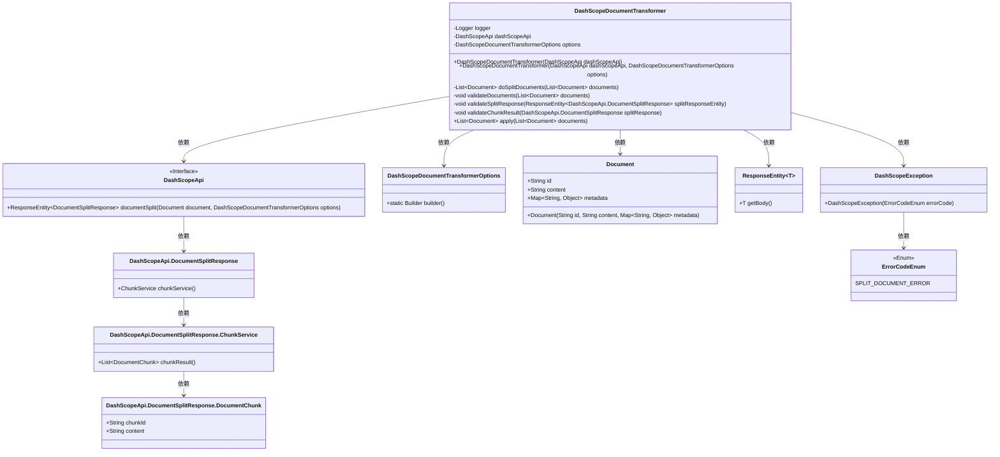
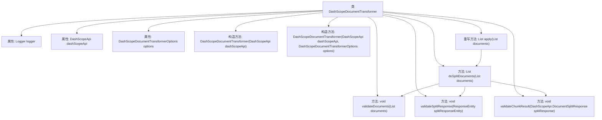

# 基础信息

|      |      |
|------|------|
| 名称 | DashScopeDocumentTransformer |
| 编码语言 | .java |
| 代码路径 | spring-ai-alibaba/spring-ai-alibaba-core/src/main/java/com/alibaba/cloud/ai/dashscope/rag/DashScopeDocumentTransformer.java |
| 包名 | com.alibaba.cloud.ai.dashscope.rag |
| 依赖项 | ['java.util.ArrayList', 'java.util.List', 'com.alibaba.cloud.ai.dashscope.api.DashScopeApi', 'com.alibaba.cloud.ai.dashscope.common.DashScopeException', 'com.alibaba.cloud.ai.dashscope.common.ErrorCodeEnum', 'org.slf4j.Logger', 'org.slf4j.LoggerFactory', 'org.springframework.ai.document.Document', 'org.springframework.ai.document.DocumentTransformer', 'org.springframework.http.ResponseEntity', 'org.springframework.util.Assert', 'org.springframework.util.CollectionUtils'] |
| 概述说明 | DashScopeDocumentTransformer类用于文档分割，依赖DashScopeApi和配置，验证输入并处理结果。 |

# 说明

DashScopeDocumentTransformer类专门用于文档分割任务，其功能依赖于DashScopeApi接口和配置选项。该类在操作过程中会首先验证输入数据的有效性，确保输入符合处理要求，然后对文档进行分割处理，并最终生成分割结果。通过这一系列步骤，DashScopeDocumentTransformer类实现了高效且可靠的文档分割功能。

# 类列表 Class Summary

| 名称   | 类型  | 说明 |
|-------|------|-------------|
| DashScopeDocumentTransformer | class | DashScopeDocumentTransformer类用于文档分割，依赖DashScopeApi和配置选项，验证输入并处理分割结果。 |

## 类 DashScopeDocumentTransformer

|      |      |
|------|------|
| 访问范围 | public |
| 类型 | class |
| 名称 | DashScopeDocumentTransformer |
| 说明 | DashScopeDocumentTransformer类用于文档分割，依赖DashScopeApi和配置选项，验证输入并处理分割结果。 |

### UML类图

**描述：**
`DashScopeDocumentTransformer` 类负责将文档分割成多个部分。它依赖于 `DashScopeApi` 接口来执行文档分割操作，并使用 `DashScopeDocumentTransformerOptions` 来配置分割行为。该类包含多个私有方法用于验证输入文档、分割响应和分割结果，并最终通过 `apply` 方法返回分割后的文档列表。整个流程涉及多个内部类和枚举，确保分割过程的正确性和异常处理。

### 内部方法调用关系图

这段代码定义了一个名为`DashScopeDocumentTransformer`的类，该类实现了`DocumentTransformer`接口。它包含两个构造方法，分别用于初始化`DashScopeApi`和`DashScopeDocumentTransformerOptions`。`doSplitDocuments`方法用于将文档拆分成多个部分，并调用多个验证方法来确保输入和输出的有效性。`apply`方法是接口的实现，直接调用`doSplitDocuments`方法来处理文档。流程图展示了类的结构及其方法之间的调用关系。

### 字段列表 Field List

| 名称  | 类型  | 说明 |
|-------|-------|------|
| logger = LoggerFactory.getLogger(DashScopeDocumentTransformer.class) | Logger | 在DashScopeDocumentTransformer类中定义了一个静态日志记录器。 |
| options | DashScopeDocumentTransformerOptions | 私有且不可变的DashScope文档转换器选项实例。 |
| dashScopeApi | DashScopeApi | 私有成员变量dashScopeApi，类型为DashScopeApi。 |

### 方法列表 Method List

| 名称  | 类型  | 说明 |
|-------|-------|------|
| validateDocuments | void | 验证文档列表不为空且仅支持一个文档。 |
| validateChunkResult | void | 验证文档分割结果，若为空或无效则抛出异常。 |
| validateSplitResponse | void | 验证分割响应，若为空则抛出异常。 |
| apply | List<Document> | 重写方法，拆分文档列表并返回结果。 |
| doSplitDocuments | List<Document> | 方法拆分文档列表，验证并调用API分割文档，生成并返回分割后的文档列表。 |

