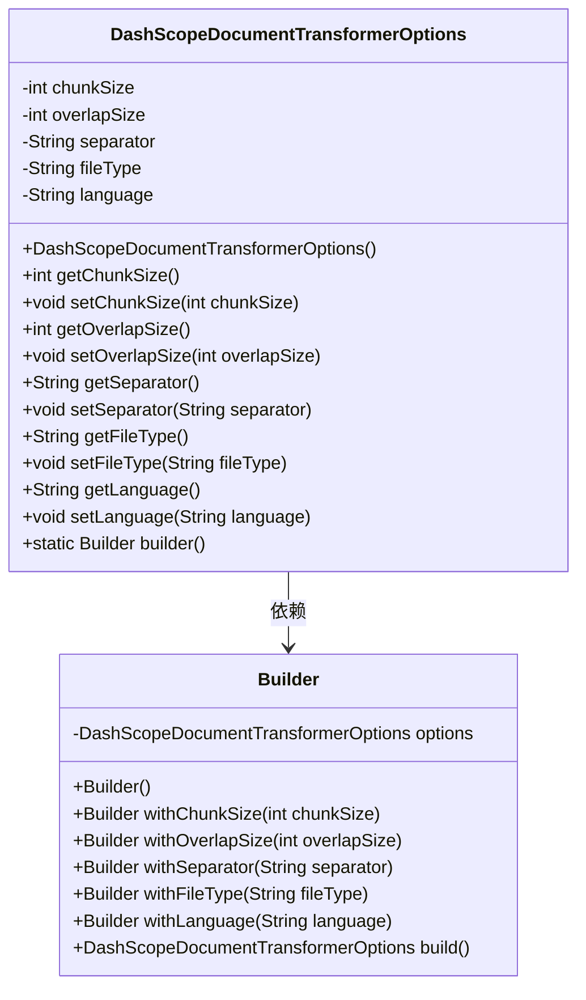

# 基础信息

|      |      |
|------|------|
| 名称 | DashScopeDocumentTransformerOptions |
| 编码语言 | .java |
| 代码路径 | spring-ai-alibaba/spring-ai-alibaba-core/src/main/java/com/alibaba/cloud/ai/dashscope/rag/DashScopeDocumentTransformerOptions.java |
| 包名 | com.alibaba.cloud.ai.dashscope.rag |
| 依赖项 | ['com.fasterxml.jackson.annotation.JsonInclude', 'com.fasterxml.jackson.annotation.JsonProperty'] |
| 概述说明 | DashScope文档转换选项类含块大小、重叠大小等配置，支持构建器模式。 |

# 说明

DashScope文档转换选项类提供了多种配置项，包括块大小、重叠大小、分隔符、文件类型和语言等，允许用户根据需求灵活设置文档转换的参数。该类支持构建器模式，便于用户通过链式调用的方式逐步配置各项参数，从而实现高效且定制化的文档转换操作。

# 类列表 Class Summary

| 名称   | 类型  | 说明 |
|-------|------|-------------|
| DashScopeDocumentTransformerOptions | class | DashScope文档转换选项类，包含块大小、重叠大小、分隔符、文件类型和语言等配置项，支持构建器模式。 |

## 类 DashScopeDocumentTransformerOptions

|      |      |
|------|------|
| 访问范围 | @JsonInclude(JsonInclude.Include.NON_NULL);public |
| 类型 | class |
| 名称 | DashScopeDocumentTransformerOptions |
| 说明 | DashScope文档转换选项类，包含块大小、重叠大小、分隔符、文件类型和语言等配置项，支持构建器模式。 |

### UML类图

**描述：**  
`DashScopeDocumentTransformerOptions` 类用于配置文档转换的选项，包括块大小、重叠大小、分隔符、文件类型和语言等。它通过 `Builder` 内部类提供了流畅的API来设置这些选项。`Builder` 类允许链式调用方法来配置 `DashScopeDocumentTransformerOptions` 实例，最后通过 `build()` 方法返回配置好的实例。这种设计模式使得对象的创建和配置更加灵活和直观。

### 内部方法调用关系图

```mermaid
graph TD
    A["类DashScopeDocumentTransformerOptions"]
    B["属性: int chunkSize"]
    C["属性: int overlapSize"]
    D["属性: String separator"]
    E["属性: String fileType"]
    F["属性: String language"]
    G["方法: builder()"]
    H["方法: getChunkSize()"]
    I["方法: setChunkSize(int chunkSize)"]
    J["方法: getOverlapSize()"]
    K["方法: setOverlapSize(int overlapSize)"]
    L["方法: getSeparator()"]
    M["方法: setSeparator(String separator)"]
    N["方法: getFileType()"]
    O["方法: setFileType(String fileType)"]
    P["方法: getLanguage()"]
    Q["方法: setLanguage(String language)"]
    R["内部类Builder"]
    S["属性: DashScopeDocumentTransformerOptions options"]
    T["方法: Builder()"]
    U["方法: withChunkSize(int chunkSize)"]
    V["方法: withOverlapSize(int overlapSize)"]
    W["方法: withSeparator(String separator)"]
    X["方法: withFileType(String fileType)"]
    Y["方法: withLanguage(String language)"]
    Z["方法: build()"]

    A --> B
    A --> C
    A --> D
    A --> E
    A --> F
    A --> G
    A --> H
    A --> I
    A --> J
    A --> K
    A --> L
    A --> M
    A --> N
    A --> O
    A --> P
    A --> Q
    A -.-> R
    R --> S
    R --> T
    R --> U
    R --> V
    R --> W
    R --> X
    R --> Y
    R --> Z
```

这段代码定义了一个名为 `DashScopeDocumentTransformerOptions` 的类，该类包含多个属性和方法，用于配置文档转换的选项。类中定义了五个属性：`chunkSize`、`overlapSize`、`separator`、`fileType` 和 `language`，并提供了相应的 getter 和 setter 方法。此外，类中还包含一个内部类 `Builder`，用于构建 `DashScopeDocumentTransformerOptions` 对象。`Builder` 类提供了多个 `with` 方法，用于设置属性值，并通过 `build` 方法返回最终的配置对象。

### 字段列表 Field List

| 名称  | 类型  | 说明 |
|-------|-------|------|
| overlapSize = 100 | int | 私有属性overlapSize默认值为100。 |
| fileType = "idp" | String | 私有属性fileType初始化为"idp"。 |
| chunkSize = 500 | int | 代码定义私有整型变量chunkSize，初始值为500。 |
| language = "cn" | String | 代码定义了一个私有字符串变量，初始值为“cn”。 |
| separator = "|,|，|。|？|！|\\n|\\\\?|\\\\!" | String | 私有字符串separator定义多个分隔符。 |

### 方法列表 Method List

| 名称  | 类型  | 说明 |
|-------|-------|------|
| setOverlapSize | void | 设置重叠大小的公共方法。 |
| getFileType | String | 该方法返回文件类型字符串。 |
| setChunkSize | void | 设置块大小的方法。 |
| getChunkSize | int | 获取块大小的方法。 |
| getLanguage | String | 获取语言属性的字符串方法。 |
| getOverlapSize | int | 获取重叠区域大小的方法。 |
| builder | DashScopeDocumentTransformerOptions.Builder | 创建DashScope文档转换器选项的构建器方法。 |
| getSeparator | String | 该方法返回字符串类型的separator变量值。 |
| setLanguage | void | 设置语言属性的方法，参数为字符串类型。 |
| setSeparator | void | 设置分隔符的公共方法。 |
| setFileType | void | 设置文件类型的方法，参数为文件类型字符串。 |

