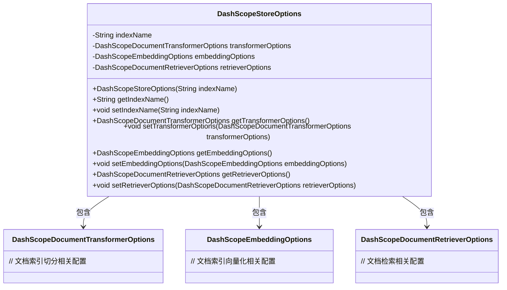

# 基础信息

|      |      |
|------|------|
| 名称 | DashScopeStoreOptions |
| 编码语言 | .java |
| 代码路径 | spring-ai-alibaba/spring-ai-alibaba-core/src/main/java/com/alibaba/cloud/ai/dashscope/rag/DashScopeStoreOptions.java |
| 包名 | com.alibaba.cloud.ai.dashscope.rag |
| 依赖项 | ['com.alibaba.cloud.ai.dashscope.embedding.DashScopeEmbeddingOptions', 'com.fasterxml.jackson.annotation.JsonInclude', 'com.fasterxml.jackson.annotation.JsonProperty'] |
| 概述说明 | DashScopeStoreOptions类涵盖索引、文档处理、向量化及检索配置。 |

# 说明

DashScopeStoreOptions类用于配置索引、文档处理、向量化和检索相关参数。它包含索引名、文档切分、向量化和检索配置等关键信息，确保数据存储和检索过程的高效性和准确性。通过此类，用户可以灵活定义索引结构、文档处理方式、向量化方法以及检索策略，以满足不同应用场景的需求。

# 类列表 Class Summary

| 名称   | 类型  | 说明 |
|-------|------|-------------|
| DashScopeStoreOptions | class | DashScopeStoreOptions类包含索引名、文档切分、向量化和检索配置。 |

## 类 DashScopeStoreOptions

|      |      |
|------|------|
| 访问范围 | @JsonInclude(JsonInclude.Include.NON_NULL);public |
| 类型 | class |
| 名称 | DashScopeStoreOptions |
| 说明 | DashScopeStoreOptions类包含索引名、文档切分、向量化和检索配置。 |

### UML类图

**描述：**  
`DashScopeStoreOptions` 类用于存储文档索引、切分、向量化和检索的相关配置。它包含四个主要属性：`indexName`（索引名称）、`transformerOptions`（文档索引切分配置）、`embeddingOptions`（文档索引向量化配置）和`retrieverOptions`（文档检索配置）。通过构造函数和相应的getter/setter方法，可以对这些属性进行初始化和修改。该类与`DashScopeDocumentTransformerOptions`、`DashScopeEmbeddingOptions`和`DashScopeDocumentRetrieverOptions`三个类之间存在依赖关系，分别用于处理文档的不同处理阶段。

### 内部方法调用关系图

```mermaid
graph TD
    A["类DashScopeStoreOptions"]
    B["属性: String indexName"]
    C["属性: DashScopeDocumentTransformerOptions transformerOptions"]
    D["属性: DashScopeEmbeddingOptions embeddingOptions"]
    E["属性: DashScopeDocumentRetrieverOptions retrieverOptions"]
    F["构造方法: DashScopeStoreOptions(String indexName)"]
    G["方法: String getIndexName()"]
    H["方法: void setIndexName(String indexName)"]
    I["方法: DashScopeDocumentTransformerOptions getTransformerOptions()"]
    J["方法: void setTransformerOptions(DashScopeDocumentTransformerOptions transformerOptions)"]
    K["方法: DashScopeEmbeddingOptions getEmbeddingOptions()"]
    L["方法: void setEmbeddingOptions(DashScopeEmbeddingOptions embeddingOptions)"]
    M["方法: DashScopeDocumentRetrieverOptions getRetrieverOptions()"]
    N["方法: void setRetrieverOptions(DashScopeDocumentRetrieverOptions retrieverOptions)"]

    A --> B
    A --> C
    A --> D
    A --> E
    A --> F
    A --> G
    A --> H
    A --> I
    A --> J
    A --> K
    A --> L
    A --> M
    A --> N
```

这段代码定义了一个名为 `DashScopeStoreOptions` 的类，用于存储与文档索引、向量化和检索相关的配置选项。类中包含四个属性：`indexName`、`transformerOptions`、`embeddingOptions` 和 `retrieverOptions`，分别表示索引名称、文档索引切分配置、文档索引向量化配置和文档检索配置。类提供了一个构造方法用于初始化 `indexName`，并为每个属性提供了相应的 `getter` 和 `setter` 方法，以便于对这些配置进行读取和修改。

### 字段列表 Field List

| 名称  | 类型  | 说明 |
|-------|-------|------|
| indexName | String | 私有字符串属性indexName，使用JsonProperty注解标记。 |
| transformerOptions | DashScopeDocumentTransformerOptions | 包含私有属性transformerOptions，类型为DashScopeDocumentTransformerOptions。 |
| embeddingOptions | DashScopeEmbeddingOptions | 私有属性 embeddingOptions 用于存储 DashScopeEmbeddingOptions 配置。 |
| retrieverOptions | DashScopeDocumentRetrieverOptions | 私有属性retrieverOptions，类型为DashScopeDocumentRetrieverOptions。 |

### 方法列表 Method List

| 名称  | 类型  | 说明 |
|-------|-------|------|
| getIndexName | String | 获取索引名称的方法。 |
| setRetrieverOptions | void | 设置文档检索器选项。 |
| getTransformerOptions | DashScopeDocumentTransformerOptions | 获取DashScope文档转换器选项的方法。 |
| getEmbeddingOptions | DashScopeEmbeddingOptions | 获取嵌入选项的公共方法。 |
| setTransformerOptions | void | 设置文档转换器选项的方法。 |
| setIndexName | void | 设置索引名称的方法，将传入的indexName赋值给当前对象的indexName属性。 |
| getRetrieverOptions | DashScopeDocumentRetrieverOptions | 获取检索器选项的方法，返回retrieverOptions。 |
| setEmbeddingOptions | void | 设置嵌入选项方法，参数为DashScopeEmbeddingOptions类型。 |

