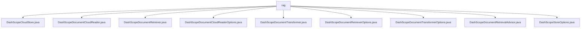

# 基础信息

|      |      |
|------|------|
| 名称 | rag |
| 编码语言 | .java |
| 代码路径 | spring-ai-alibaba/spring-ai-alibaba-core/src/main/java/com/alibaba/cloud/ai/dashscope/rag |
| 包名 | spring-ai-alibaba.spring-ai-alibaba-core.src.main.java.com.alibaba.cloud.ai.dashscope.rag |
| 概述说明 | DashScope类实现文档存储、读取、检索和分割功能，依赖API和配置选项。 |

# 说明

## 概述
该代码模块是一个基于DashScope服务的文档管理与检索系统，主要用于处理文档的存储、读取、转换、检索及相关操作。模块通过多个类实现了文档的向量化存储、相似性搜索、文件读取、文档分割、检索配置等功能，确保与DashScope服务的无缝集成。所有类均围绕文档管理和检索的核心业务场景展开，提供了灵活的配置选项和高效的操作接口，支持用户根据需求定制文档处理流程。

## 主要业务场景
1. **文档存储与检索**：
   - `DashScopeCloudStore`类实现了文档的存储、删除和相似性搜索功能，确保与DashScope服务的有效集成。
   - `DashScopeDocumentRetriever`类负责文档的检索操作，通过调用API获取文档列表，支持索引名配置和相似度调整。
   - `DashScopeDocumentRetrievalAdvisor`类提供文档检索与引用功能，支持同步与异步调用，确保检索结果的准确性和可靠性。

2. **文件读取与解析**：
   - `DashScopeDocumentCloudReader`类支持文件的上传、查询和解析功能，处理文件操作的成功或失败状态，确保用户能够准确获取文件内容。
   - `DashScopeDocumentCloudReaderOptions`类用于配置文档读取的相关选项，支持默认类目ID和自定义参数设置。

3. **文档转换与分割**：
   - `DashScopeDocumentTransformer`类专门用于文档分割任务，验证输入数据的有效性并生成分割结果。
   - `DashScopeDocumentTransformerOptions`类提供文档转换的配置项，如块大小、重叠大小、分隔符等，支持构建器模式以实现定制化操作。

4. **配置管理**：
   - `DashScopeStoreOptions`类用于配置索引、文档处理、向量化和检索相关参数，确保数据存储和检索过程的高效性和准确性。
   - `DashScopeDocumentRetrieverOptions`类提供文档检索的配置参数，如索引名、相似度、重写和重排，支持灵活的检索策略调整。

这些业务场景共同构成了一个完整的文档管理与检索系统，适用于需要高效处理、存储和检索文档的应用场景。

### 包内部结构视图

该流程图展示了`rag`目录下的文件层级关系，所有文件都直接位于`rag`目录下，没有进一步的子目录结构。这些文件包括与DashScope相关的存储、读取、检索、转换等功能的实现类及其配置选项。

# 文件列表 File List

| 名称   | 类型  | 说明 |
|-------|------|-------------|
| [DashScopeDocumentRetrievalAdvisor.java](DashScopeDocumentRetrievalAdvisor.md) | file | DashScopeDocumentRetrievalAdvisor实现文档检索与引用，支持同步异步调用，处理元数据。 |
| [DashScopeDocumentTransformer.java](DashScopeDocumentTransformer.md) | file | DashScopeDocumentTransformer类用于文档分割，依赖DashScopeApi和配置，验证输入并处理结果。 |
| [DashScopeDocumentRetriever.java](DashScopeDocumentRetriever.md) | file | DashScopeDocumentRetriever类通过API和配置实现文档检索，确保索引名非空。 |
| [DashScopeStoreOptions.java](DashScopeStoreOptions.md) | file | DashScopeStoreOptions类涵盖索引、文档处理、向量化及检索配置。 |
| [DashScopeDocumentTransformerOptions.java](DashScopeDocumentTransformerOptions.md) | file | DashScope文档转换选项类含块大小、重叠大小等配置，支持构建器模式。 |
| [DashScopeDocumentRetrieverOptions.java](DashScopeDocumentRetrieverOptions.md) | file | DashScope文档检索选项类包含索引名、相似度、重写和重排等配置。 |
| [DashScopeDocumentCloudReaderOptions.java](DashScopeDocumentCloudReaderOptions.md) | file | DashScopeDocumentCloudReaderOptions类设置文档云读取选项，默认类目ID为“default”。 |
| [DashScopeDocumentCloudReader.java](DashScopeDocumentCloudReader.md) | file | DashScopeDocumentCloudReader类支持文件上传、查询、解析及处理状态。 |
| [DashScopeCloudStore.java](DashScopeCloudStore.md) | file | DashScopeCloudStore类实现VectorStore接口，支持文档存储、删除和相似性搜索，依赖DashScopeApi和DashScopeStoreOptions。 |

