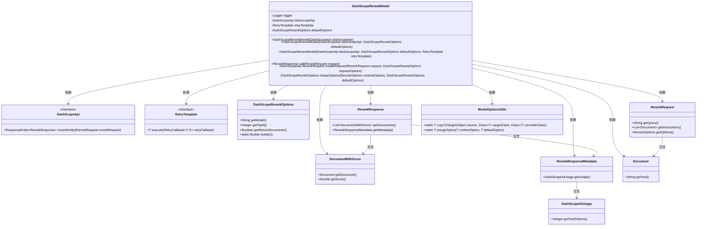

# 基础信息

|      |      |
|------|------|
| 名称 | DashScopeRerankModel |
| 编码语言 | .java |
| 代码路径 | spring-ai-alibaba/spring-ai-alibaba-core/src/main/java/com/alibaba/cloud/ai/dashscope/rerank/DashScopeRerankModel.java |
| 包名 | com.alibaba.cloud.ai.dashscope.rerank |
| 依赖项 | ['java.util.Collections', 'java.util.List', 'com.alibaba.cloud.ai.dashscope.api.DashScopeApi', 'com.alibaba.cloud.ai.dashscope.metadata.DashScopeAiUsage', 'com.alibaba.cloud.ai.document.DocumentWithScore', 'com.alibaba.cloud.ai.model.RerankModel', 'com.alibaba.cloud.ai.model.RerankOptions', 'com.alibaba.cloud.ai.model.RerankRequest', 'com.alibaba.cloud.ai.model.RerankResponse', 'com.alibaba.cloud.ai.model.RerankResponseMetadata', 'org.slf4j.Logger', 'org.slf4j.LoggerFactory', 'org.springframework.ai.document.Document', 'org.springframework.ai.model.ModelOptionsUtils', 'org.springframework.ai.retry.RetryUtils', 'org.springframework.http.ResponseEntity', 'org.springframework.lang.Nullable', 'org.springframework.retry.support.RetryTemplate', 'org.springframework.util.Assert'] |
| 概述说明 | DashScopeRerankModel类集成DashScope API，实现重排序功能，支持重试和选项合并。 |

# 说明

DashScopeRerankModel类实现了重排序功能，集成了DashScope API，具备重试机制和选项合并能力。该类通过调用DashScope API对数据进行重新排序，确保处理过程的稳定性和灵活性。重试机制在遇到网络或API错误时自动重试，提升可靠性。选项合并功能允许用户自定义配置，优化重排序效果。整体设计旨在提供高效、可靠的重排序解决方案。

# 类列表 Class Summary

| 名称   | 类型  | 说明 |
|-------|------|-------------|
| DashScopeRerankModel | class | DashScopeRerankModel类实现重排序功能，集成DashScope API，支持重试机制和选项合并。 |

## 类 DashScopeRerankModel

|      |      |
|------|------|
| 访问范围 | public |
| 类型 | class |
| 名称 | DashScopeRerankModel |
| 说明 | DashScopeRerankModel类实现重排序功能，集成DashScope API，支持重试机制和选项合并。 |

### UML类图

这段代码描述了一个 `DashScopeRerankModel` 类，该类实现了 `RerankModel` 接口，用于处理重排名请求。它依赖于 `DashScopeApi` 进行 API 调用，并使用 `RetryTemplate` 进行重试。`DashScopeRerankModel` 通过 `RerankRequest` 接收请求，处理后将结果封装为 `RerankResponse` 返回。代码中涉及多个辅助类，如 `DashScopeRerankOptions`、`DocumentWithScore`、`RerankResponseMetadata` 等，用于处理请求参数、响应数据和元信息。整体设计较为复杂，涉及多个类的协作与依赖。

### 内部方法调用关系图

```mermaid
graph TD
    A["类DashScopeRerankModel"]
    B["属性: Logger logger"]
    C["属性: DashScopeApi dashscopeApi"]
    D["属性: RetryTemplate retryTemplate"]
    E["属性: DashScopeRerankOptions defaultOptions"]
    F["构造方法: DashScopeRerankModel(DashScopeApi dashscopeApi)"]
    G["构造方法: DashScopeRerankModel(DashScopeApi dashscopeApi, DashScopeRerankOptions defaultOptions)"]
    H["构造方法: DashScopeRerankModel(DashScopeApi dashscopeApi, DashScopeRerankOptions defaultOptions, RetryTemplate retryTemplate)"]
    I["方法: RerankResponse call(RerankRequest request)"]
    J["方法: DashScopeApi.RerankRequest createRequest(RerankRequest request, DashScopeRerankOptions requestOptions)"]
    K["方法: DashScopeRerankOptions mergeOptions(RerankOptions runtimeOptions, DashScopeRerankOptions defaultOptions)"]
    L["调用: Assert.notNull(dashscopeApi, 'DashScopeApi must not be null')"]
    M["调用: Assert.notNull(defaultOptions, 'Options must not be null')"]
    N["调用: Assert.notNull(retryTemplate, 'RetryTemplate must not be null')"]
    O["调用: Assert.notNull(request.getQuery(), 'query must not be null')"]
    P["调用: Assert.notNull(request.getInstructions(), 'documents must not be null')"]
    Q["调用: retryTemplate.execute(ctx -> dashscopeApi.rerankEntity(rerankRequest))"]
    R["调用: responseEntity.getBody()"]
    S["调用: logger.warn('No rerank returned for query: {}', request.getQuery())"]
    T["调用: DocumentWithScore.builder().withScore(data.relevanceScore()).withDocument(request.getInstructions().get(data.index())).build()"]
    U["调用: new RerankResponse(documentWithScores, metadata)"]
    V["调用: new DashScopeApi.RerankRequestParameter(requestOptions.getTopN(), requestOptions.getReturnDocuments())"]
    W["调用: new DashScopeApi.RerankRequestInput(request.getQuery(), docs)"]
    X["调用: new DashScopeApi.RerankRequest(requestOptions.getModel(), input, parameter)"]
    Y["调用: ModelOptionsUtils.copyToTarget(runtimeOptions, RerankOptions.class, DashScopeRerankOptions.class)"]
    Z["调用: DashScopeRerankOptions.builder().withModel(ModelOptionsUtils.mergeOption(runtimeOptionsForProvider.getModel(), defaultOptions.getModel())).withTopN(ModelOptionsUtils.mergeOption(runtimeOptionsForProvider.getTopN(), defaultOptions.getTopN())).withReturnDocuments(ModelOptionsUtils.mergeOption(runtimeOptionsForProvider.getReturnDocuments(), defaultOptions.getReturnDocuments())).build()"]

    A --> B
    A --> C
    A --> D
    A --> E
    A --> F
    A --> G
    A --> H
    A --> I
    I --> O
    I --> P
    I --> K
    I --> J
    I --> Q
    Q --> R
    R --> S
    R --> T
    T --> U
    J --> V
    J --> W
    J --> X
    K --> Y
    K --> Z
    H --> L
    H --> M
    H --> N
```

**描述：**  
`DashScopeRerankModel` 类负责处理重排名请求，通过 `DashScopeApi` 与外部API交互。类中包含多个构造方法，用于初始化 `DashScopeApi`、`RetryTemplate` 和 `DashScopeRerankOptions`。`call` 方法是核心逻辑，接收 `RerankRequest` 请求，合并选项并生成重排名请求，通过 `retryTemplate` 执行请求并处理响应。`createRequest` 方法用于构建请求参数，`mergeOptions` 方法用于合并运行时选项和默认选项。整个流程通过多次调用 `Assert.notNull` 确保参数有效性，并在请求失败时记录警告日志。

### 字段列表 Field List

| 名称  | 类型  | 说明 |
|-------|-------|------|
| logger = LoggerFactory.getLogger(DashScopeRerankModel.class) | Logger | DashScopeRerankModel类中定义了私有静态日志记录器。 |
| defaultOptions | DashScopeRerankOptions | 私有最终变量存储默认重排序选项。 |
| retryTemplate | RetryTemplate | 私有且不可变的RetryTemplate实例。 |
| dashscopeApi | DashScopeApi | 私有且不可变的DashScopeApi实例。 |

### 方法列表 Method List

| 名称  | 类型  | 说明 |
|-------|-------|------|
| createRequest | DashScopeApi.RerankRequest | 创建重排请求，包含文档列表、参数和输入。 |
| mergeOptions | DashScopeRerankOptions | 合并运行时与默认选项，返回DashScopeRerankOptions对象。 |
| call | RerankResponse | 方法处理重排请求，验证输入，合并选项，调用API，处理响应并返回结果。 |

