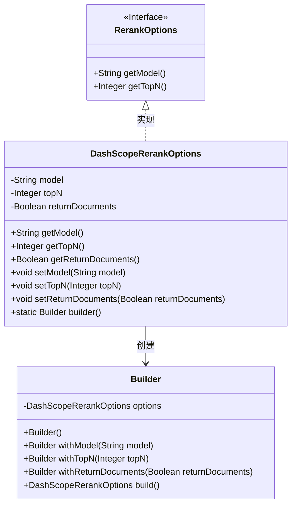
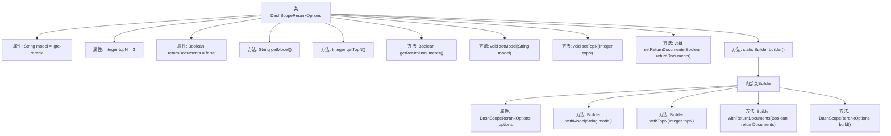

# 基础信息

|      |      |
|------|------|
| 名称 | DashScopeRerankOptions |
| 编码语言 | .java |
| 代码路径 | spring-ai-alibaba/spring-ai-alibaba-core/src/main/java/com/alibaba/cloud/ai/dashscope/rerank/DashScopeRerankOptions.java |
| 包名 | com.alibaba.cloud.ai.dashscope.rerank |
| 依赖项 | ['com.alibaba.cloud.ai.model.RerankOptions'] |
| 概述说明 | DashScopeRerankOptions类用于配置模型、文档数量和原始文档返回选项。 |

# 说明

DashScopeRerankOptions类用于配置模型的相关参数，包括选择使用的模型、指定返回的文档数量以及决定是否返回原始文档。通过设置这些选项，用户可以灵活调整文档排序和返回结果的方式，以满足不同的应用需求。

# 类列表 Class Summary

| 名称   | 类型  | 说明 |
|-------|------|-------------|
| DashScopeRerankOptions | class | DashScopeRerankOptions类用于设置模型、返回文档数量及是否返回原始文档。 |

## 类 DashScopeRerankOptions

|      |      |
|------|------|
| 访问范围 | public |
| 类型 | class |
| 名称 | DashScopeRerankOptions |
| 说明 | DashScopeRerankOptions类用于设置模型、返回文档数量及是否返回原始文档。 |

### UML类图

这段代码定义了一个 `DashScopeRerankOptions` 类，该类实现了 `RerankOptions` 接口。`DashScopeRerankOptions` 类包含三个私有字段：`model`、`topN` 和 `returnDocuments`，并提供了相应的 getter 和 setter 方法。此外，`DashScopeRerankOptions` 类还包含一个静态内部类 `Builder`，用于构建 `DashScopeRerankOptions` 对象。`Builder` 类提供了链式调用的方法，允许用户逐步设置 `DashScopeRerankOptions` 的属性，并通过 `build` 方法返回最终的 `DashScopeRerankOptions` 对象。

### 内部方法调用关系图

这段代码定义了一个名为 `DashScopeRerankOptions` 的类，用于配置重排选项。类中包含三个属性：`model`、`topN` 和 `returnDocuments`，分别表示模型ID、返回的文档数量和是否返回原始文档。类提供了这些属性的getter和setter方法，并且通过内部类 `Builder` 实现了构建者模式，方便链式调用设置属性并最终构建 `DashScopeRerankOptions` 对象。

### 字段列表 Field List

| 名称  | 类型  | 说明 |
|-------|-------|------|
| model = "gte-rerank" | String | 模型变量设置为"gte-rerank"。 |
| returnDocuments = false | Boolean | 设置返回文档标志为假。 |
| topN = 3 | Integer | 私有整型变量topN初始值为3。 |

### 方法列表 Method List

| 名称  | 类型  | 说明 |
|-------|-------|------|
| builder | Builder | 静态方法返回新的Builder实例。 |
| getReturnDocuments | Boolean | 该方法返回布尔值，表示是否返回文档。 |
| getTopN | Integer | 重写getTopN方法，返回topN值。 |
| setModel | void | 设置模型属性的方法。 |
| setTopN | void | 设置topN属性值为指定整数。 |
| getModel | String | 重写getModel方法，返回模型字段值。 |
| setReturnDocuments | void | 设置返回文档的方法，参数为布尔类型。 |

