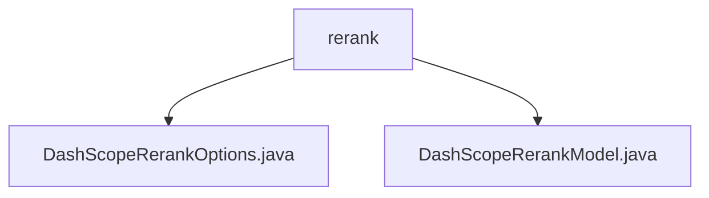

# 基础信息

|      |      |
|------|------|
| 名称 | rerank |
| 编码语言 | .java |
| 代码路径 | spring-ai-alibaba/spring-ai-alibaba-core/src/main/java/com/alibaba/cloud/ai/dashscope/rerank |
| 包名 | spring-ai-alibaba.spring-ai-alibaba-core.src.main.java.com.alibaba.cloud.ai.dashscope.rerank |
| 概述说明 | DashScopeRerankOptions类配置模型参数，DashScopeRerankModel类实现重排序，具备重试和选项合并功能。 |

# 说明

## 概述
该代码模块主要实现了文档重排序功能，集成了DashScope API，并提供了灵活的配置选项。通过`DashScopeRerankOptions`类，用户可以配置模型参数、指定返回的文档数量以及决定是否返回原始文档。`DashScopeRerankModel`类则负责实现具体的重排序逻辑，并集成了重试机制和选项合并功能，以确保处理过程的稳定性和灵活性。

## 主要业务场景
1. **文档重排序**：通过调用DashScope API，对文档进行重新排序，以满足不同的应用需求。
2. **配置灵活性**：用户可以通过`DashScopeRerankOptions`类自定义模型参数，如选择使用的模型、指定返回的文档数量等，以适应不同的业务场景。
3. **重试机制**：在遇到网络或API错误时，`DashScopeRerankModel`类会自动重试，提升系统的可靠性。
4. **选项合并**：允许用户自定义配置，并优化重排序效果，确保处理过程的灵活性和高效性。

该模块旨在为需要文档重排序的应用场景提供一个高效、可靠的解决方案，适用于各种需要对文档进行排序和优化的业务需求。

### 包内部结构视图

该流程图展示了`rerank`目录下的两个Java文件：`DashScopeRerankOptions.java`和`DashScopeRerankModel.java`。`rerank`作为父节点，包含了这两个文件，清晰地表示了它们之间的层级关系。

# 文件列表 File List

| 名称   | 类型  | 说明 |
|-------|------|-------------|
| [DashScopeRerankOptions.java](DashScopeRerankOptions.md) | file | DashScopeRerankOptions类用于配置模型、文档数量和原始文档返回选项。 |
| [DashScopeRerankModel.java](DashScopeRerankModel.md) | file | DashScopeRerankModel类集成DashScope API，实现重排序功能，支持重试和选项合并。 |

