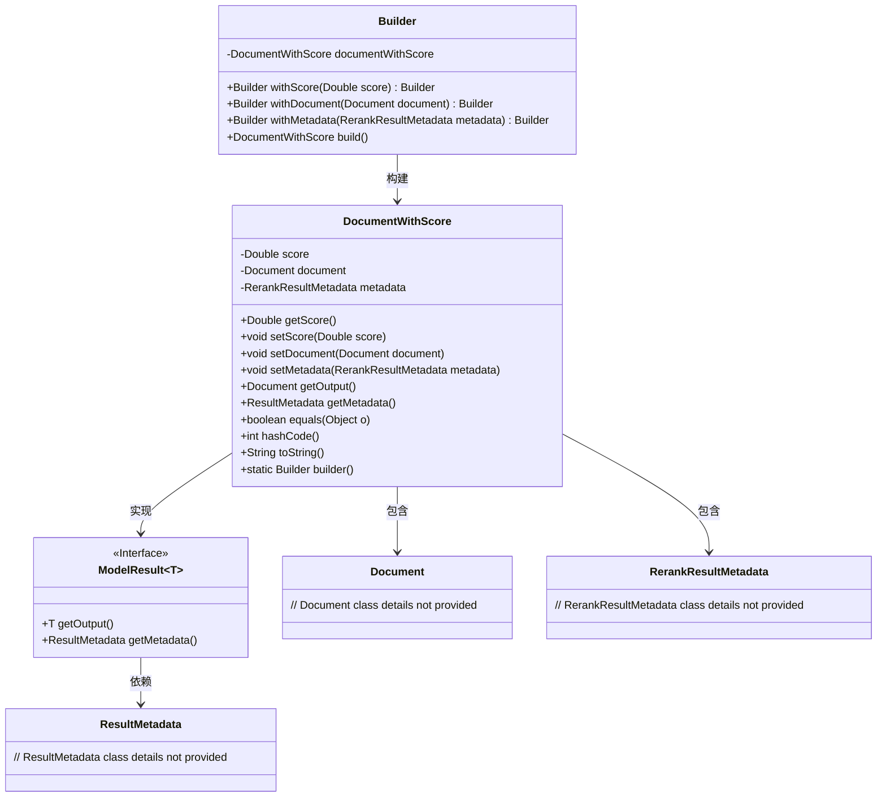

# 基础信息

|      |      |
|------|------|
| 名称 | DocumentWithScore |
| 编码语言 | .java |
| 代码路径 | spring-ai-alibaba/spring-ai-alibaba-core/src/main/java/com/alibaba/cloud/ai/document/DocumentWithScore.java |
| 包名 | com.alibaba.cloud.ai.document |
| 依赖项 | ['com.alibaba.cloud.ai.model.RerankResultMetadata', 'org.springframework.ai.document.Document', 'org.springframework.ai.model.ModelResult', 'org.springframework.ai.model.ResultMetadata', 'java.util.Objects'] |
| 概述说明 | DocumentWithScore类整合文档评分、信息和元数据，支持构建器模式和对象比较。 |

# 说明

DocumentWithScore类是一个用于管理文档评分、文档信息和元数据的类。它支持构建器模式，允许通过链式调用来创建和配置对象。此外，该类还支持对象比较功能，可以方便地对不同实例进行比较操作。这些特性使得DocumentWithScore类在处理文档相关数据时更加灵活和高效。

# 类列表 Class Summary

| 名称   | 类型  | 说明 |
|-------|------|-------------|
| DocumentWithScore | class | DocumentWithScore类包含文档评分、文档信息和元数据，支持构建器模式和对象比较。 |

## 类 DocumentWithScore

|      |      |
|------|------|
| 访问范围 | public |
| 类型 | class |
| 名称 | DocumentWithScore |
| 说明 | DocumentWithScore类包含文档评分、文档信息和元数据，支持构建器模式和对象比较。 |

### UML类图

### 描述
`DocumentWithScore` 类实现了 `ModelResult<Document>` 接口，包含文档的评分、文档信息以及重排结果的元数据。通过 `Builder` 类可以方便地构建 `DocumentWithScore` 对象。`DocumentWithScore` 类还提供了 `equals`、`hashCode` 和 `toString` 方法，用于对象的比较和字符串表示。`ModelResult` 接口定义了获取输出和元数据的方法，`Document` 和 `RerankResultMetadata` 类分别表示文档和重排结果的元数据。

### 内部方法调用关系图

```mermaid
graph TD
    A["类DocumentWithScore"]
    B["属性: Double score"]
    C["属性: Document document"]
    D["属性: RerankResultMetadata metadata"]
    E["方法: Double getScore()"]
    F["方法: void setScore(Double score)"]
    G["方法: void setDocument(Document document)"]
    H["方法: void setMetadata(RerankResultMetadata metadata)"]
    I["方法: static Builder builder()"]
    J["方法: Document getOutput()"]
    K["方法: ResultMetadata getMetadata()"]
    L["内部类: Builder"]
    M["方法: Builder withScore(Double score)"]
    N["方法: Builder withDocument(Document document)"]
    O["方法: Builder withMetadata(RerankResultMetadata metadata)"]
    P["方法: DocumentWithScore build()"]
    Q["方法: boolean equals(Object o)"]
    R["方法: int hashCode()"]
    S["方法: String toString()"]

    A --> B
    A --> C
    A --> D
    A --> E
    A --> F
    A --> G
    A --> H
    A --> I
    A --> J
    A --> K
    A --> L
    L --> M
    L --> N
    L --> O
    L --> P
    A --> Q
    A --> R
    A --> S
```

该流程图展示了`DocumentWithScore`类的结构及其内部方法调用关系。类包含三个属性：`score`、`document`和`metadata`，并提供了相应的getter和setter方法。此外，类还包含一个内部类`Builder`，用于构建`DocumentWithScore`对象。`Builder`类提供了`withScore`、`withDocument`和`withMetadata`方法，用于设置属性，并最终通过`build`方法返回`DocumentWithScore`对象。类还重写了`equals`、`hashCode`和`toString`方法，用于对象的比较、哈希计算和字符串表示。

### 字段列表 Field List

| 名称  | 类型  | 说明 |
|-------|-------|------|
| score | Double | 定义了一个私有的双精度浮点型变量score。 |
| document | Document | 声明一个私有的Document类型变量document。 |
| metadata | RerankResultMetadata | 私有变量metadata用于存储RerankResultMetadata类型的数据。 |

### 方法列表 Method List

| 名称  | 类型  | 说明 |
|-------|-------|------|
| setMetadata | void | 该方法用于设置元数据属性。 |
| setDocument | void | 方法用于设置文档对象。 |
| getMetadata | ResultMetadata | 重写getMetadata方法，返回当前对象的metadata属性。 |
| getOutput | Document | 重写getOutput方法，返回当前文档对象。 |
| builder | Builder | 静态方法`builder()`返回`Builder`类的新实例。 |
| getScore | Double | 获取当前分数的公共方法。 |
| toString | String | 重写toString方法，返回DocumentWithScore对象及其分数和文档信息。 |
| equals | boolean | 重写equals方法，比较对象引用、类类型及属性值是否相等。 |
| hashCode | int | 重写hashCode方法，使用score和document生成哈希值。 |
| setScore | void | 设置分数值的方法，接受双精度类型参数。 |

