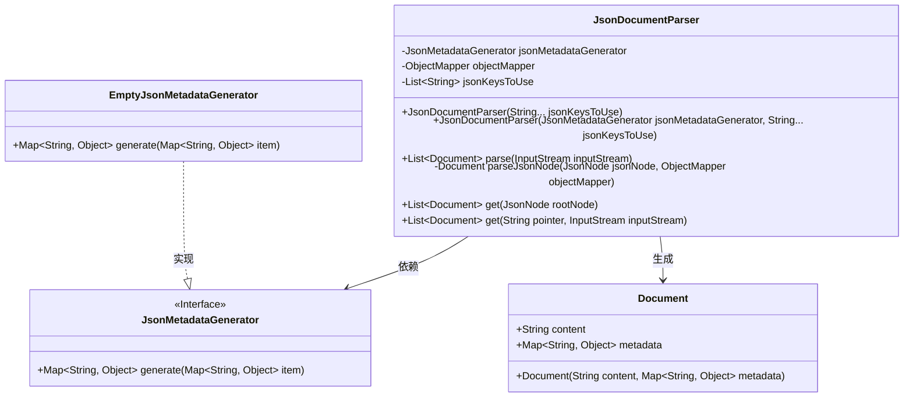

# 基础信息

|      |      |
|------|------|
| 名称 | JsonDocumentParser |
| 编码语言 | .java |
| 代码路径 | spring-ai-alibaba/spring-ai-alibaba-core/src/main/java/com/alibaba/cloud/ai/document/JsonDocumentParser.java |
| 包名 | com.alibaba.cloud.ai.document |
| 依赖项 | ['com.fasterxml.jackson.core.type.TypeReference', 'com.fasterxml.jackson.databind.JsonNode', 'com.fasterxml.jackson.databind.ObjectMapper', 'org.springframework.ai.document.Document', 'org.springframework.ai.reader.EmptyJsonMetadataGenerator', 'org.springframework.ai.reader.JsonMetadataGenerator', 'java.io.IOException', 'java.io.InputStream', 'java.util.Collections', 'java.util.List', 'java.util.Map', 'java.util.Objects', 'java.util.stream.StreamSupport'] |
| 概述说明 | JsonDocumentParser类解析JSON流，支持键和元数据生成。 |

# 说明

JsonDocumentParser类用于解析JSON输入流，将其转换为文档格式。该类支持通过指定键和元数据来生成文档，确保解析过程灵活且符合特定需求。

# 类列表 Class Summary

| 名称   | 类型  | 说明 |
|-------|------|-------------|
| JsonDocumentParser | class | JsonDocumentParser类解析JSON输入流为文档，支持指定键和元数据生成。 |

## 类 JsonDocumentParser

|      |      |
|------|------|
| 访问范围 | public |
| 类型 | class |
| 名称 | JsonDocumentParser |
| 说明 | JsonDocumentParser类解析JSON输入流为文档，支持指定键和元数据生成。 |

### UML类图

这段代码定义了一个`JsonDocumentParser`类，用于解析JSON文档并生成`Document`对象。`JsonDocumentParser`依赖于`JsonMetadataGenerator`接口来生成元数据，并且默认使用`EmptyJsonMetadataGenerator`实现。`JsonDocumentParser`通过`parse`方法解析输入的JSON流，并根据指定的JSON键生成文档内容。`get`方法允许通过JSON指针定位特定元素并生成文档。整体设计灵活，支持自定义元数据生成和JSON键的选择。

### 内部方法调用关系图

```mermaid
graph TD
    A["类JsonDocumentParser"]
    B["属性: JsonMetadataGenerator jsonMetadataGenerator"]
    C["属性: ObjectMapper objectMapper"]
    D["属性: List<String> jsonKeysToUse"]
    E["构造方法: JsonDocumentParser(String... jsonKeysToUse)"]
    F["构造方法: JsonDocumentParser(JsonMetadataGenerator jsonMetadataGenerator, String... jsonKeysToUse)"]
    G["方法: List<Document> parse(InputStream inputStream)"]
    H["方法: Document parseJsonNode(JsonNode jsonNode, ObjectMapper objectMapper)"]
    I["方法: List<Document> get(JsonNode rootNode)"]
    J["方法: List<Document> get(String pointer, InputStream inputStream)"]
    K["方法: JsonNode rootNode = this.objectMapper.readTree(inputStream)"]
    L["方法: JsonNode targetNode = rootNode.at(pointer)"]
    M["方法: Map<String, Object> metadata = this.jsonMetadataGenerator.generate(item)"]
    N["方法: String content = sb.isEmpty() ? item.toString() : sb.toString()"]
    O["方法: return new Document(content, metadata)"]
    P["方法: return Collections.singletonList(parseJsonNode(rootNode, this.objectMapper))"]
    Q["方法: return StreamSupport.stream(rootNode.spliterator(), true).map(jsonNode -> parseJsonNode(jsonNode, this.objectMapper)).toList()"]
    R["方法: throw new RuntimeException(e)"]
    S["方法: throw new IllegalArgumentException('Invalid JSON Pointer: ' + pointer)"]
    T["方法: throw new RuntimeException('Error reading JSON resource', e)"]

    A --> B
    A --> C
    A --> D
    A --> E
    A --> F
    A --> G
    A --> H
    A --> I
    A --> J
    G --> K
    G --> Q
    G --> P
    G --> R
    H --> M
    H --> N
    H --> O
    I --> Q
    I --> P
    J --> K
    J --> L
    J --> S
    J --> T
```

**描述：**
该流程图展示了`JsonDocumentParser`类的结构及其方法调用关系。类包含多个构造方法和实例方法，主要用于解析JSON文档并生成`Document`对象。流程从类的构造方法开始，展示了如何通过`parse`方法解析输入流，并根据JSON节点的类型（数组或单个节点）进行处理。此外，`get`方法通过JSON指针定位目标节点并返回解析后的文档列表。整个流程涵盖了异常处理和文档生成的关键步骤。

### 字段列表 Field List

| 名称  | 类型  | 说明 |
|-------|-------|------|
| jsonMetadataGenerator | JsonMetadataGenerator | 私有且不可变的JsonMetadataGenerator实例。 |
| objectMapper = new ObjectMapper() | ObjectMapper | 创建私有且不可变的ObjectMapper实例。 |
| jsonKeysToUse | List<String> | 私有不可变列表存储用于JSON处理的键名。 |

### 方法列表 Method List

| 名称  | 类型  | 说明 |
|-------|-------|------|
| parseJsonNode | Document | 解析JsonNode生成文档，提取指定键值并生成元数据。 |
| get | List<Document> | 方法通过JSON指针从输入流中提取目标节点并返回文档列表。 |
| parse | List<Document> | 解析输入流为文档列表，处理JSON数组或单节点，异常时抛出运行时错误。 |
| get | List<Document> | 解析JSON节点并返回文档列表，支持数组和单节点处理。 |

