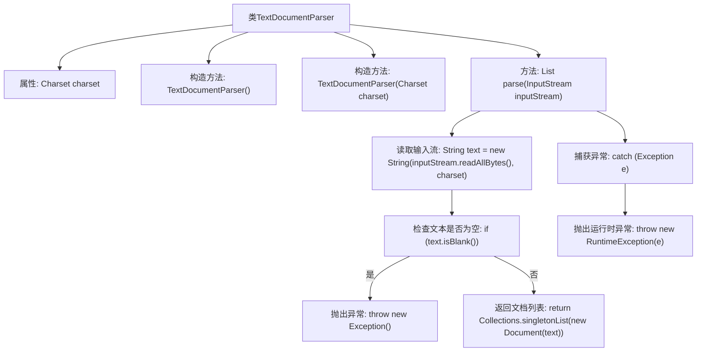

# 基础信息

|      |      |
|------|------|
| 名称 | TextDocumentParser |
| 编码语言 | .java |
| 代码路径 | spring-ai-alibaba/spring-ai-alibaba-core/src/main/java/com/alibaba/cloud/ai/document/TextDocumentParser.java |
| 包名 | com.alibaba.cloud.ai.document |
| 依赖项 | ['org.springframework.ai.document.Document', 'org.springframework.util.Assert', 'java.io.InputStream', 'java.nio.charset.Charset', 'java.util.Collections', 'java.util.List', 'java.nio.charset.StandardCharsets.UTF_8'] |
| 概述说明 | TextDocumentParser类实现DocumentParser接口，解析输入流为文档列表。 |

# 说明

TextDocumentParser类实现了DocumentParser接口，其主要功能是通过指定的字符集将输入流解析为文档列表。该类确保了解析过程的准确性和一致性，能够处理不同字符集的输入流，并生成结构化的文档列表以供后续使用。

# 类列表 Class Summary

| 名称   | 类型  | 说明 |
|-------|------|-------------|
| TextDocumentParser | class | TextDocumentParser类实现DocumentParser接口，使用指定字符集解析输入流为文档列表。 |


## 类 TextDocumentParser

|      |      |
|------|------|
| 访问范围 | public |
| 类型 | class |
| 名称 | TextDocumentParser |
| 说明 | TextDocumentParser类实现DocumentParser接口，使用指定字符集解析输入流为文档列表。 |


### UML类图

```mermaid
classDiagram
    class Document {
        +String content
        +Document(String content)
    }

    class TextDocumentParser {
        -Charset charset
        +TextDocumentParser()
        +TextDocumentParser(Charset charset)
        +List~Document~ parse(InputStream inputStream)
    }

    <<Interface>> DocumentParser {
        +List~Document~ parse(InputStream inputStream)
    }

    TextDocumentParser --> Document : 创建
    TextDocumentParser ..|> DocumentParser : 实现
```

这段代码定义了一个 `TextDocumentParser` 类，该类实现了 `DocumentParser` 接口，用于解析文本文件并生成 `Document` 对象。`TextDocumentParser` 类包含两个构造函数，一个使用默认字符集 `UTF_8`，另一个允许指定字符集。`parse` 方法从输入流中读取数据并将其转换为字符串，如果字符串为空则抛出异常，否则返回包含单个 `Document` 对象的列表。`Document` 类用于存储解析后的文本内容。


### 内部方法调用关系图



**描述：**  
`TextDocumentParser`类用于解析文本文档，包含两个构造方法，分别使用默认字符集和指定字符集初始化。`parse`方法读取输入流并将其转换为字符串，若字符串为空则抛出异常，否则返回包含该文本的文档列表。若在解析过程中发生异常，则捕获并抛出运行时异常。

### 字段列表 Field List

| 名称  | 类型  | 说明 |
|-------|-------|------|
| charset | Charset | 私有不可变的字符集变量。 |

### 方法列表 Method List

| 名称  | 类型  | 说明 |
|-------|-------|------|
| parse | List<Document> | 解析输入流为文档列表，若文本为空则抛出异常。 |


