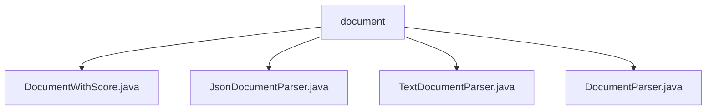

# 基础信息

|      |      |
|------|------|
| 名称 | document |
| 编码语言 | .java |
| 代码路径 | spring-ai-alibaba/spring-ai-alibaba-core/src/main/java/com/alibaba/cloud/ai/document |
| 包名 | spring-ai-alibaba.spring-ai-alibaba-core.src.main.java.com.alibaba.cloud.ai.document |
| 概述说明 | DocumentWithScore类管理文档评分信息，支持链式调用和对象比较。JsonDocumentParser解析JSON流生成文档。TextDocumentParser将输入流解析为文档列表。 |

# 说明

## 概述
该代码模块主要围绕文档处理和解析展开，提供了多种工具和类来管理文档的评分、信息、元数据以及解析不同类型的输入流（如JSON和文本）为结构化文档。模块中的类设计灵活，支持构建器模式和链式调用，同时提供了对象比较功能，使得文档处理更加高效和易于维护。

## 主要业务场景
1. **文档管理**：通过`DocumentWithScore`类，用户可以高效地管理文档的评分、信息和元数据，支持构建器模式和对象比较，适用于需要灵活配置和比较文档的场景。
2. **JSON文档解析**：`JsonDocumentParser`类用于将JSON输入流解析为文档格式，支持通过指定键和元数据生成文档，适用于需要从JSON数据中提取结构化信息的场景。
3. **文本文档解析**：`TextDocumentParser`类实现了`DocumentParser`接口，能够将不同字符集的输入流解析为文档列表，适用于处理文本数据并生成结构化文档的场景。

### 包内部结构视图

该流程图展示了`document`文件夹下的文件层级关系。`document`作为根节点，包含了四个子节点：`DocumentWithScore.java`、`JsonDocumentParser.java`、`TextDocumentParser.java`和`DocumentParser.java`。这些文件均位于`document`目录下，且没有进一步的嵌套层级，结构清晰简洁。

# 文件列表 File List

| 名称   | 类型  | 说明 |
|-------|------|-------------|
| [DocumentParser.java](DocumentParser.md) | file | 无内容提供，无法生成概要描述。 |
| [TextDocumentParser.java](TextDocumentParser.md) | file | TextDocumentParser类实现DocumentParser接口，解析输入流为文档列表。 |
| [JsonDocumentParser.java](JsonDocumentParser.md) | file | JsonDocumentParser类解析JSON流，支持键和元数据生成。 |
| [DocumentWithScore.java](DocumentWithScore.md) | file | DocumentWithScore类整合文档评分、信息和元数据，支持构建器模式和对象比较。 |

