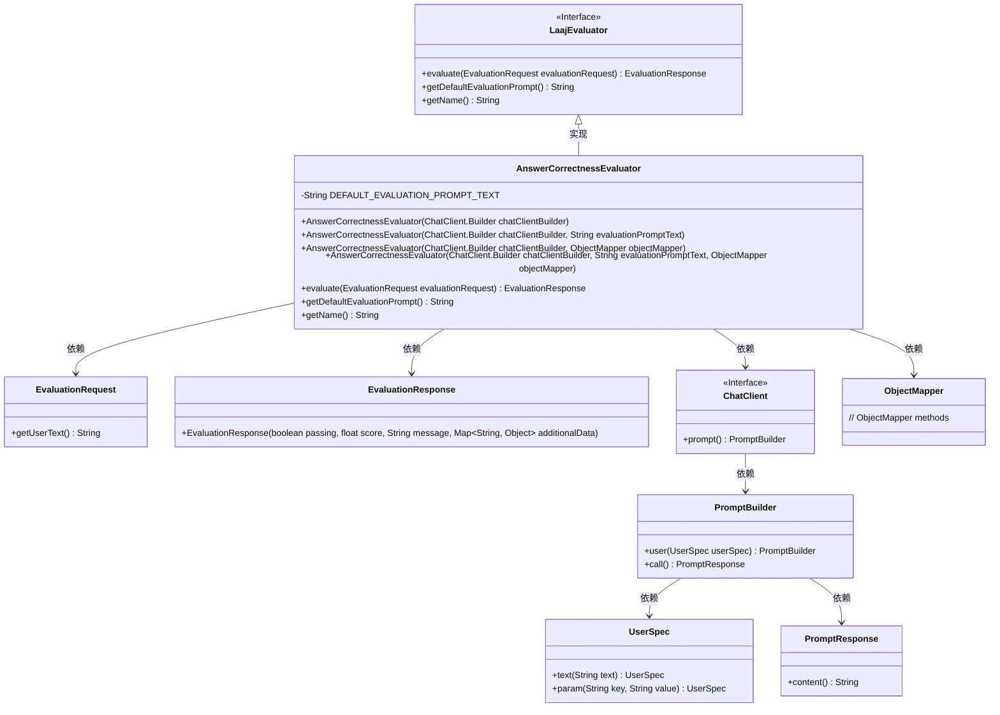
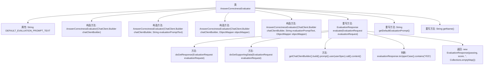

# 基础信息

|      |      |
|------|------|
| 名称 | AnswerCorrectnessEvaluator |
| 编码语言 | .java |
| 代码路径 | spring-ai-alibaba/spring-ai-alibaba-core/src/main/java/com/alibaba/cloud/ai/evaluation/AnswerCorrectnessEvaluator.java |
| 包名 | com.alibaba.cloud.ai.evaluation |
| 依赖项 | ['com.fasterxml.jackson.databind.ObjectMapper', 'org.springframework.ai.chat.client.ChatClient', 'org.springframework.ai.evaluation.EvaluationRequest', 'org.springframework.ai.evaluation.EvaluationResponse', 'java.util.Collections'] |
| 概述说明 | AnswerCorrectnessEvaluator类评估响应上下文，返回YES或NO及评分。 |

# 说明

AnswerCorrectnessEvaluator类的主要功能是评估给定响应是否符合上下文要求。它通过分析响应的内容，判断其是否与上下文一致，并最终返回一个简单的YES或NO结果，同时提供一个评分以量化评估的准确性。该类的设计旨在确保响应的正确性和相关性，帮助用户快速判断信息是否符合预期。

# 类列表 Class Summary

| 名称   | 类型  | 说明 |
|-------|------|-------------|
| AnswerCorrectnessEvaluator | class | AnswerCorrectnessEvaluator类用于评估响应是否符合上下文，返回YES或NO及评分。 |

## 类 AnswerCorrectnessEvaluator

|      |      |
|------|------|
| 访问范围 | public |
| 类型 | class |
| 名称 | AnswerCorrectnessEvaluator |
| 说明 | AnswerCorrectnessEvaluator类用于评估响应是否符合上下文，返回YES或NO及评分。 |

### UML类图

这段代码定义了一个`AnswerCorrectnessEvaluator`类，它继承自`LaajEvaluator`接口。该类用于评估查询响应是否符合提供的上下文信息。它通过构造器注入`ChatClient.Builder`和`ObjectMapper`，并实现了`evaluate`方法来执行评估逻辑。评估结果通过`EvaluationResponse`返回。代码中使用了泛型、接口实现和依赖注入等设计模式，确保了代码的灵活性和可扩展性。

### 内部方法调用关系图

这段代码定义了一个名为 `AnswerCorrectnessEvaluator` 的类，继承自 `LaajEvaluator`，用于评估查询的响应是否符合提供的上下文信息。类中包含多个构造方法和重写方法，主要功能是通过 `evaluate` 方法对请求进行评估，判断响应是否与上下文一致，并返回评估结果。流程图展示了类的结构和方法调用关系，帮助理解代码的执行流程。

### 字段列表 Field List

| 名称  | 类型  | 说明 |
|-------|-------|------|
| DEFAULT_EVALUATION_PROMPT_TEXT = """			你的任务是评估Query返回的Response是否符合提供的Context信息。			你有两个选项来回答，要么是"YES"/"NO"。			如果查询的响应与上下文信息一致，回答"YES"，否则回答"NO"。			Query: {query}			Response: {response}			Context: {context}			Answer: "			""" | String | 任务：评估Response是否符合Context，回答YES或NO。 |

### 方法列表 Method List

| 名称  | 类型  | 说明 |
|-------|-------|------|
| getDefaultEvaluationPrompt | String | 重写方法，返回默认评估提示文本。 |
| getName | String | 重写getName方法，返回字符串"correctness"。 |
| evaluate | EvaluationResponse | 方法验证请求并生成评估响应，根据响应内容判断是否通过。 |

