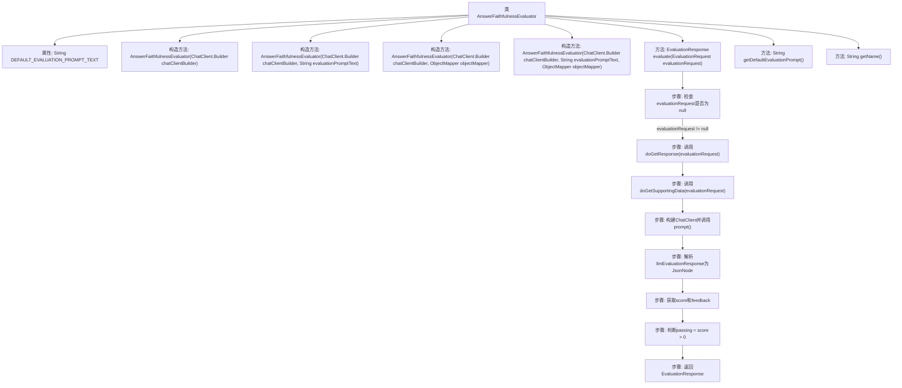

# 基础信息

|      |      |
|------|------|
| 名称 | AnswerFaithfulnessEvaluator |
| 编码语言 | .java |
| 代码路径 | spring-ai-alibaba/spring-ai-alibaba-core/src/main/java/com/alibaba/cloud/ai/evaluation/AnswerFaithfulnessEvaluator.java |
| 包名 | com.alibaba.cloud.ai.evaluation |
| 依赖项 | ['com.fasterxml.jackson.core.JsonProcessingException', 'com.fasterxml.jackson.databind.JsonNode', 'com.fasterxml.jackson.databind.ObjectMapper', 'org.springframework.ai.chat.client.ChatClient', 'org.springframework.ai.evaluation.EvaluationRequest', 'org.springframework.ai.evaluation.EvaluationResponse', 'org.springframework.ai.evaluation.Evaluator', 'org.springframework.ai.model.Content', 'java.util.Collections', 'java.util.List', 'java.util.stream.Collectors'] |
| 概述说明 | AnswerFaithfulnessEvaluator类评估答案真实性，输出JSON评分和反馈。 |

# 说明

AnswerFaithfulnessEvaluator类的主要功能是评估学生答案是否基于事实。该类通过分析学生答案的内容，判断其是否与已知事实相符，并输出JSON格式的评分和反馈。评分部分可能包括准确性、完整性和相关性等指标，而反馈则提供具体的改进建议或指出答案中的问题。该类的设计旨在帮助教育者和学生更好地理解答案的质量，并促进基于事实的学习和思考。

# 类列表 Class Summary

| 名称   | 类型  | 说明 |
|-------|------|-------------|
| AnswerFaithfulnessEvaluator | class | AnswerFaithfulnessEvaluator类用于评估学生答案是否基于事实，输出JSON格式评分和反馈。 |


## 类 AnswerFaithfulnessEvaluator

|      |      |
|------|------|
| 访问范围 | public |
| 类型 | class |
| 名称 | AnswerFaithfulnessEvaluator |
| 说明 | AnswerFaithfulnessEvaluator类用于评估学生答案是否基于事实，输出JSON格式评分和反馈。 |


### UML类图

```mermaid
classDiagram
    class LaajEvaluator {
        <<Interface>>
        +EvaluationResponse evaluate(EvaluationRequest evaluationRequest)
        +String getDefaultEvaluationPrompt()
        +String getName()
    }

    class AnswerFaithfulnessEvaluator {
        -String DEFAULT_EVALUATION_PROMPT_TEXT
        +AnswerFaithfulnessEvaluator(ChatClient.Builder chatClientBuilder)
        +AnswerFaithfulnessEvaluator(ChatClient.Builder chatClientBuilder, String evaluationPromptText)
        +AnswerFaithfulnessEvaluator(ChatClient.Builder chatClientBuilder, ObjectMapper objectMapper)
        +AnswerFaithfulnessEvaluator(ChatClient.Builder chatClientBuilder, String evaluationPromptText, ObjectMapper objectMapper)
        +EvaluationResponse evaluate(EvaluationRequest evaluationRequest)
        +String getDefaultEvaluationPrompt()
        +String getName()
    }

    class EvaluationRequest {
        // 用于传递评估请求的类
    }

    class EvaluationResponse {
        -boolean passing
        -float score
        -String feedback
        -Map~String, Object~ additionalData
        +EvaluationResponse(boolean passing, float score, String feedback, Map~String, Object~ additionalData)
    }

    class ChatClient {
        <<Interface>>
        +ChatClient.Builder build()
        +Prompt prompt()
    }

    class ObjectMapper {
        +JsonNode readTree(String content)
    }

    class JsonNode {
        // 用于表示JSON节点的类
    }

    class JsonProcessingException {
        // 用于表示JSON处理异常的类
    }

    LaajEvaluator <|-- AnswerFaithfulnessEvaluator : 实现
    AnswerFaithfulnessEvaluator --> EvaluationRequest : 依赖 : 评估请求
    AnswerFaithfulnessEvaluator --> EvaluationResponse : 依赖 : 评估响应
    AnswerFaithfulnessEvaluator --> ChatClient : 依赖 : 构建ChatClient
    AnswerFaithfulnessEvaluator --> ObjectMapper : 依赖 : 解析JSON
    ObjectMapper --> JsonNode : 依赖 : 生成JSON节点
    ObjectMapper --> JsonProcessingException : 依赖 : 处理异常
```

**描述：**
`AnswerFaithfulnessEvaluator`类继承自`LaajEvaluator`接口，用于评估学生回答的忠实度。它通过`ChatClient`与LLM交互，获取评估结果，并使用`ObjectMapper`解析JSON响应。该类包含多个构造函数，支持不同的初始化方式，并实现了`evaluate`方法以执行评估逻辑。评估结果以`EvaluationResponse`对象返回，包含评分、反馈等信息。


### 内部方法调用关系图



这段代码定义了一个名为`AnswerFaithfulnessEvaluator`的类，该类继承自`LaajEvaluator`。其主要功能是评估学生回答的忠实度，即判断学生的回答是否基于给定的事实内容。代码中包含多个构造方法，用于初始化对象，并重写了`evaluate`方法，该方法通过调用`ChatClient`进行提示生成，并解析返回的JSON响应来获取评分和反馈。流程图展示了从检查输入参数到最终返回评估结果的完整流程。

### 字段列表 Field List

| 名称  | 类型  | 说明 |
|-------|-------|------|
| DEFAULT_EVALUATION_PROMPT_TEXT = """			您是一名评测专家，能够基于提供的评分标准和内容信息进行评分。			您将获得一些FACTS(事实内容)和STUDENT ANSWER。			以下是评分标准：			(1) 确保STUDENT ANSWER的内容是基于FACTS的事实内容，不能随意编纂。			(2) 确保STUDENT ANSWER的内容没有超出FACTS的内容范围外的虚假信息。			Score:			得分为1意味着STUDENT ANSWER满足所有标准。这是最高（最佳）得分。			得分为0意味着STUDENT ANSWER没有满足所有标准。这是最低的得分。			请逐步解释您的推理，以确保您的推理和结论正确，避免简单地陈述正确答案。			最终答案按照标准的json格式输出,不要使用markdown的格式, 比如:			\\{"score": 0.7, "feedback": "STUDENT ANSWER的内容超出了FACTS的事实内容。"\\}			FACTS: {context}			STUDENT ANSWER: {student_answer}			""" | String | 评测专家根据FACTS和STUDENT ANSWER评分，确保内容真实且不超范围，输出JSON格式结果。 |

### 方法列表 Method List

| 名称  | 类型  | 说明 |
|-------|-------|------|
| getName | String | 重写getName方法，返回字符串"faithfulness"。 |
| getDefaultEvaluationPrompt | String | 重写getDefaultEvaluationPrompt方法，返回默认评估提示文本。 |
| evaluate | EvaluationResponse | 方法评估请求，获取响应和数据，调用LLM生成评估结果，返回评分和反馈。 |


