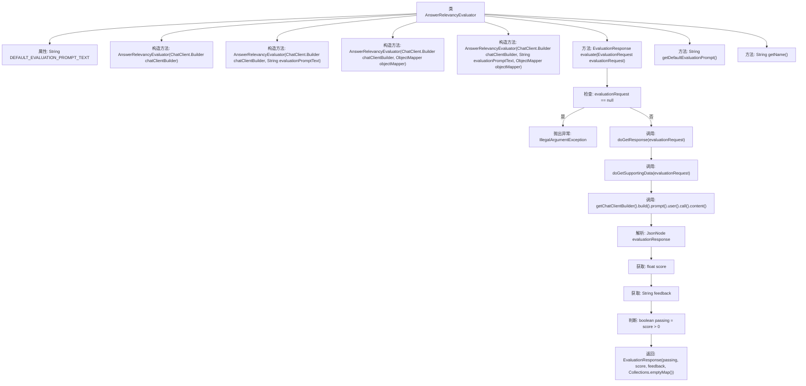

# 基础信息

|      |      |
|------|------|
| 名称 | AnswerRelevancyEvaluator |
| 编码语言 | .java |
| 代码路径 | spring-ai-alibaba/spring-ai-alibaba-core/src/main/java/com/alibaba/cloud/ai/evaluation/AnswerRelevancyEvaluator.java |
| 包名 | com.alibaba.cloud.ai.evaluation |
| 依赖项 | ['com.fasterxml.jackson.core.JsonProcessingException', 'com.fasterxml.jackson.databind.JsonNode', 'com.fasterxml.jackson.databind.ObjectMapper', 'org.springframework.ai.chat.client.ChatClient', 'org.springframework.ai.evaluation.EvaluationRequest', 'org.springframework.ai.evaluation.EvaluationResponse', 'java.util.Collections'] |
| 概述说明 | AnswerRelevancyEvaluator类评估学生答案与标准答案的相关性，输出评分和反馈。 |

# 说明

AnswerRelevancyEvaluator类的主要功能是评估学生提供的答案与标准答案之间的相关性。该类通过分析学生答案的内容，与标准答案进行对比，最终输出一个评分和相应的反馈。评分反映了学生答案与标准答案的匹配程度，而反馈则提供了具体的改进建议或指出答案中的不足之处。该类的设计旨在帮助教师或系统自动化地评估学生答案的准确性和相关性，从而提高评估效率和准确性。

# 类列表 Class Summary

| 名称   | 类型  | 说明 |
|-------|------|-------------|
| AnswerRelevancyEvaluator | class | AnswerRelevancyEvaluator类用于评估学生答案与标准答案的相关性，输出评分和反馈。 |


## 类 AnswerRelevancyEvaluator

|      |      |
|------|------|
| 访问范围 | public |
| 类型 | class |
| 名称 | AnswerRelevancyEvaluator |
| 说明 | AnswerRelevancyEvaluator类用于评估学生答案与标准答案的相关性，输出评分和反馈。 |


### UML类图

```mermaid
classDiagram
    class LaajEvaluator {
        <<Interface>>
        +evaluate(EvaluationRequest evaluationRequest) EvaluationResponse
        +getDefaultEvaluationPrompt() String
        +getName() String
    }

    class AnswerRelevancyEvaluator {
        -String DEFAULT_EVALUATION_PROMPT_TEXT
        +AnswerRelevancyEvaluator(ChatClient.Builder chatClientBuilder)
        +AnswerRelevancyEvaluator(ChatClient.Builder chatClientBuilder, String evaluationPromptText)
        +AnswerRelevancyEvaluator(ChatClient.Builder chatClientBuilder, ObjectMapper objectMapper)
        +AnswerRelevancyEvaluator(ChatClient.Builder chatClientBuilder, String evaluationPromptText, ObjectMapper objectMapper)
        +evaluate(EvaluationRequest evaluationRequest) EvaluationResponse
        +getDefaultEvaluationPrompt() String
        +getName() String
    }

    class EvaluationRequest {
        +String getUserText()
    }

    class EvaluationResponse {
        +boolean passing
        +float score
        +String feedback
        +Map~String, Object~ additionalData
    }

    class ChatClient {
        <<Interface>>
        +prompt() PromptBuilder
    }

    class ObjectMapper {
        +readTree(String content) JsonNode
    }

    class JsonNode {
        +asDouble() double
        +asText() String
    }

    LaajEvaluator <|-- AnswerRelevancyEvaluator : 实现
    AnswerRelevancyEvaluator --> EvaluationRequest : 依赖 : 接收评估请求
    AnswerRelevancyEvaluator --> EvaluationResponse : 依赖 : 返回评估结果
    AnswerRelevancyEvaluator --> ChatClient : 依赖 : 使用ChatClient进行交互
    AnswerRelevancyEvaluator --> ObjectMapper : 依赖 : 使用ObjectMapper解析JSON
    ObjectMapper --> JsonNode : 依赖 : 生成JsonNode
```

**描述：**  
`AnswerRelevancyEvaluator` 类继承自 `LaajEvaluator` 接口，用于评估学生答案的相关性。它通过 `ChatClient` 与语言模型交互，获取评估结果，并使用 `ObjectMapper` 解析 JSON 数据。评估结果包含分数、反馈和是否通过的标志。该类提供了多个构造函数，允许自定义评估提示文本和 JSON 解析器。


### 内部方法调用关系图



这段代码定义了一个名为`AnswerRelevancyEvaluator`的类，该类继承自`LaajEvaluator`。其主要功能是通过调用ChatClient进行问答相关性评估，并将结果以`EvaluationResponse`对象返回。代码中包含了多个构造方法和重写方法，其中`evaluate`方法是核心，负责处理评估请求、调用ChatClient、解析响应并返回评估结果。流程图展示了从请求处理到结果返回的完整流程，包括异常处理和数据解析等关键步骤。

### 字段列表 Field List

| 名称  | 类型  | 说明 |
|-------|-------|------|
| DEFAULT_EVALUATION_PROMPT_TEXT = """			您是一名评测专家，能够基于提供的评分标准和内容信息进行评分。			您将获得一个QUESTION, GROUND TRUTH (correct) ANSWER和STUDENT ANSWER。			以下是评分标准：			(1) 基于提供的GROUND TRUTH ANSWER作为正确基准答案，对STUDENT ANSWER的事实性、准确性和相关性进行评分。			(2) 确保STUDENT ANSWER不包含任何冲突的陈述和内容。			(3) 可以接受STUDENT ANSWER比GROUND TRUTH ANSWER包含更多的信息，只要对于GROUND TRUTH ANSWER保证事实性、准确性和相关性.			Score:			得分为1意味着STUDENT ANSWER满足所有标准。这是最高（最佳）得分。			得分为0意味着STUDENT ANSWER没有满足所有标准。这是最低的得分。			请逐步解释您的推理，以确保您的推理和结论正确。			避免简单地陈述正确答案。			最终答案按照标准的json格式输出, 比如:			\\{"score": 0.7, "feedback": "GROUND TRUTH ANSWER与STUDENT ANSWER完全不相关。"\\}			QUESTION: {question}			GROUND TRUTH ANSWER: {correct_answer}			STUDENT ANSWER: {student_answer}			""" | String | 评测专家根据标准答案评估学生答案，确保事实性、准确性和相关性，输出JSON格式评分和反馈。 |

### 方法列表 Method List

| 名称  | 类型  | 说明 |
|-------|-------|------|
| getDefaultEvaluationPrompt | String | 重写方法返回默认评估提示文本。 |
| getName | String | 重写getName方法，返回值为"relevancy"。 |
| evaluate | EvaluationResponse | 方法evaluate处理评估请求，验证非空后获取响应和上下文，调用ChatClient生成评估结果，解析JSON返回评分和反馈。 |


