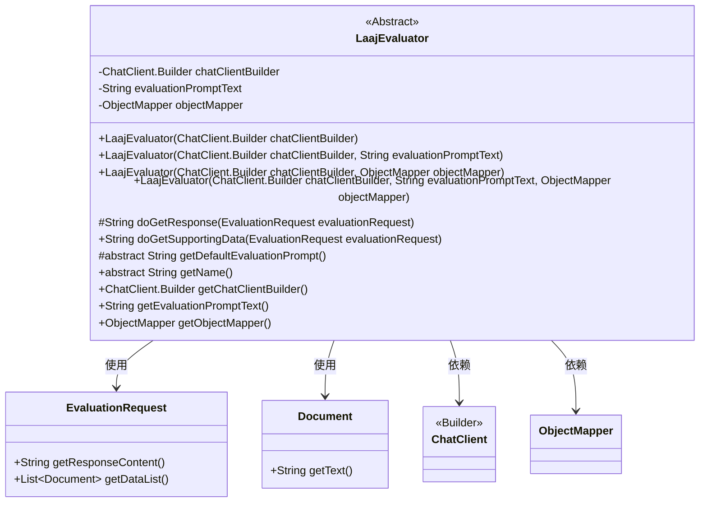

# 基础信息

|      |      |
|------|------|
| 名称 | LaajEvaluator |
| 编码语言 | .java |
| 代码路径 | spring-ai-alibaba/spring-ai-alibaba-core/src/main/java/com/alibaba/cloud/ai/evaluation/LaajEvaluator.java |
| 包名 | com.alibaba.cloud.ai.evaluation |
| 依赖项 | ['com.fasterxml.jackson.databind.ObjectMapper', 'org.springframework.ai.chat.client.ChatClient', 'org.springframework.ai.document.Document', 'org.springframework.ai.evaluation.EvaluationRequest', 'org.springframework.ai.evaluation.Evaluator', 'java.util.List', 'java.util.stream.Collectors'] |
| 概述说明 | LaajEvaluator类实现Evaluator接口，含ChatClient.Builder等，提供多种构造方法。 |

# 说明

LaajEvaluator类实现了Evaluator接口，集成了ChatClient.Builder、evaluationPromptText和ObjectMapper等关键组件。该类提供了多种构造方法，支持灵活的对象初始化，并具备丰富的数据获取功能，确保能够高效地进行评估操作。

# 类列表 Class Summary

| 名称   | 类型  | 说明 |
|-------|------|-------------|
| LaajEvaluator | class | LaajEvaluator类实现Evaluator接口，包含ChatClient.Builder、evaluationPromptText和ObjectMapper，提供多种构造方法和数据获取功能。 |

## 类 LaajEvaluator

|      |      |
|------|------|
| 访问范围 | public abstract |
| 类型 | class |
| 名称 | LaajEvaluator |
| 说明 | LaajEvaluator类实现Evaluator接口，包含ChatClient.Builder、evaluationPromptText和ObjectMapper，提供多种构造方法和数据获取功能。 |

### UML类图

**描述：**  
`LaajEvaluator` 是一个抽象类，用于处理评估请求。它包含多个构造函数，允许通过不同的参数组合初始化对象。类中包含了一些方法用于获取响应内容、支持数据、默认评估提示等。`LaajEvaluator` 依赖于 `EvaluationRequest`、`Document`、`ChatClient.Builder` 和 `ObjectMapper` 类来完成其功能。

### 内部方法调用关系图

```mermaid
graph TD
    A["抽象类LaajEvaluator"]
    B["属性: ChatClient.Builder chatClientBuilder"]
    C["属性: String evaluationPromptText"]
    D["属性: ObjectMapper objectMapper"]
    E["构造方法: LaajEvaluator(ChatClient.Builder chatClientBuilder)"]
    F["构造方法: LaajEvaluator(ChatClient.Builder chatClientBuilder, String evaluationPromptText)"]
    G["构造方法: LaajEvaluator(ChatClient.Builder chatClientBuilder, ObjectMapper objectMapper)"]
    H["构造方法: LaajEvaluator(ChatClient.Builder chatClientBuilder, String evaluationPromptText, ObjectMapper objectMapper)"]
    I["方法: protected String doGetResponse(EvaluationRequest evaluationRequest)"]
    J["方法: public String doGetSupportingData(EvaluationRequest evaluationRequest)"]
    K["抽象方法: protected abstract String getDefaultEvaluationPrompt()"]
    L["抽象方法: public abstract String getName()"]
    M["方法: public ChatClient.Builder getChatClientBuilder()"]
    N["方法: public String getEvaluationPromptText()"]
    O["方法: public ObjectMapper getObjectMapper()"]

    A --> B
    A --> C
    A --> D
    A --> E
    A --> F
    A --> G
    A --> H
    A --> I
    A --> J
    A --> K
    A --> L
    A --> M
    A --> N
    A --> O
```

这段代码定义了一个名为`LaajEvaluator`的抽象类，该类包含多个构造方法和成员方法。类中有三个属性：`chatClientBuilder`、`evaluationPromptText`和`objectMapper`。构造方法用于初始化这些属性，而其他方法则提供了对这些属性的访问和处理功能。其中，`doGetResponse`和`doGetSupportingData`方法用于处理请求数据，而`getDefaultEvaluationPrompt`和`getName`是抽象方法，需要在子类中实现。

### 字段列表 Field List

| 名称  | 类型  | 说明 |
|-------|-------|------|
| chatClientBuilder | ChatClient.Builder | 私有变量chatClientBuilder用于构建ChatClient实例。 |
| objectMapper | ObjectMapper | 声明了一个私有的ObjectMapper对象。 |
| evaluationPromptText | String | 私有字符串变量存储评估提示文本。 |

### 方法列表 Method List

| 名称  | 类型  | 说明 |
|-------|-------|------|
| doGetResponse | String | 该方法返回评估请求的响应内容。 |
| getObjectMapper | ObjectMapper | 返回对象映射器实例。 |
| getName | String | 抽象方法，返回字符串类型的名称。 |
| doGetSupportingData | String | 方法doGetSupportingData过滤非空文档并返回拼接文本。 |
| getEvaluationPromptText | String | 获取评估提示文本的方法。 |
| getChatClientBuilder | ChatClient.Builder | 获取ChatClient.Builder实例的方法。 |
| getDefaultEvaluationPrompt | String | 获取默认评估提示的受保护抽象方法。 |

