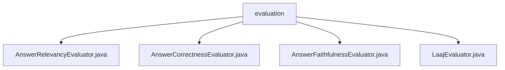

# 基础信息

|      |      |
|------|------|
| 名称 | evaluation |
| 编码语言 | .java |
| 代码路径 | spring-ai-alibaba/spring-ai-alibaba-core/src/main/java/com/alibaba/cloud/ai/evaluation |
| 包名 | spring-ai-alibaba.spring-ai-alibaba-core.src.main.java.com.alibaba.cloud.ai.evaluation |
| 概述说明 | AnswerRelevancyEvaluator评估答案相关性，AnswerCorrectnessEvaluator判断响应正确性，AnswerFaithfulnessEvaluator检验答案事实性，LaajEvaluator集成多种评估功能。 |

# 说明

## 概述
该代码模块主要包含多个评估类，旨在自动化地评估学生答案的质量和准确性。这些评估类通过分析学生答案的内容，与标准答案或已知事实进行对比，输出评分和反馈，帮助教师或系统快速判断答案的相关性、正确性和基于事实的程度。模块的设计目标是提高评估效率和准确性，促进基于事实的学习和思考。

## 主要业务场景
1. **答案相关性评估**：`AnswerRelevancyEvaluator`类用于评估学生答案与标准答案之间的相关性，输出评分和反馈，帮助教师或系统判断答案的匹配程度。
2. **答案正确性评估**：`AnswerCorrectnessEvaluator`类用于评估给定响应是否符合上下文要求，返回简单的YES或NO结果，并提供评分以量化评估的准确性。
3. **答案基于事实的评估**：`AnswerFaithfulnessEvaluator`类用于评估学生答案是否基于已知事实，输出JSON格式的评分和反馈，帮助教育者和学生理解答案的质量。
4. **灵活评估操作**：`LaajEvaluator`类实现了`Evaluator`接口，集成了多个关键组件，支持灵活的对象初始化和高效的数据获取，确保评估操作的灵活性和高效性。

这些类共同构成了一个完整的评估体系，适用于教育、自动化测试等需要快速、准确评估答案质量的场景。

### 包内部结构视图

该流程图展示了`evaluation`文件夹下的四个Java文件之间的层级关系。`evaluation`作为根节点，包含了`AnswerRelevancyEvaluator.java`、`AnswerCorrectnessEvaluator.java`、`AnswerFaithfulnessEvaluator.java`和`LaajEvaluator.java`四个子节点。这些文件均位于`spring-ai-alibaba/spring-ai-alibaba-core/src/main/java/com/alibaba/cloud/ai/evaluation`路径下，用于不同的评估功能。

# 文件列表 File List

| 名称   | 类型  | 说明 |
|-------|------|-------------|
| [LaajEvaluator.java](LaajEvaluator.md) | file | LaajEvaluator类实现Evaluator接口，含ChatClient.Builder等，提供多种构造方法。 |
| [AnswerCorrectnessEvaluator.java](AnswerCorrectnessEvaluator.md) | file | AnswerCorrectnessEvaluator类评估响应上下文，返回YES或NO及评分。 |
| [AnswerFaithfulnessEvaluator.java](AnswerFaithfulnessEvaluator.md) | file | AnswerFaithfulnessEvaluator类评估答案真实性，输出JSON评分和反馈。 |
| [AnswerRelevancyEvaluator.java](AnswerRelevancyEvaluator.md) | file | AnswerRelevancyEvaluator类评估学生答案与标准答案的相关性，输出评分和反馈。 |

