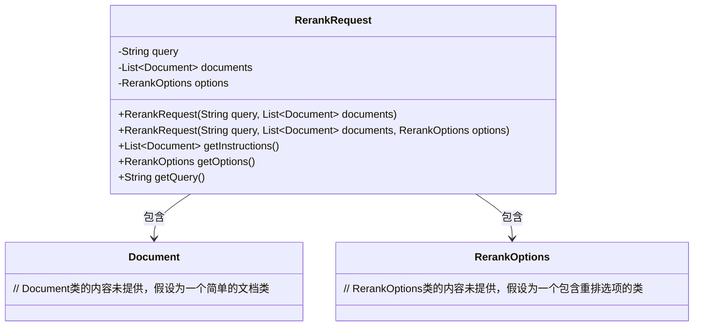
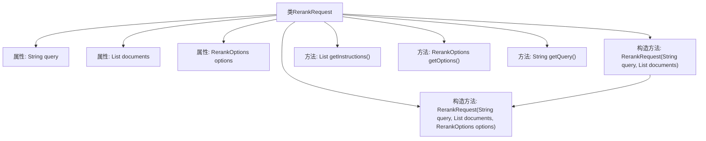

# 基础信息

|      |      |
|------|------|
| 名称 | RerankRequest |
| 编码语言 | .java |
| 代码路径 | spring-ai-alibaba/spring-ai-alibaba-core/src/main/java/com/alibaba/cloud/ai/model/RerankRequest.java |
| 包名 | com.alibaba.cloud.ai.model |
| 依赖项 | ['org.springframework.ai.document.Document', 'org.springframework.ai.model.ModelRequest', 'java.util.List'] |
| 概述说明 | RerankRequest类实现ModelRequest接口，包含查询、文档列表和重排选项。 |

# 说明

RerankRequest类实现了ModelRequest接口，主要用于处理查询请求。该类包含三个主要组成部分：查询条件、文档列表以及重排选项。查询条件用于指定用户输入的搜索内容，文档列表包含待重排的文档集合，重排选项则用于定义文档排序的具体规则和策略。通过实现ModelRequest接口，RerankRequest类能够与其他模型请求类保持一致，确保系统的兼容性和扩展性。

# 类列表 Class Summary

| 名称   | 类型  | 说明 |
|-------|------|-------------|
| RerankRequest | class | RerankRequest类实现ModelRequest接口，包含查询、文档列表和重排选项。 |

## 类 RerankRequest

|      |      |
|------|------|
| 访问范围 | public |
| 类型 | class |
| 名称 | RerankRequest |
| 说明 | RerankRequest类实现ModelRequest接口，包含查询、文档列表和重排选项。 |

### UML类图

**描述**：  
`RerankRequest` 类是一个实现 `ModelRequest` 接口的类，用于封装重排请求的相关信息。它包含一个查询字符串 `query`、一个文档列表 `documents` 和一个重排选项 `options`。类中提供了两个构造函数，分别用于初始化这些字段，并提供了获取这些字段值的方法。`RerankRequest` 依赖于 `Document` 和 `RerankOptions` 类，分别表示文档和重排选项。

### 内部方法调用关系图

这段代码定义了一个名为`RerankRequest`的类，该类实现了`ModelRequest<List<Document>>`接口。类中包含三个属性：`query`、`documents`和`options`，分别表示查询字符串、文档列表和重排选项。类提供了两个构造方法，其中一个允许传入`RerankOptions`参数，另一个则默认传入`null`。此外，类还提供了三个方法：`getInstructions()`返回文档列表，`getOptions()`返回重排选项，`getQuery()`返回查询字符串。流程图清晰地展示了类的结构及其内部方法调用关系。

### 字段列表 Field List

| 名称  | 类型  | 说明 |
|-------|-------|------|
| query | String | 定义了一个私有且不可变的字符串变量query。 |
| options | RerankOptions | 私有常量RerankOptions选项。 |
| documents | List<Document> | 私有且不可变的文档列表变量。 |

### 方法列表 Method List

| 名称  | 类型  | 说明 |
|-------|-------|------|
| getInstructions | List<Document> | 重写getInstructions方法，返回documents列表。 |
| getOptions | RerankOptions | 该方法返回当前对象的rerankOptions选项。 |
| getQuery | String | 方法getQuery返回字符串类型的query变量。 |

