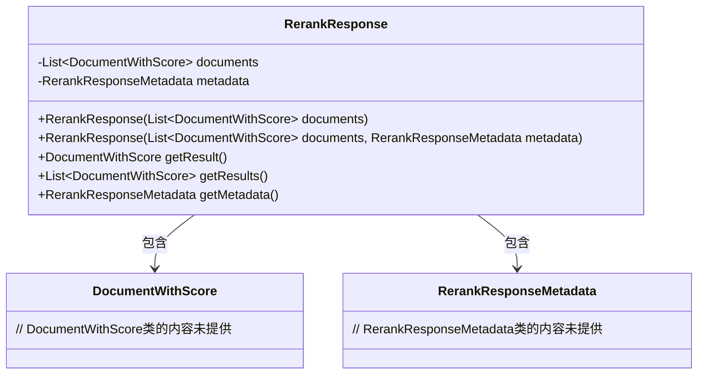
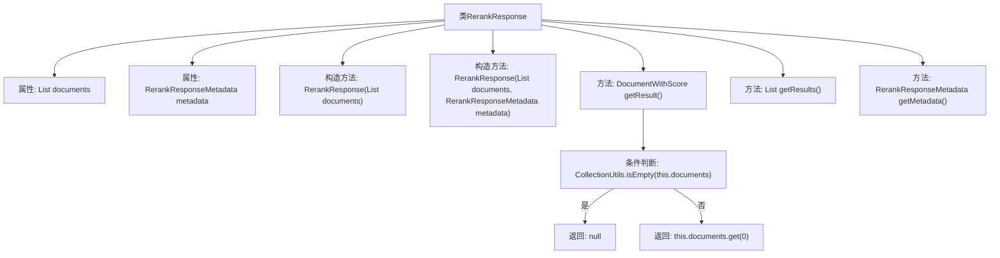

# 基础信息

|      |      |
|------|------|
| 名称 | RerankResponse |
| 编码语言 | .java |
| 代码路径 | spring-ai-alibaba/spring-ai-alibaba-core/src/main/java/com/alibaba/cloud/ai/model/RerankResponse.java |
| 包名 | com.alibaba.cloud.ai.model |
| 依赖项 | ['java.util.List', 'com.alibaba.cloud.ai.document.DocumentWithScore', 'org.springframework.ai.model.ModelResponse', 'org.springframework.util.CollectionUtils'] |
| 概述说明 | RerankResponse类管理文档列表和元数据，提供获取结果和元数据的方法。 |

# 说明

RerankResponse类用于存储文档列表及其相关元数据，并提供获取这些结果和元数据的方法。该类的主要功能是管理和访问经过重新排序后的文档信息，确保用户能够有效地检索和处理文档数据。

# 类列表 Class Summary

| 名称   | 类型  | 说明 |
|-------|------|-------------|
| RerankResponse | class | RerankResponse类存储文档列表和元数据，提供获取结果和元数据的方法。 |

## 类 RerankResponse

|      |      |
|------|------|
| 访问范围 | public |
| 类型 | class |
| 名称 | RerankResponse |
| 说明 | RerankResponse类存储文档列表和元数据，提供获取结果和元数据的方法。 |

### UML类图

类图描述：
`RerankResponse`类实现了`ModelResponse<DocumentWithScore>`接口，包含一个`DocumentWithScore`类型的列表和一个`RerankResponseMetadata`对象。该类提供了两个构造函数，分别用于初始化文档列表和元数据。`getResult`方法返回列表中的第一个文档，如果列表为空则返回`null`。`getResults`方法返回整个文档列表，`getMetadata`方法返回元数据对象。

### 内部方法调用关系图

该流程图描述了`RerankResponse`类的结构及其内部方法的调用关系。类包含两个属性`documents`和`metadata`，以及两个构造方法和三个重写方法。`getResult()`方法中有一个条件判断，如果`documents`为空则返回`null`，否则返回列表中的第一个元素。`getResults()`和`getMetadata()`方法分别返回`documents`和`metadata`。

### 字段列表 Field List

| 名称  | 类型  | 说明 |
|-------|-------|------|
| documents | List<DocumentWithScore> | 私有文档列表，包含带分数的文档对象。 |
| metadata | RerankResponseMetadata | 私有常量RerankResponseMetadata元数据对象。 |

### 方法列表 Method List

| 名称  | 类型  | 说明 |
|-------|-------|------|
| getResults | List<DocumentWithScore> | 该方法返回带有分数的文档列表。 |
| getResult | DocumentWithScore | 该方法返回文档列表中第一个文档，若列表为空则返回null。 |
| getMetadata | RerankResponseMetadata | 重写getMetadata方法，返回metadata对象。 |

