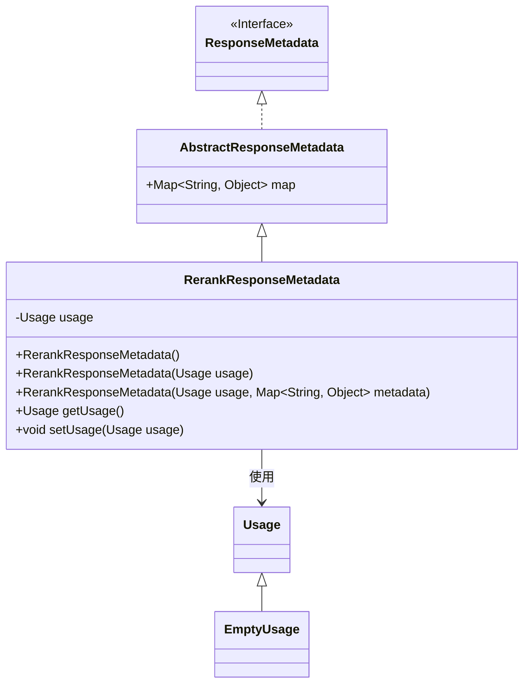
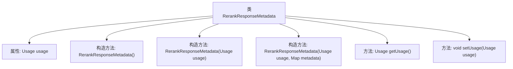

# 基础信息

|      |      |
|------|------|
| 名称 | RerankResponseMetadata |
| 编码语言 | .java |
| 代码路径 | spring-ai-alibaba/spring-ai-alibaba-core/src/main/java/com/alibaba/cloud/ai/model/RerankResponseMetadata.java |
| 包名 | com.alibaba.cloud.ai.model |
| 依赖项 | ['java.util.Map', 'org.springframework.ai.chat.metadata.EmptyUsage', 'org.springframework.ai.chat.metadata.Usage', 'org.springframework.ai.model.AbstractResponseMetadata', 'org.springframework.ai.model.ResponseMetadata'] |
| 概述说明 | RerankResponseMetadata继承AbstractResponseMetadata，包含Usage属性及相关方法。 |

# 说明

RerankResponseMetadata类继承自AbstractResponseMetadata，包含一个名为Usage的属性，用于存储相关使用信息。该类提供了构造方法和访问器，以便于初始化和获取Usage属性的值。这种设计使得RerankResponseMetadata类能够有效地管理和访问与响应元数据相关的使用信息。

# 类列表 Class Summary

| 名称   | 类型  | 说明 |
|-------|------|-------------|
| RerankResponseMetadata | class | RerankResponseMetadata类继承AbstractResponseMetadata，包含Usage属性和相关构造方法及访问器。 |

## 类 RerankResponseMetadata

|      |      |
|------|------|
| 访问范围 | public |
| 类型 | class |
| 名称 | RerankResponseMetadata |
| 说明 | RerankResponseMetadata类继承AbstractResponseMetadata，包含Usage属性和相关构造方法及访问器。 |

### UML类图

类图描述：`RerankResponseMetadata` 类继承自 `AbstractResponseMetadata` 并实现了 `ResponseMetadata` 接口。它包含一个 `Usage` 类型的私有成员 `usage`，并提供了多个构造函数来初始化该成员。`Usage` 是一个基类，`EmptyUsage` 是其子类。`RerankResponseMetadata` 类通过 `Usage` 类来管理使用情况，并通过 `AbstractResponseMetadata` 中的 `map` 来存储元数据。

### 内部方法调用关系图

这段代码定义了一个名为`RerankResponseMetadata`的类，该类继承自`AbstractResponseMetadata`并实现了`ResponseMetadata`接口。类中包含一个`Usage`类型的属性`usage`，并提供了三个构造方法，分别用于初始化`usage`属性和可选的元数据映射。此外，类中还提供了`getUsage`和`setUsage`方法，用于获取和设置`usage`属性的值。代码结构清晰，主要功能围绕`usage`属性的管理和初始化展开。

### 字段列表 Field List

| 名称  | 类型  | 说明 |
|-------|-------|------|
| usage = new EmptyUsage() | Usage | 创建了一个名为usage的EmptyUsage类实例。 |

### 方法列表 Method List

| 名称  | 类型  | 说明 |
|-------|-------|------|
| getUsage | Usage | 获取`usage`属性的公共方法`getUsage`。 |
| setUsage | void | 设置使用对象的方法。 |

