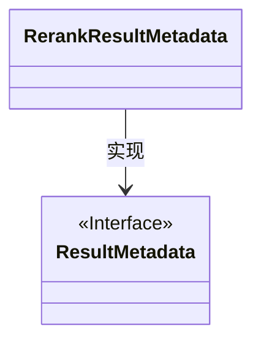
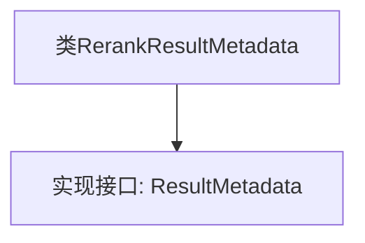

# 基础信息

|      |      |
|------|------|
| 名称 | RerankResultMetadata |
| 编码语言 | .java |
| 代码路径 | spring-ai-alibaba/spring-ai-alibaba-core/src/main/java/com/alibaba/cloud/ai/model/RerankResultMetadata.java |
| 包名 | com.alibaba.cloud.ai.model |
| 依赖项 | ['org.springframework.ai.model.ResultMetadata'] |
| 概述说明 | RerankResultMetadata类实现了ResultMetadata接口。 |

# 说明

RerankResultMetadata类实现了ResultMetadata接口。这意味着RerankResultMetadata类遵循了ResultMetadata接口定义的规范，具备接口中声明的所有方法和属性。通过实现该接口，RerankResultMetadata类确保了与ResultMetadata接口兼容，可以在需要ResultMetadata类型的地方使用RerankResultMetadata类的实例。这种实现方式有助于保持代码的一致性和可扩展性，使得RerankResultMetadata类能够与其他依赖于ResultMetadata接口的组件无缝集成。

# 类列表 Class Summary

| 名称   | 类型  | 说明 |
|-------|------|-------------|
| RerankResultMetadata | class | RerankResultMetadata类实现ResultMetadata接口。 |

## 类 RerankResultMetadata

|      |      |
|------|------|
| 访问范围 | public |
| 类型 | class |
| 名称 | RerankResultMetadata |
| 说明 | RerankResultMetadata类实现ResultMetadata接口。 |

### UML类图

这段代码定义了一个名为 `RerankResultMetadata` 的类，该类实现了 `ResultMetadata` 接口。`ResultMetadata` 是一个接口，而 `RerankResultMetadata` 是该接口的具体实现类。类图中展示了 `RerankResultMetadata` 类与 `ResultMetadata` 接口之间的实现关系。通过这种设计，`RerankResultMetadata` 类能够遵循 `ResultMetadata` 接口定义的规范，提供具体的实现细节。

### 内部方法调用关系图

这段代码定义了一个名为 `RerankResultMetadata` 的类，该类实现了 `ResultMetadata` 接口。由于代码中未包含具体的属性和方法，流程图仅展示了类与接口之间的实现关系。`RerankResultMetadata` 类通过实现 `ResultMetadata` 接口，承诺提供该接口所定义的方法实现。

### 字段列表 Field List

| 名称  | 类型  | 说明 |
|-------|-------|------|

### 方法列表 Method List

| 名称  | 类型  | 说明 |
|-------|-------|------|

