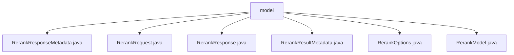

# 基础信息

|      |      |
|------|------|
| 名称 | model |
| 编码语言 | .java |
| 代码路径 | spring-ai-alibaba/spring-ai-alibaba-core/src/main/java/com/alibaba/cloud/ai/model |
| 包名 | spring-ai-alibaba.spring-ai-alibaba-core.src.main.java.com.alibaba.cloud.ai.model |
| 概述说明 | RerankResponseMetadata类管理使用信息，RerankRequest处理查询请求，RerankResponse存储排序文档，RerankResultMetadata实现ResultMetadata接口。 |

# 说明

## 概述
该代码模块主要涉及文档重排（Rerank）功能的设计与实现，属于 `spring-ai-alibaba` 项目的核心部分。模块通过多个类协作，实现了对文档重排请求的处理、响应的管理以及相关元数据的存储与访问。这些类包括 `RerankRequest`、`RerankResponse`、`RerankResponseMetadata` 和 `RerankResultMetadata`，它们分别负责处理请求、存储响应、管理使用信息和实现元数据接口。整体设计遵循接口规范和面向对象原则，确保系统的兼容性、扩展性和一致性。

## 主要业务场景
1. **文档重排请求处理**  
   - `RerankRequest` 类实现了 `ModelRequest` 接口，用于处理用户输入的查询请求。它包含查询条件、待重排的文档列表以及重排选项，支持定义文档排序的具体规则和策略。

2. **文档重排响应管理**  
   - `RerankResponse` 类负责存储经过重排后的文档列表及其相关元数据，并提供访问这些数据的方法，确保用户能够高效地检索和处理文档信息。

3. **使用信息管理**  
   - `RerankResponseMetadata` 类继承自 `AbstractResponseMetadata`，用于存储与响应相关的使用信息。它提供了构造方法和访问器，便于初始化和获取使用信息。

4. **元数据接口实现**  
   - `RerankResultMetadata` 类实现了 `ResultMetadata` 接口，确保与依赖于该接口的其他组件无缝集成。这种设计增强了代码的一致性和可扩展性。

5. **重排选项与模型**  
   - 尽管 `RerankOptions` 和 `RerankModel` 的具体内容未提供，但从上下文推测，它们可能用于定义重排的具体配置和模型行为，支持灵活的重排策略。

该模块的核心业务场景是处理文档重排请求，对文档进行排序，并返回重排后的结果及其相关元数据，适用于搜索、推荐等需要对文档进行动态排序的应用场景。

### 包内部结构视图

该流程图展示了`spring-ai-alibaba-core`项目中`model`目录下的文件结构。`model`作为根节点，包含了多个与重排（Rerank）相关的Java文件，如`RerankResponseMetadata.java`、`RerankRequest.java`等。这些文件共同构成了该模块的核心模型部分，用于处理与重排相关的请求和响应。

# 文件列表 File List

| 名称   | 类型  | 说明 |
|-------|------|-------------|
| [RerankModel.java](RerankModel.md) | file | 信息为空，无法生成概要描述。 |
| [RerankOptions.java](RerankOptions.md) | file | 信息为空，无法生成概要描述。 |
| [RerankResponse.java](RerankResponse.md) | file | RerankResponse类管理文档列表和元数据，提供获取结果和元数据的方法。 |
| [RerankResultMetadata.java](RerankResultMetadata.md) | file | RerankResultMetadata类实现了ResultMetadata接口。 |
| [RerankRequest.java](RerankRequest.md) | file | RerankRequest类实现ModelRequest接口，包含查询、文档列表和重排选项。 |
| [RerankResponseMetadata.java](RerankResponseMetadata.md) | file | RerankResponseMetadata继承AbstractResponseMetadata，包含Usage属性及相关方法。 |

