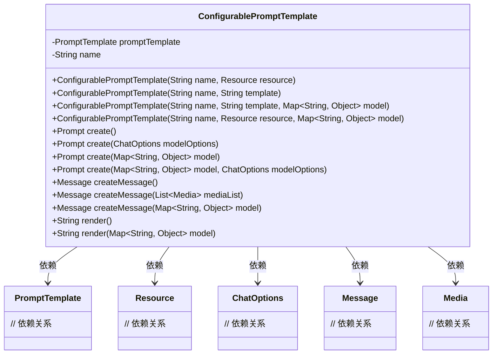

# 基础信息

|      |      |
|------|------|
| 名称 | ConfigurablePromptTemplate |
| 编码语言 | .java |
| 代码路径 | spring-ai-alibaba/spring-ai-alibaba-core/src/main/java/com/alibaba/cloud/ai/prompt/ConfigurablePromptTemplate.java |
| 包名 | com.alibaba.cloud.ai.prompt |
| 依赖项 | ['java.util.List', 'java.util.Map', 'org.springframework.ai.chat.messages.Message', 'org.springframework.ai.chat.prompt.ChatOptions', 'org.springframework.ai.chat.prompt.Prompt', 'org.springframework.ai.chat.prompt.PromptTemplate', 'org.springframework.ai.chat.prompt.PromptTemplateActions', 'org.springframework.ai.chat.prompt.PromptTemplateMessageActions', 'org.springframework.ai.model.Media', 'org.springframework.core.io.Resource'] |
| 概述说明 | ConfigurablePromptTemplate类实现PromptTemplate接口，支持多构造函数及Prompt、Message创建方法。 |

# 说明

ConfigurablePromptTemplate类实现了PromptTemplate接口，提供了多种构造函数和创建Prompt及Message的方法。该类具备高度可配置性，能够灵活地生成不同格式的提示信息和消息，满足多样化的应用需求。通过支持多种构造函数，用户可以方便地根据具体场景定制PromptTemplate实例，从而实现高效的消息处理和提示生成。

# 类列表 Class Summary

| 名称   | 类型  | 说明 |
|-------|------|-------------|
| ConfigurablePromptTemplate | class | ConfigurablePromptTemplate类实现PromptTemplate接口，支持多种构造函数和创建Prompt及Message的方法。 |

## 类 ConfigurablePromptTemplate

|      |      |
|------|------|
| 访问范围 | public |
| 类型 | class |
| 名称 | ConfigurablePromptTemplate |
| 说明 | ConfigurablePromptTemplate类实现PromptTemplate接口，支持多种构造函数和创建Prompt及Message的方法。 |

### UML类图

**描述：**
`ConfigurablePromptTemplate` 类实现了 `PromptTemplateActions` 和 `PromptTemplateMessageActions` 接口，用于创建和渲染提示模板。它通过多个构造函数初始化 `PromptTemplate` 对象，并提供多种方法来创建 `Prompt` 和 `Message` 对象，以及渲染模板。该类依赖于 `PromptTemplate`、`Resource`、`ChatOptions`、`Message` 和 `Media` 等类，以实现其功能。

### 内部方法调用关系图

```mermaid
graph TD
    A["类ConfigurablePromptTemplate"]
    B["属性: PromptTemplate promptTemplate"]
    C["属性: String name"]
    D["构造方法: ConfigurablePromptTemplate(String name, Resource resource)"]
    E["构造方法: ConfigurablePromptTemplate(String name, String template)"]
    F["构造方法: ConfigurablePromptTemplate(String name, String template, Map<String, Object> model)"]
    G["构造方法: ConfigurablePromptTemplate(String name, Resource resource, Map<String, Object> model)"]
    H["方法: Prompt create()"]
    I["方法: Prompt create(ChatOptions modelOptions)"]
    J["方法: Prompt create(Map<String, Object> model)"]
    K["方法: Prompt create(Map<String, Object> model, ChatOptions modelOptions)"]
    L["方法: Message createMessage()"]
    M["方法: Message createMessage(List<Media> mediaList)"]
    N["方法: Message createMessage(Map<String, Object> model)"]
    O["方法: String render()"]
    P["方法: String render(Map<String, Object> model)"]

    A --> B
    A --> C
    A --> D
    A --> E
    A --> F
    A --> G
    A --> H
    A --> I
    A --> J
    A --> K
    A --> L
    A --> M
    A --> N
    A --> O
    A --> P
```

这段代码定义了一个`ConfigurablePromptTemplate`类，该类实现了`PromptTemplateActions`和`PromptTemplateMessageActions`接口。类中包含两个属性：`promptTemplate`和`name`，并提供了多个构造方法以不同的方式初始化这些属性。类中还实现了多个方法，用于创建`Prompt`和`Message`对象，并提供了渲染模板的功能。这些方法通过调用`promptTemplate`对象的相应方法来实现其功能。

### 字段列表 Field List

| 名称  | 类型  | 说明 |
|-------|-------|------|
| promptTemplate | PromptTemplate | 私有变量promptTemplate用于存储PromptTemplate对象。 |
| name | String | 声明了一个私有字符串类型的变量name。 |

### 方法列表 Method List

| 名称  | 类型  | 说明 |
|-------|-------|------|
| create | Prompt | 重写create方法，调用promptTemplate生成Prompt对象。 |
| create | Prompt | 重写create方法，调用promptTemplate创建提示。 |
| create | Prompt | 重写create方法，调用promptTemplate的create方法返回结果。 |
| create | Prompt | 重写create方法，调用promptTemplate生成Prompt。 |
| createMessage | Message | 重写方法createMessage，调用promptTemplate的createMessage方法生成消息。 |
| render | String | 重写render方法，调用promptTemplate渲染模型数据。 |
| createMessage | Message | 重写方法，调用模板创建消息。 |
| render | String | 重写render方法，调用promptTemplate的render方法并返回结果。 |
| createMessage | Message | 重写方法，调用模板生成消息。 |

