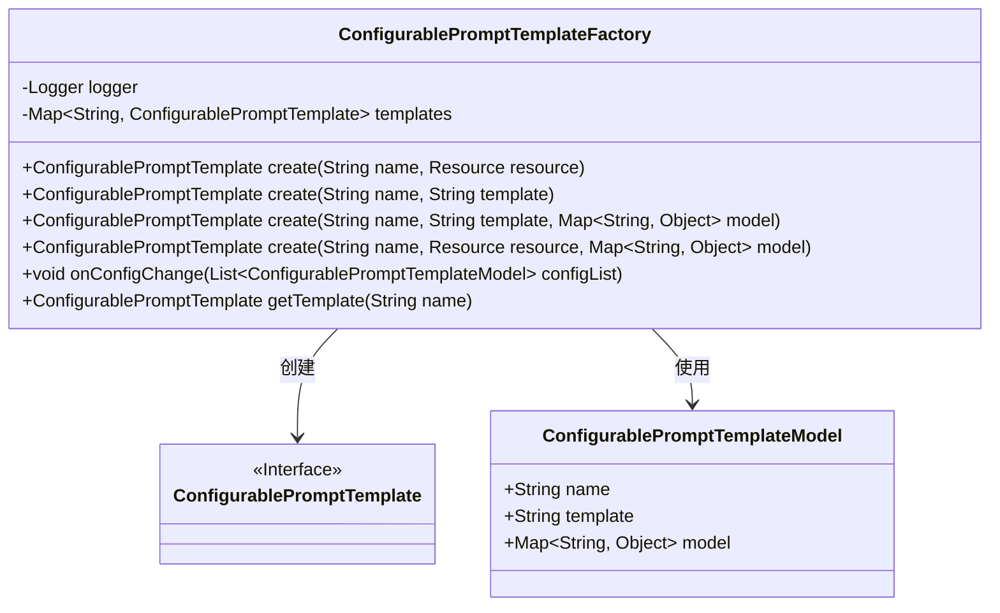
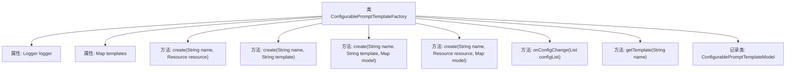

# 基础信息

|      |      |
|------|------|
| 名称 | ConfigurablePromptTemplateFactory |
| 编码语言 | .java |
| 代码路径 | spring-ai-alibaba/spring-ai-alibaba-core/src/main/java/com/alibaba/cloud/ai/prompt/ConfigurablePromptTemplateFactory.java |
| 包名 | com.alibaba.cloud.ai.prompt |
| 依赖项 | ['java.util.HashMap', 'java.util.List', 'java.util.Map', 'java.util.concurrent.ConcurrentHashMap', 'com.alibaba.cloud.nacos.annotation.NacosConfigListener', 'org.slf4j.Logger', 'org.slf4j.LoggerFactory', 'org.springframework.core.io.Resource', 'org.springframework.util.CollectionUtils', 'org.springframework.util.StringUtils'] |
| 概述说明 | ConfigurablePromptTemplateFactory用于创建和管理动态更新的提示模板。 |

# 说明

ConfigurablePromptTemplateFactory是一个用于创建和管理可配置提示模板的工具，支持动态更新配置。其主要功能包括模板的生成、配置的灵活调整以及实时更新，确保提示模板能够根据需求变化进行动态调整，提升系统的灵活性和适应性。

# 类列表 Class Summary

| 名称   | 类型  | 说明 |
|-------|------|-------------|
| ConfigurablePromptTemplateFactory | class | ConfigurablePromptTemplateFactory用于创建和管理可配置的提示模板，支持动态配置更新。 |

## 类 ConfigurablePromptTemplateFactory

|      |      |
|------|------|
| 访问范围 | public |
| 类型 | class |
| 名称 | ConfigurablePromptTemplateFactory |
| 说明 | ConfigurablePromptTemplateFactory用于创建和管理可配置的提示模板，支持动态配置更新。 |

### UML类图

这段代码定义了一个`ConfigurablePromptTemplateFactory`类，用于创建和管理`ConfigurablePromptTemplate`实例。工厂类通过`ConcurrentHashMap`缓存模板实例，并提供了多个重载的`create`方法，支持从资源、字符串或模型创建模板。`onConfigChange`方法监听配置变化并更新模板。`ConfigurablePromptTemplateModel`是一个记录类，用于存储模板的配置信息。

### 内部方法调用关系图

这段代码定义了一个`ConfigurablePromptTemplateFactory`类，用于创建和管理`ConfigurablePromptTemplate`实例。类中包含多个`create`方法，用于根据不同的参数创建模板，并使用`ConcurrentHashMap`来存储这些模板。`onConfigChange`方法监听配置变化并更新模板。`getTemplate`方法用于获取指定名称的模板。`ConfigurablePromptTemplateModel`是一个记录类，用于存储模板的配置信息。

### 字段列表 Field List

| 名称  | 类型  | 说明 |
|-------|-------|------|
| logger = LoggerFactory.getLogger(ConfigurablePromptTemplateFactory.class) | Logger | 定义私有静态日志记录器，用于ConfigurablePromptTemplateFactory类。 |
| templates = new ConcurrentHashMap<>() | Map<String, ConfigurablePromptTemplate> | 私有并发映射存储可配置提示模板。 |

### 方法列表 Method List

| 名称  | 类型  | 说明 |
|-------|-------|------|
| getTemplate | ConfigurablePromptTemplate | 获取指定名称的配置提示模板。 |
| create | ConfigurablePromptTemplate | 创建可配置提示模板，若不存在则新建并存储。 |
| create | ConfigurablePromptTemplate | 创建可配置提示模板方法，若不存在则新建并返回。 |
| create | ConfigurablePromptTemplate | 创建可配置提示模板，若不存在则生成并存储。 |
| create | ConfigurablePromptTemplate | 创建可配置提示模板，若不存在则新建并返回。 |
| onConfigChange | void | 监听Nacos配置变更，更新提示模板并记录日志。 |

