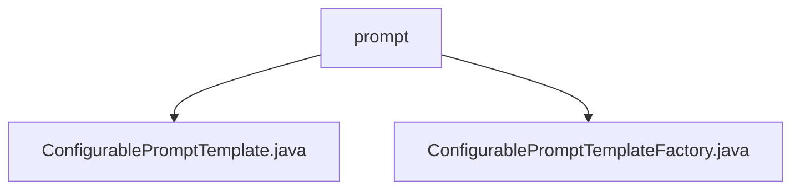

# 基础信息

|      |      |
|------|------|
| 名称 | prompt |
| 编码语言 | .java |
| 代码路径 | spring-ai-alibaba/spring-ai-alibaba-core/src/main/java/com/alibaba/cloud/ai/prompt |
| 包名 | spring-ai-alibaba.spring-ai-alibaba-core.src.main.java.com.alibaba.cloud.ai.prompt |
| 概述说明 | ConfigurablePromptTemplate类实现PromptTemplate接口，支持多种构造函数，灵活生成提示信息。ConfigurablePromptTemplateFactory动态管理模板，支持配置调整和实时更新。 |

# 说明

## 概述
该代码模块主要围绕`ConfigurablePromptTemplate`类和`ConfigurablePromptTemplateFactory`类展开，旨在提供高度可配置的提示模板生成和管理功能。`ConfigurablePromptTemplate`类实现了`PromptTemplate`接口，支持多种构造函数和灵活的提示信息生成方式，能够满足多样化的应用需求。`ConfigurablePromptTemplateFactory`类则负责创建和管理这些可配置的提示模板，支持动态更新配置，确保模板能够根据需求变化进行实时调整，从而提升系统的灵活性和适应性。

## 主要业务场景
1. **提示信息生成**：`ConfigurablePromptTemplate`类提供了多种构造函数和创建提示信息的方法，能够根据具体场景生成不同格式的提示信息和消息，适用于需要动态生成提示信息的业务场景。
2. **模板管理与配置更新**：`ConfigurablePromptTemplateFactory`类支持模板的动态生成和配置的灵活调整，适用于需要实时更新提示模板配置的场景，确保系统能够快速响应需求变化。
3. **高度可配置性**：整个模块的设计注重可配置性，用户可以根据具体需求定制`PromptTemplate`实例，适用于需要高度定制化提示模板的应用场景，如智能对话系统、自动化任务处理等。

### 包内部结构视图

该流程图展示了`prompt`文件夹下的两个Java文件`ConfigurablePromptTemplate.java`和`ConfigurablePromptTemplateFactory.java`的层级关系。`prompt`作为根节点，直接包含这两个文件，清晰地反映了它们的组织结构和依赖关系。

# 文件列表 File List

| 名称   | 类型  | 说明 |
|-------|------|-------------|
| [ConfigurablePromptTemplateFactory.java](ConfigurablePromptTemplateFactory.md) | file | ConfigurablePromptTemplateFactory用于创建和管理动态更新的提示模板。 |
| [ConfigurablePromptTemplate.java](ConfigurablePromptTemplate.md) | file | ConfigurablePromptTemplate类实现PromptTemplate接口，支持多构造函数及Prompt、Message创建方法。 |

