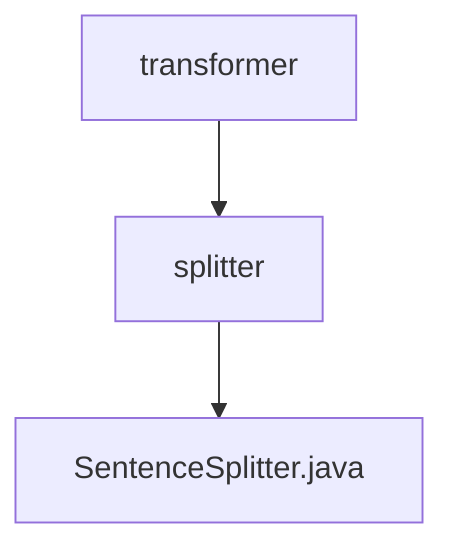

# 基础信息

|      |      |
|------|------|
| 名称 | transformer |
| 编码语言 | .java |
| 代码路径 | spring-ai-alibaba/spring-ai-alibaba-core/src/main/java/com/alibaba/cloud/ai/transformer |
| 包名 | spring-ai-alibaba.spring-ai-alibaba-core.src.main.java.com.alibaba.cloud.ai.transformer |
| 概述说明 | SentenceSplitter类用于文本分句，支持自定义块大小和CL100K_BASE编码。 |

# 说明

SentenceSplitter类专门用于将文本按句子进行分割，支持用户自定义块大小，并采用CL100K_BASE编码方式进行处理。

### 包内部结构视图

该流程图展示了路径的层级关系，从`transformer`文件夹到`splitter`子文件夹，再到`SentenceSplitter.java`文件。整个结构清晰地反映了文件在项目中的嵌套关系，帮助开发者快速理解项目的目录组织。

# 文件列表 File List

| 名称   | 类型  | 说明 |
|-------|------|-------------|
| [splitter](splitter/_module.md) | package | SentenceSplitter类用于文本分句，支持自定义块大小和CL100K_BASE编码。 |

