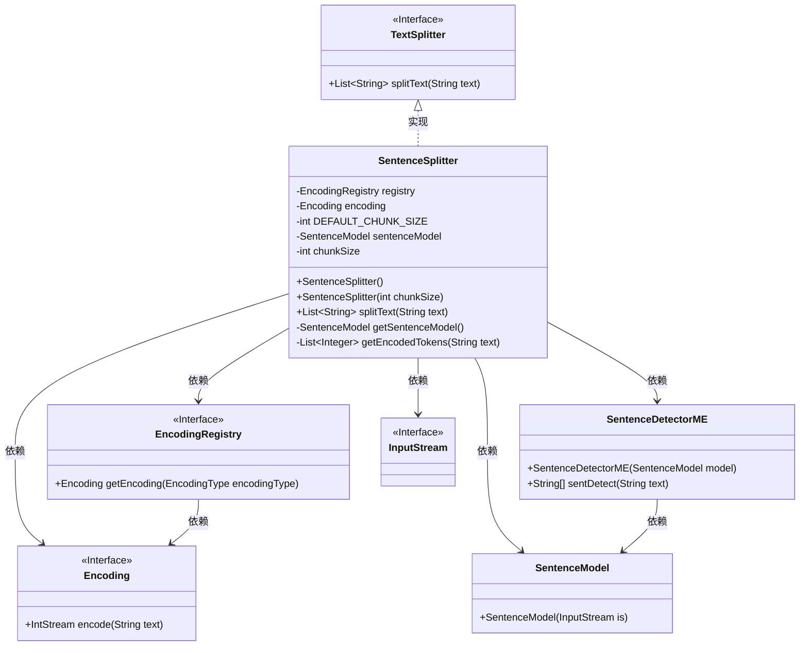
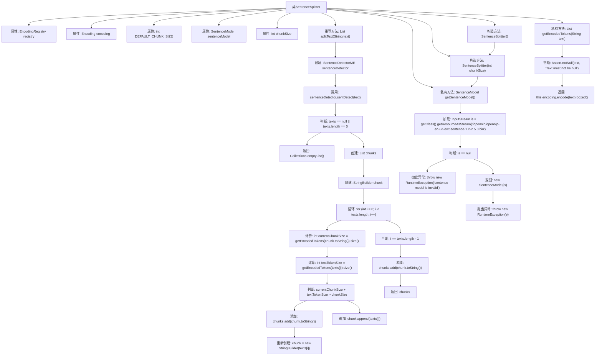

# 基础信息

|      |      |
|------|------|
| 名称 | SentenceSplitter |
| 编码语言 | .java |
| 代码路径 | spring-ai-alibaba/spring-ai-alibaba-core/src/main/java/com/alibaba/cloud/ai/transformer/splitter/SentenceSplitter.java |
| 包名 | com.alibaba.cloud.ai.transformer.splitter |
| 依赖项 | ['java.io.IOException', 'java.io.InputStream', 'java.util.ArrayList', 'java.util.Collections', 'java.util.List', 'com.knuddels.jtokkit.Encodings', 'com.knuddels.jtokkit.api.Encoding', 'com.knuddels.jtokkit.api.EncodingRegistry', 'com.knuddels.jtokkit.api.EncodingType', 'opennlp.tools.sentdetect.SentenceDetectorME', 'opennlp.tools.sentdetect.SentenceModel', 'org.springframework.ai.transformer.splitter.TextSplitter', 'org.springframework.util.Assert'] |
| 概述说明 | SentenceSplitter类用于文本分句，支持自定义块大小和CL100K_BASE编码。 |

# 说明

SentenceSplitter类专门用于将文本按句子进行分割，支持用户自定义块大小，并采用CL100K_BASE编码方式进行处理。

# 类列表 Class Summary

| 名称   | 类型  | 说明 |
|-------|------|-------------|
| SentenceSplitter | class | SentenceSplitter类用于按句子分割文本，支持自定义块大小，使用CL100K_BASE编码。 |

## 类 SentenceSplitter

|      |      |
|------|------|
| 访问范围 | public |
| 类型 | class |
| 名称 | SentenceSplitter |
| 说明 | SentenceSplitter类用于按句子分割文本，支持自定义块大小，使用CL100K_BASE编码。 |

### UML类图

### 描述
`SentenceSplitter` 类继承自 `TextSplitter` 接口，用于将文本按句子分割成指定大小的块。它依赖于 `EncodingRegistry` 和 `Encoding` 来处理文本编码，使用 `SentenceModel` 和 `SentenceDetectorME` 来检测句子。`SentenceSplitter` 通过 `splitText` 方法将文本分割成块，并通过 `getEncodedTokens` 方法获取编码后的 token 列表。`getSentenceModel` 方法用于加载句子模型文件。整个类设计用于高效处理文本分割任务。

### 内部方法调用关系图

这段代码定义了一个 `SentenceSplitter` 类，用于将文本按句子分割，并根据指定的块大小将句子组合成块。类中包含了两个构造方法，分别用于初始化块大小和句子模型。`splitText` 方法负责将输入文本分割成句子，并根据编码后的令牌数量将句子组合成块。`getSentenceModel` 方法用于加载句子模型，`getEncodedTokens` 方法用于获取文本的编码令牌。流程图展示了类中各个方法的调用关系和逻辑流程。

### 字段列表 Field List

| 名称  | 类型  | 说明 |
|-------|-------|------|
| registry = Encodings.newLazyEncodingRegistry() | EncodingRegistry | 创建私有且不可变的编码注册表实例。 |
| sentenceModel | SentenceModel | 私有不可变的句子模型实例。 |
| DEFAULT_CHUNK_SIZE = 1024 | int | 定义默认块大小为1024的私有静态常量。 |
| chunkSize | int | 私有整型变量chunkSize。 |
| encoding = registry.getEncoding(EncodingType.CL100K_BASE) | Encoding | 私有编码对象初始化为注册表中CL100K_BASE类型的编码。 |

### 方法列表 Method List

| 名称  | 类型  | 说明 |
|-------|-------|------|
| getEncodedTokens | List<Integer> | 获取文本编码后的整数列表，确保文本非空。 |
| splitText | List<String> | 方法将文本按句子分割，并根据块大小合并为合适的分块。 |
| getSentenceModel | SentenceModel | 获取OpenNLP句子模型，若无效或异常则抛出运行时错误。 |

