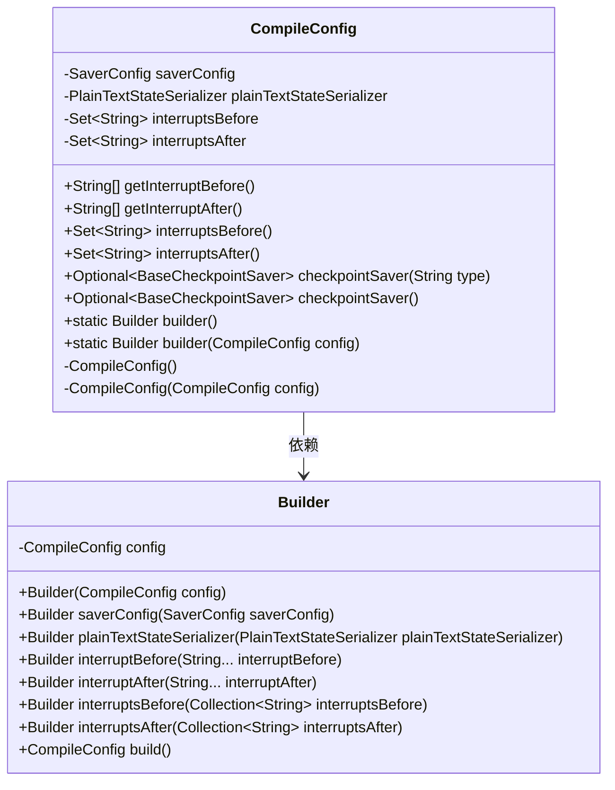

# 基础信息

|      |      |
|------|------|
| 名称 | CompileConfig |
| 编码语言 | .java |
| 代码路径 | spring-ai-alibaba/spring-ai-alibaba-graph/spring-ai-alibaba-graph-core/src/main/java/com/alibaba/cloud/ai/graph/CompileConfig.java |
| 包名 | com.alibaba.cloud.ai.graph |
| 依赖项 | ['java.util.Collection', 'java.util.Optional', 'java.util.Set', 'java.util.stream.Collectors', 'com.alibaba.cloud.ai.graph.checkpoint.BaseCheckpointSaver', 'com.alibaba.cloud.ai.graph.checkpoint.config.SaverConfig', 'com.alibaba.cloud.ai.graph.serializer.plain_text.PlainTextStateSerializer', 'java.util.Optional.ofNullable'] |
| 概述说明 | CompileConfig类管理编译配置，支持Builder模式配置。 |

# 说明

CompileConfig类负责管理编译配置，包含保存器配置、状态序列化器和中断集合等关键组件。该类支持通过Builder模式进行灵活的配置，允许用户逐步构建和定制编译配置，确保配置过程清晰且易于维护。

# 类列表 Class Summary

| 名称   | 类型  | 说明 |
|-------|------|-------------|
| CompileConfig | class | CompileConfig类管理编译配置，包含保存器配置、状态序列化器和中断集合，支持通过Builder模式进行配置。 |

## 类 CompileConfig

|      |      |
|------|------|
| 访问范围 | public |
| 类型 | class |
| 名称 | CompileConfig |
| 说明 | CompileConfig类管理编译配置，包含保存器配置、状态序列化器和中断集合，支持通过Builder模式进行配置。 |

### UML类图

这段代码定义了一个 `CompileConfig` 类，用于配置编译过程中的各种选项，如中断前后的操作、检查点保存器等。`CompileConfig` 类通过 `Builder` 模式进行构建，允许通过链式调用来设置配置项。`Builder` 类负责创建和初始化 `CompileConfig` 实例，并提供了多种方法来设置不同的配置项。`CompileConfig` 类还包含了一些私有构造函数，确保实例的创建和复制操作在内部进行。

### 内部方法调用关系图

```mermaid
graph TD
    A["类CompileConfig"]
    B["属性: SaverConfig saverConfig"]
    C["属性: PlainTextStateSerializer plainTextStateSerializer"]
    D["属性: Set<String> interruptsBefore"]
    E["属性: Set<String> interruptsAfter"]
    F["方法: String[] getInterruptBefore()"]
    G["方法: String[] getInterruptAfter()"]
    H["方法: Set<String> interruptsBefore()"]
    I["方法: Set<String> interruptsAfter()"]
    J["方法: Optional<BaseCheckpointSaver> checkpointSaver(String type)"]
    K["方法: Optional<BaseCheckpointSaver> checkpointSaver()"]
    L["静态方法: Builder builder()"]
    M["静态方法: Builder builder(CompileConfig config)"]
    N["内部类: Builder"]
    O["属性: CompileConfig config"]
    P["方法: Builder saverConfig(SaverConfig saverConfig)"]
    Q["方法: Builder plainTextStateSerializer(PlainTextStateSerializer plainTextStateSerializer)"]
    R["方法: Builder interruptBefore(String... interruptBefore)"]
    S["方法: Builder interruptAfter(String... interruptAfter)"]
    T["方法: Builder interruptsBefore(Collection<String> interruptsBefore)"]
    U["方法: Builder interruptsAfter(Collection<String> interruptsAfter)"]
    V["方法: CompileConfig build()"]
    W["构造方法: Builder(CompileConfig config)"]
    X["默认构造方法: CompileConfig()"]
    Y["拷贝构造方法: CompileConfig(CompileConfig config)"]

    A --> B
    A --> C
    A --> D
    A --> E
    A --> F
    A --> G
    A --> H
    A --> I
    A --> J
    A --> K
    A --> L
    A --> M
    A --> N
    N --> O
    N --> P
    N --> Q
    N --> R
    N --> S
    N --> T
    N --> U
    N --> V
    N --> W
    A --> X
    A --> Y
```

这段代码定义了一个`CompileConfig`类，用于配置编译过程中的各种选项。该类包含多个属性和方法，用于获取和设置中断前后的操作、检查点保存器以及文本状态序列化器。此外，`CompileConfig`类还包含一个内部`Builder`类，用于通过链式调用的方式配置`CompileConfig`实例。`Builder`类提供了多个方法来设置不同的配置选项，并最终通过`build`方法返回配置好的`CompileConfig`实例。

### 字段列表 Field List

| 名称  | 类型  | 说明 |
|-------|-------|------|
| saverConfig | SaverConfig | 私有SaverConfig配置对象声明。 |
| plainTextStateSerializer | PlainTextStateSerializer | 私有PlainTextStateSerializer实例plainTextStateSerializer。 |
| interruptsBefore = Set.of() | Set<String> | 定义了一个私有空字符串集合interruptsBefore。 |
| interruptsAfter = Set.of() | Set<String> | 私有字符串集合interruptsAfter初始化为空集。 |

### 方法列表 Method List

| 名称  | 类型  | 说明 |
|-------|-------|------|
| interruptsAfter | Set<String> | 该方法返回一个包含中断后操作的字符串集合。 |
| getInterruptAfter | String[] | 已弃用方法，返回中断后字符串数组。 |
| interruptsBefore | Set<String> | 返回中断前集合的方法。 |
| getInterruptBefore | String[] | 已弃用方法：返回中断前字符串数组。 |
| checkpointSaver | Optional<BaseCheckpointSaver> | 返回可选的检查点保存器配置。 |
| builder | Builder | 静态方法返回Builder实例，参数为CompileConfig。 |
| checkpointSaver | Optional<BaseCheckpointSaver> | 方法返回指定类型的检查点保存器实例。 |
| builder | Builder | 静态方法返回新Builder实例，初始化CompileConfig。 |

