# 基础信息

|      |      |
|------|------|
| 名称 | CompiledGraph |
| 编码语言 | .java |
| 代码路径 | spring-ai-alibaba/spring-ai-alibaba-graph/spring-ai-alibaba-graph-core/src/main/java/com/alibaba/cloud/ai/graph/CompiledGraph.java |
| 包名 | com.alibaba.cloud.ai.graph |
| 依赖项 | ['java.io.IOException', 'java.util', 'java.util.concurrent.CompletableFuture', 'java.util.concurrent.CompletionException', 'java.util.function.Function', 'java.util.function.Supplier', 'java.util.stream.Collectors', 'java.util.stream.Stream', 'lombok.NonNull', 'lombok.extern.slf4j.Slf4j', 'org.bsc.async.AsyncGenerator', 'com.alibaba.cloud.ai.graph.action.AsyncNodeAction', 'com.alibaba.cloud.ai.graph.action.AsyncNodeActionWithConfig', 'com.alibaba.cloud.ai.graph.checkpoint.BaseCheckpointSaver', 'com.alibaba.cloud.ai.graph.checkpoint.Checkpoint', 'com.alibaba.cloud.ai.graph.internal.edge.Edge', 'com.alibaba.cloud.ai.graph.internal.edge.EdgeValue', 'com.alibaba.cloud.ai.graph.internal.node.ParallelNode', 'com.alibaba.cloud.ai.graph.state.AgentState', 'com.alibaba.cloud.ai.graph.state.StateSnapshot', 'org.springframework.util.CollectionUtils', 'java.lang.String.format', 'java.util.concurrent.CompletableFuture.completedFuture', 'java.util.stream.Collectors.toList', 'com.alibaba.cloud.ai.graph.StateGraph.END', 'com.alibaba.cloud.ai.graph.StateGraph.START'] |
| 概述说明 | CompiledGraph类管理状态图，处理节点、边、配置，支持状态更新和检查点保存。 |

# 说明

CompiledGraph类是一个用于管理和执行状态图的工具，具备处理节点、边和配置的能力。它提供了状态更新和检查点保存的功能，确保状态图的有效执行和管理。通过支持节点和边的处理，该类能够灵活地处理复杂的状态图结构。同时，配置处理功能使得用户可以根据需求自定义状态图的行为。状态更新功能确保状态图的实时性和准确性，而检查点保存功能则提供了在需要时恢复状态的能力，增强了系统的可靠性和稳定性。

# 类列表 Class Summary

| 名称   | 类型  | 说明 |
|-------|------|-------------|
| CompiledGraph | class | CompiledGraph类用于管理和执行状态图，支持节点、边和配置处理，提供状态更新和检查点保存功能。 |

## 类 CompiledGraph

|      |      |
|------|------|
| 访问范围 | @Slf4j;public |
| 类型 | class |
| 名称 | CompiledGraph |
| 说明 | CompiledGraph类用于管理和执行状态图，支持节点、边和配置处理，提供状态更新和检查点保存功能。 |

### UML类图

```mermaid
classDiagram
    class CompiledGraph {
        +StateGraph stateGraph
        -Map~String, AsyncNodeActionWithConfig~ nodes
        -Map~String, EdgeValue~ edges
        -ProcessedNodesEdgesAndConfig processedData
        -int maxIterations
        +CompileConfig compileConfig
        +CompiledGraph(StateGraph stateGraph, CompileConfig compileConfig) throws GraphStateException
        +Collection~StateSnapshot~ getStateHistory(RunnableConfig config)
        +StateSnapshot getState(RunnableConfig config)
        +Optional~StateSnapshot~ stateOf(RunnableConfig config)
        +RunnableConfig updateState(RunnableConfig config, Map~String, Object~ values, String asNode) throws Exception
        +RunnableConfig updateState(RunnableConfig config, Map~String, Object~ values) throws Exception
        +void setMaxIterations(int maxIterations)
        -String nextNodeId(EdgeValue route, Map~String, Object~ state, String nodeId) throws Exception
        -String nextNodeId(String nodeId, Map~String, Object~ state) throws Exception
        -String getEntryPoint(Map~String, Object~ state) throws Exception
        -boolean shouldInterruptBefore(String nodeId, String previousNodeId)
        -boolean shouldInterruptAfter(String nodeId, String previousNodeId)
        -Optional~Checkpoint~ addCheckpoint(RunnableConfig config, String nodeId, Map~String, Object~ state, String nextNodeId) throws Exception
        +Map~String, Object~ getInitialState(Map~String, Object~ inputs, RunnableConfig config)
        +OverAllState cloneState(Map~String, Object~ data) throws IOException, ClassNotFoundException, InstantiationException, IllegalAccessException
        +AsyncGenerator~NodeOutput~ stream(Map~String, Object~ inputs, RunnableConfig config)
        +AsyncGenerator~NodeOutput~ stream(OverAllState overAllState, RunnableConfig config)
        +AsyncGenerator~NodeOutput~ stream(Map~String, Object~ inputs)
        +AsyncGenerator~NodeOutput~ stream()
        +Optional invoke(Map~String, Object~ inputs, RunnableConfig config)
        +Optional invoke(OverAllState overAllState, RunnableConfig config)
        +Optional invoke(Map~String, Object~ inputs)
        +AsyncGenerator~NodeOutput~ streamSnapshots(Map~String, Object~ inputs, RunnableConfig config)
        +GraphRepresentation getGraph(GraphRepresentation.Type type, String title, boolean printConditionalEdges)
        +GraphRepresentation getGraph(GraphRepresentation.Type type, String title)
        +GraphRepresentation getGraph(GraphRepresentation.Type type)
    }

    class AsyncNodeGenerator~Output~ {
        -Map~String, Object~ currentState
        -String currentNodeId
        -String nextNodeId
        -OverAllState overAllState
        -int iteration
        -RunnableConfig config
        -boolean resumedFromEmbed
        +AsyncNodeGenerator(OverAllState overAllState, RunnableConfig config)
        +AsyncNodeGenerator(Map~String, Object~ inputs, RunnableConfig config)
        -Output buildNodeOutput(String nodeId) throws Exception
        -Output buildStateSnapshot(Checkpoint checkpoint) throws Exception
        -Optional~Data~Output~~ getEmbedGenerator(Map~String, Object~ partialState)
        -CompletableFuture~Data~Output~~ evaluateAction(AsyncNodeActionWithConfig action, OverAllState withState)
        -CompletableFuture~Output~ evaluateActionWithoutNested(AsyncNodeAction action, OverAllState withState)
        -CompletableFuture~Output~ getNodeOutput() throws Exception
        +Data~Output~ next()
    }

    class StateGraph {
        +StateGraph()
    }

    class ProcessedNodesEdgesAndConfig {
        +ProcessedNodesEdgesAndConfig()
    }

    class CompileConfig {
        +CompileConfig()
    }

    class AsyncNodeActionWithConfig {
        +AsyncNodeActionWithConfig()
    }

    class EdgeValue {
        +EdgeValue()
    }

    class RunnableConfig {
        +RunnableConfig()
    }

    class StateSnapshot {
        +StateSnapshot()
    }

    class Checkpoint {
        +Checkpoint()
    }

    class OverAllState {
        +OverAllState()
    }

    class NodeOutput {
        +NodeOutput()
    }

    class GraphRepresentation {
        +GraphRepresentation()
    }

    class AsyncGenerator~Output~ {
        +AsyncGenerator()
    }

    CompiledGraph --> StateGraph : 依赖
    CompiledGraph --> ProcessedNodesEdgesAndConfig : 依赖
    CompiledGraph --> CompileConfig : 依赖
    CompiledGraph --> AsyncNodeActionWithConfig : 依赖
    CompiledGraph --> EdgeValue : 依赖
    CompiledGraph --> RunnableConfig : 依赖
    CompiledGraph --> StateSnapshot : 依赖
    CompiledGraph --> Checkpoint : 依赖
    CompiledGraph --> OverAllState : 依赖
    CompiledGraph --> NodeOutput : 依赖
    CompiledGraph --> GraphRepresentation : 依赖
    CompiledGraph --> AsyncGenerator~Output~ : 依赖
    AsyncNodeGenerator~Output~ --> CompiledGraph : 依赖
    AsyncNodeGenerator~Output~ --> OverAllState : 依赖
    AsyncNodeGenerator~Output~ --> RunnableConfig : 依赖
    AsyncNodeGenerator~Output~ --> Checkpoint : 依赖
    AsyncNodeGenerator~Output~ --> NodeOutput : 依赖
    AsyncNodeGenerator~Output~ --> AsyncGenerator~Output~ : 依赖
```

### 描述
`CompiledGraph` 是一个复杂的类，用于管理和执行状态图的逻辑。它包含了多个私有和公有成员变量，如 `stateGraph`、`nodes`、`edges` 等，用于存储和处理状态图的相关数据。类中提供了多种方法，如 `getStateHistory`、`updateState`、`stream` 等，用于获取状态历史、更新状态、生成异步流等操作。`AsyncNodeGenerator` 是 `CompiledGraph` 的内部类，用于生成异步节点输出。类图中展示了 `CompiledGraph` 与其他类之间的依赖关系，如 `StateGraph`、`ProcessedNodesEdgesAndConfig`、`CompileConfig` 等。

### 内部方法调用关系图

```mermaid
graph TD
    A["类CompiledGraph"]
    B["枚举StreamMode"]
    C["属性: StateGraph stateGraph"]
    D["属性: Map<String, AsyncNodeActionWithConfig> nodes"]
    E["属性: Map<String, EdgeValue> edges"]
    F["属性: ProcessedNodesEdgesAndConfig processedData"]
    G["属性: int maxIterations"]
    H["属性: CompileConfig compileConfig"]
    I["构造方法: CompiledGraph(StateGraph stateGraph, CompileConfig compileConfig)"]
    J["方法: Collection<StateSnapshot> getStateHistory(RunnableConfig config)"]
    K["方法: StateSnapshot getState(RunnableConfig config)"]
    L["方法: Optional<StateSnapshot> stateOf(RunnableConfig config)"]
    M["方法: RunnableConfig updateState(RunnableConfig config, Map<String, Object> values, String asNode)"]
    N["方法: RunnableConfig updateState(RunnableConfig config, Map<String, Object> values)"]
    O["方法: void setMaxIterations(int maxIterations)"]
    P["方法: String nextNodeId(EdgeValue route, Map<String, Object> state, String nodeId)"]
    Q["方法: String nextNodeId(String nodeId, Map<String, Object> state)"]
    R["方法: String getEntryPoint(Map<String, Object> state)"]
    S["方法: boolean shouldInterruptBefore(String nodeId, String previousNodeId)"]
    T["方法: boolean shouldInterruptAfter(String nodeId, String previousNodeId)"]
    U["方法: Optional<Checkpoint> addCheckpoint(RunnableConfig config, String nodeId, Map<String, Object> state, String nextNodeId)"]
    V["方法: Map<String, Object> getInitialState(Map<String, Object> inputs, RunnableConfig config)"]
    W["方法: OverAllState cloneState(Map<String, Object> data)"]
    X["方法: AsyncGenerator<NodeOutput> stream(Map<String, Object> inputs, RunnableConfig config)"]
    Y["方法: AsyncGenerator<NodeOutput> stream(OverAllState overAllState, RunnableConfig config)"]
    Z["方法: AsyncGenerator<NodeOutput> stream(Map<String, Object> inputs)"]
    AA["方法: AsyncGenerator<NodeOutput> stream()"]
    AB["方法: Optional invoke(Map<String, Object> inputs, RunnableConfig config)"]
    AC["方法: Optional invoke(OverAllState overAllState, RunnableConfig config)"]
    AD["方法: Optional invoke(Map<String, Object> inputs)"]
    AE["方法: AsyncGenerator<NodeOutput> streamSnapshots(Map<String, Object> inputs, RunnableConfig config)"]
    AF["方法: GraphRepresentation getGraph(GraphRepresentation.Type type, String title, boolean printConditionalEdges)"]
    AG["方法: GraphRepresentation getGraph(GraphRepresentation.Type type, String title)"]
    AH["方法: GraphRepresentation getGraph(GraphRepresentation.Type type)"]
    AI["内部类: AsyncNodeGenerator<Output extends NodeOutput>"]

    A --> B
    A --> C
    A --> D
    A --> E
    A --> F
    A --> G
    A --> H
    A --> I
    A --> J
    A --> K
    A --> L
    A --> M
    A --> N
    A --> O
    A --> P
    A --> Q
    A --> R
    A --> S
    A --> T
    A --> U
    A --> V
    A --> W
    A --> X
    A --> Y
    A --> Z
    A --> AA
    A --> AB
    A --> AC
    A --> AD
    A --> AE
    A --> AF
    A --> AG
    A --> AH
    A --> AI
```

这段代码定义了一个名为 `CompiledGraph` 的类，用于管理和执行状态图中的节点和边。该类包含多个方法，用于处理状态图的初始化、状态更新、节点执行、检查点管理等功能。内部类 `AsyncNodeGenerator` 用于异步生成节点输出流。代码通过枚举 `StreamMode` 定义了流的模式，并通过多个方法实现了状态图的复杂逻辑处理。

### 字段列表 Field List

| 名称  | 类型  | 说明 |
|-------|-------|------|
| stateGraph | StateGraph | 公共不可变的状态图对象。 |
| compileConfig | CompileConfig | 编译配置为不可变公共变量。 |
| maxIterations = 25 | int | 私有整型变量maxIterations初始值为25。 |
| processedData | ProcessedNodesEdgesAndConfig | 私有变量processedData存储处理后的节点、边和配置信息。 |
| edges = new LinkedHashMap<>() | Map<String, EdgeValue> | 创建了一个有序的字符串到EdgeValue的映射表edges。 |
| nodes = new LinkedHashMap<>() | Map<String, AsyncNodeActionWithConfig> | 创建最终LinkedHashMap存储异步节点操作及配置。 |

### 方法列表 Method List

| 名称  | 类型  | 说明 |
|-------|-------|------|
| invoke | Optional | 该方法处理输入并返回最终状态。 |
| getGraph | GraphRepresentation | 获取指定类型、标题和条件的图形表示。 |
| getState | StateSnapshot | 获取配置状态，若缺失则抛出异常。 |
| nextNodeId | String | 方法根据路由和状态获取下一个节点ID，处理异常情况。 |
| getEntryPoint | String | 方法获取入口点并返回下一个节点ID。 |
| setMaxIterations | void | 设置最大迭代次数，若小于等于0则抛出异常。 |
| shouldInterruptBefore | boolean | 方法检查是否应在给定节点前中断，若无前节点则返回false。 |
| stateOf | Optional<StateSnapshot> | 该方法通过配置获取状态快照，若检查点保存器缺失则抛出异常。 |
| stream | AsyncGenerator<NodeOutput> | 异步生成器方法，返回节点输出流，使用默认配置。 |
| stream | AsyncGenerator<NodeOutput> | stream方法生成异步节点生成器，确保配置非空。 |
| getGraph | GraphRepresentation | 获取指定类型和标题的图表示，生成内容并返回图表示对象。 |
| stream | AsyncGenerator<NodeOutput> | 异步生成器方法，输入映射参数，返回节点输出流。 |
| invoke | Optional | 方法invoke通过流处理获取最终状态并返回。 |
| updateState | RunnableConfig | 更新配置状态，合并检查点值，保存新配置并返回。 |
| getInitialState | Map<String, Object> | 方法getInitialState根据输入和配置获取初始状态，支持检查点恢复。 |
| nextNodeId | String | 方法根据节点ID和状态获取下一个节点ID。 |
| updateState | RunnableConfig | 更新RunnableConfig状态的方法，接受配置和值映射，可抛出异常。 |
| getGraph | GraphRepresentation | 获取指定类型的图形表示，默认名称为“Graph Diagram”。 |
| getStateHistory | Collection<StateSnapshot> | 获取状态历史，通过配置检查点保存器并映射为状态快照列表。 |
| cloneState | OverAllState | OverAllState类克隆方法，接收Map参数，可能抛出多种异常。 |
| invoke | Optional | 方法invoke接收Map类型参数，返回Optional，调用stateGraph的input方法。 |
| stream | AsyncGenerator<NodeOutput> | 异步生成器方法，接收输入和配置，返回嵌入生成器的结果。 |
| streamSnapshots | AsyncGenerator<NodeOutput> | 异步生成器方法，接受输入和配置，生成节点输出快照流。 |
| addCheckpoint | Optional<Checkpoint> | 方法addCheckpoint根据配置添加检查点，若存在保存器则构建并保存检查点，返回Optional结果。 |
| shouldInterruptAfter | boolean | 方法判断节点ID是否在中断列表中，若为空则返回false。 |

