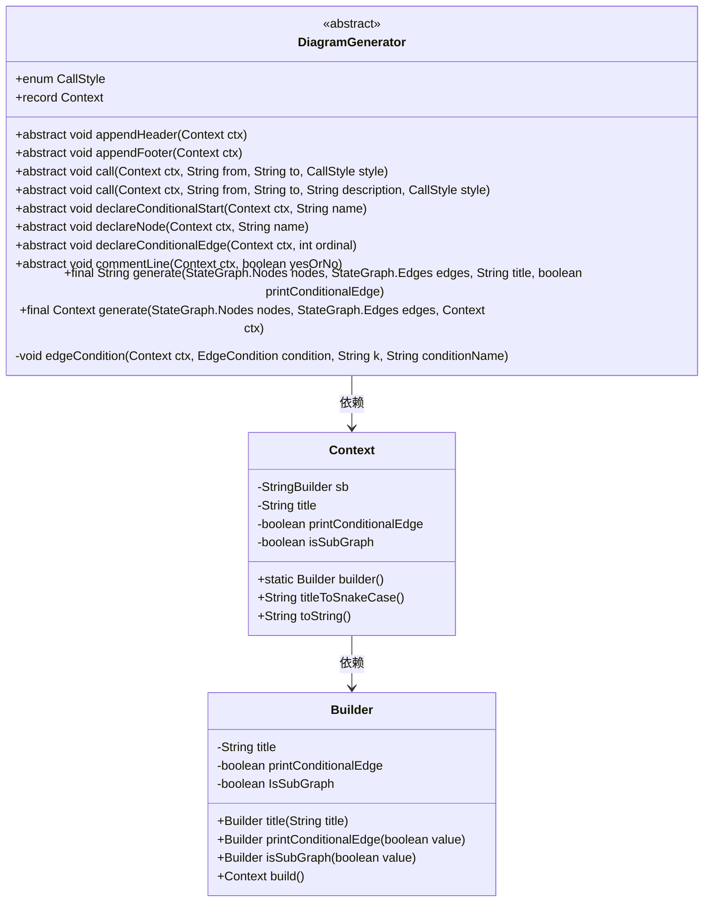
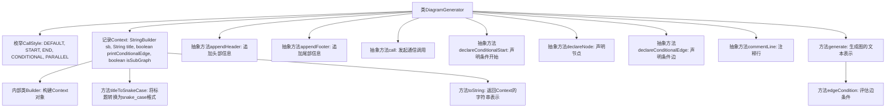

# 基础信息

|      |      |
|------|------|
| 名称 | DiagramGenerator |
| 编码语言 | .java |
| 代码路径 | spring-ai-alibaba/spring-ai-alibaba-graph/spring-ai-alibaba-graph-core/src/main/java/com/alibaba/cloud/ai/graph/DiagramGenerator.java |
| 包名 | com.alibaba.cloud.ai.graph |
| 依赖项 | ['java.util.Objects', 'com.alibaba.cloud.ai.graph.internal.edge.EdgeCondition', 'com.alibaba.cloud.ai.graph.state.AgentState', 'java.lang.String.format', 'com.alibaba.cloud.ai.graph.StateGraph.START'] |
| 概述说明 | DiagramGenerator类生成图表，管理上下文、声明节点、处理条件边和调用通信。 |

# 说明

DiagramGenerator类是一个用于生成图表的工具，具备多种核心功能。它支持上下文管理，确保在生成图表时能够有效管理相关数据和状态。节点声明功能允许用户定义和配置图表中的各个节点。条件边处理功能使得图表中的边可以根据特定条件进行动态调整。此外，通信调用功能使得该类能够与其他系统或模块进行交互，实现数据的传递和处理。整体上，DiagramGenerator类提供了全面的图表生成能力，适用于复杂的图表创建需求。

# 类列表 Class Summary

| 名称   | 类型  | 说明 |
|-------|------|-------------|
| DiagramGenerator | class | DiagramGenerator类用于生成图表，包含上下文管理、节点声明、条件边处理和通信调用等功能。 |

## 类 DiagramGenerator

|      |      |
|------|------|
| 访问范围 | public abstract |
| 类型 | class |
| 名称 | DiagramGenerator |
| 说明 | DiagramGenerator类用于生成图表，包含上下文管理、节点声明、条件边处理和通信调用等功能。 |

### UML类图

这段代码定义了一个抽象类 `DiagramGenerator`，用于生成某种图形表示。它包含一个枚举 `CallStyle` 和一个记录类 `Context`，后者用于存储生成图形时的上下文信息。`DiagramGenerator` 类提供了多个抽象方法，如 `appendHeader`、`appendFooter`、`call` 等，用于在生成图形时执行不同的操作。`Context` 类通过 `Builder` 模式进行构建，并提供了将标题转换为蛇形命名格式的方法。整体设计支持复杂的图形生成逻辑，特别是在处理条件边和子图时。

### 内部方法调用关系图

这段代码定义了一个抽象类`DiagramGenerator`，用于生成图的文本表示。它包含一个枚举`CallStyle`用于表示调用风格，以及一个记录`Context`用于存储生成图时的上下文信息。`Context`内部有一个`Builder`类用于构建`Context`对象。`DiagramGenerator`提供了多个抽象方法，如`appendHeader`、`appendFooter`、`call`等，子类需要实现这些方法来生成具体的图。`generate`方法负责生成图的文本表示，并在过程中调用其他方法来处理节点、边和条件。`edgeCondition`方法用于评估边的条件并生成相应的调用。

### 字段列表 Field List

| 名称  | 类型  | 说明 |
|-------|-------|------|

### 方法列表 Method List

| 名称  | 类型  | 说明 |
|-------|-------|------|
| appendFooter | void | 受保护的抽象方法，用于在上下文中添加页脚。 |
| declareConditionalEdge | void | 保护抽象方法声明条件边，需上下文和序号参数。 |
| appendHeader | void | 保护抽象方法，用于在上下文中添加头部信息。 |
| declareNode | void | 保护抽象方法声明节点，接收上下文和名称参数。 |
| edgeCondition | void | 处理边缘条件，遍历映射并调用相关方法。 |
| declareConditionalStart | void | 保护抽象方法，声明条件开始，需上下文和名称参数。 |
| call | void | 定义受保护的抽象方法，用于调用指定上下文和样式的通话。 |
| call | void | 抽象方法call，需传入上下文、起始、目标、描述和调用样式参数。 |
| generate | Context | 生成状态图，处理节点和边，递归处理子图，声明条件边，重置计数器。 |
| commentLine | void | 抽象方法commentLine接受Context和布尔参数，无返回值。 |
| generate | String | 生成状态图代码，接收节点、边、标题和条件边打印参数，返回生成结果。 |

