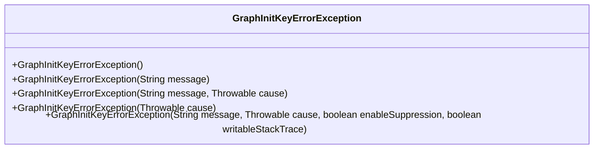
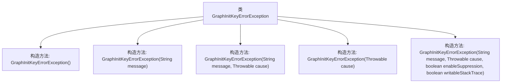

# 基础信息

|      |      |
|------|------|
| 名称 | GraphInitKeyErrorException |
| 编码语言 | .java |
| 代码路径 | spring-ai-alibaba/spring-ai-alibaba-graph/spring-ai-alibaba-graph-core/src/main/java/com/alibaba/cloud/ai/graph/GraphInitKeyErrorException.java |
| 包名 | com.alibaba.cloud.ai.graph |
| 依赖项 | [] |
| 概述说明 | GraphInitKeyErrorException继承RuntimeException，支持多种构造函数。 |

# 说明

GraphInitKeyErrorException继承自RuntimeException，表明它是一个运行时异常。该异常支持多种构造函数，提供了灵活的初始化方式，允许开发者在不同场景下创建异常实例。这种设计增强了代码的适应性和可维护性，使得异常处理更加方便和高效。

# 类列表 Class Summary

| 名称   | 类型  | 说明 |
|-------|------|-------------|
| GraphInitKeyErrorException | class | GraphInitKeyErrorException继承RuntimeException，支持多种构造函数。 |

## 类 GraphInitKeyErrorException

|      |      |
|------|------|
| 访问范围 | public |
| 类型 | class |
| 名称 | GraphInitKeyErrorException |
| 说明 | GraphInitKeyErrorException继承RuntimeException，支持多种构造函数。 |

### UML类图

这段代码定义了一个名为 `GraphInitKeyErrorException` 的异常类，它继承自 `RuntimeException`。该类提供了多个构造函数，允许在抛出异常时传递不同的参数，如错误信息、异常原因、是否启用抑制和是否可写堆栈跟踪。这些构造函数使得异常处理更加灵活，能够适应不同的错误场景。

### 内部方法调用关系图

这段代码定义了一个名为 `GraphInitKeyErrorException` 的自定义异常类，继承自 `RuntimeException`。该类提供了多个构造方法，允许在不同情况下初始化异常对象，包括传递错误信息、原因、以及控制异常抑制和堆栈跟踪的可写性。通过这些构造方法，开发者可以灵活地创建和抛出异常，以便在程序运行时处理特定的错误情况。

### 字段列表 Field List

| 名称  | 类型  | 说明 |
|-------|-------|------|

### 方法列表 Method List

| 名称  | 类型  | 说明 |
|-------|-------|------|

