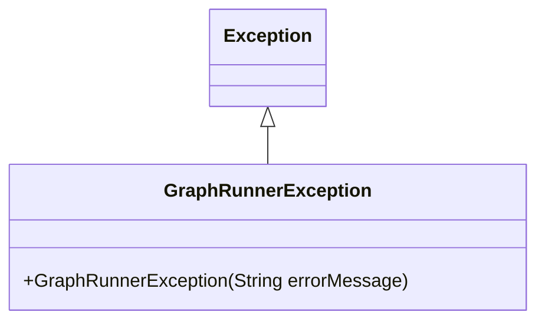
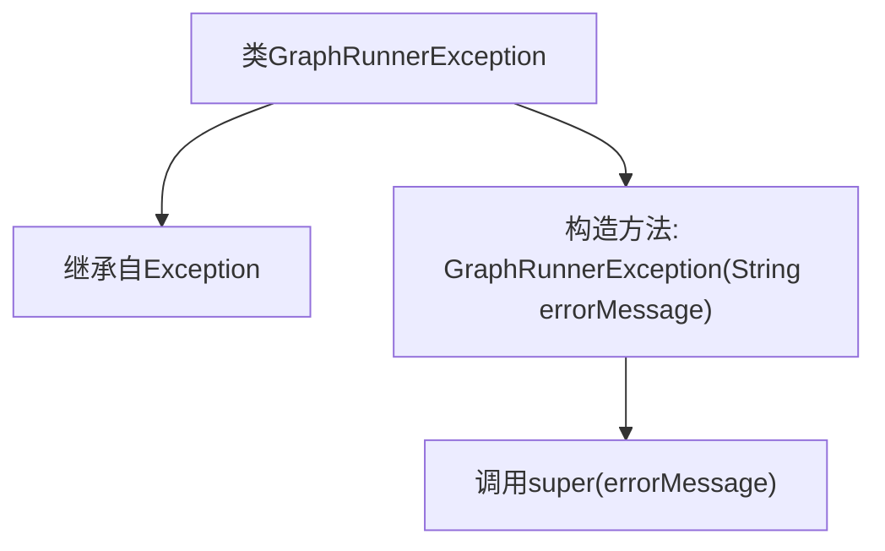

# 基础信息

|      |      |
|------|------|
| 名称 | GraphRunnerException |
| 编码语言 | .java |
| 代码路径 | spring-ai-alibaba/spring-ai-alibaba-graph/spring-ai-alibaba-graph-core/src/main/java/com/alibaba/cloud/ai/graph/GraphRunnerException.java |
| 包名 | com.alibaba.cloud.ai.graph |
| 依赖项 | [] |
| 概述说明 | GraphRunnerException继承Exception，构造函数传递错误信息。 |

# 说明

GraphRunnerException是Exception的子类，用于处理特定类型的错误。它通过构造函数接收并传递错误信息，以便在异常发生时能够提供详细的错误描述。这种设计使得错误处理更加灵活和具体，有助于开发者快速定位和解决问题。

# 类列表 Class Summary

| 名称   | 类型  | 说明 |
|-------|------|-------------|
| GraphRunnerException | class | GraphRunnerException继承Exception，通过构造函数传递错误信息。 |

## 类 GraphRunnerException

|      |      |
|------|------|
| 访问范围 | public |
| 类型 | class |
| 名称 | GraphRunnerException |
| 说明 | GraphRunnerException继承Exception，通过构造函数传递错误信息。 |

### UML类图

**描述：**  
`GraphRunnerException` 是一个自定义异常类，继承自 `Exception`。它提供了一个构造函数，允许在创建异常实例时传入详细的错误信息。这种设计通常用于在图形处理或运行过程中捕获和传递特定的错误信息，帮助开发者更好地调试和处理异常情况。

### 内部方法调用关系图

这段代码定义了一个名为 `GraphRunnerException` 的类，它继承自 `Exception` 类。`GraphRunnerException` 类包含一个构造方法，该方法接受一个字符串参数 `errorMessage`，并通过 `super(errorMessage)` 调用父类 `Exception` 的构造方法，从而初始化异常的错误信息。这段代码的主要作用是创建一个自定义异常类，用于在特定情况下抛出异常，并提供详细的错误信息。

### 字段列表 Field List

| 名称  | 类型  | 说明 |
|-------|-------|------|

### 方法列表 Method List

| 名称  | 类型  | 说明 |
|-------|-------|------|

