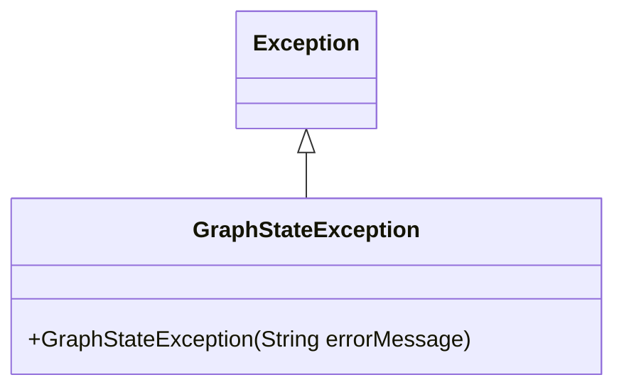
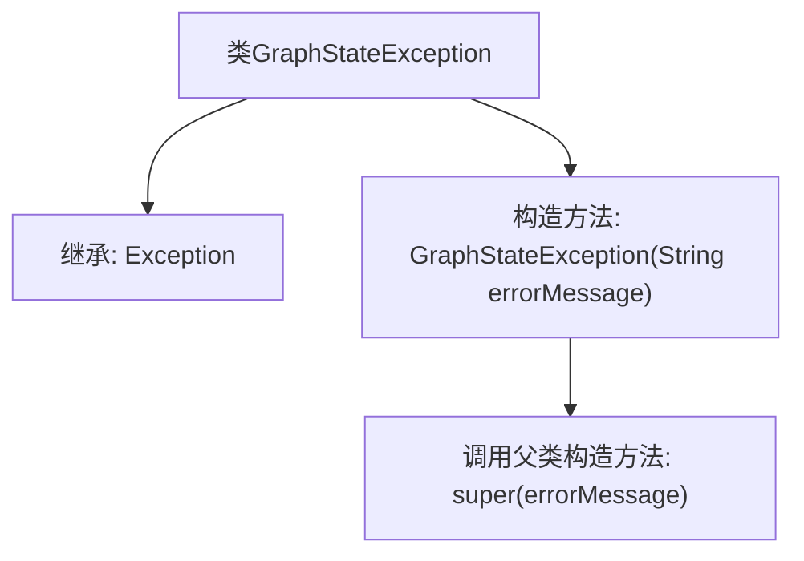

# 基础信息

|      |      |
|------|------|
| 名称 | GraphStateException |
| 编码语言 | .java |
| 代码路径 | spring-ai-alibaba/spring-ai-alibaba-graph/spring-ai-alibaba-graph-core/src/main/java/com/alibaba/cloud/ai/graph/GraphStateException.java |
| 包名 | com.alibaba.cloud.ai.graph |
| 依赖项 | [] |
| 概述说明 | GraphStateException继承Exception，处理图状态异常及错误信息。 |

# 说明

GraphStateException是继承自Exception的异常类，专门用于处理与图状态相关的错误信息。它能够捕获并传递与图操作或状态相关的异常情况，帮助开发者在图处理过程中更精准地定位和解决问题。

# 类列表 Class Summary

| 名称   | 类型  | 说明 |
|-------|------|-------------|
| GraphStateException | class | GraphStateException继承Exception，用于处理带错误信息的图状态异常。 |

## 类 GraphStateException

|      |      |
|------|------|
| 访问范围 | public |
| 类型 | class |
| 名称 | GraphStateException |
| 说明 | GraphStateException继承Exception，用于处理带错误信息的图状态异常。 |

### UML类图

**描述：**  
`GraphStateException` 是一个自定义异常类，继承自 `Exception`。它通过构造函数接收一个错误信息字符串，并将该信息传递给父类 `Exception` 的构造函数。该类用于处理与图状态相关的异常情况，提供了详细的错误信息以便于调试和错误处理。

### 内部方法调用关系图

这段代码定义了一个名为 `GraphStateException` 的异常类，它继承自 `Exception` 类。该类包含一个构造方法 `GraphStateException(String errorMessage)`，该方法接收一个错误信息字符串作为参数，并通过 `super(errorMessage)` 调用父类 `Exception` 的构造方法来初始化异常对象。该异常类用于处理与图状态相关的错误情况，提供了一种自定义错误信息的方式。

### 字段列表 Field List

| 名称  | 类型  | 说明 |
|-------|-------|------|

### 方法列表 Method List

| 名称  | 类型  | 说明 |
|-------|-------|------|

