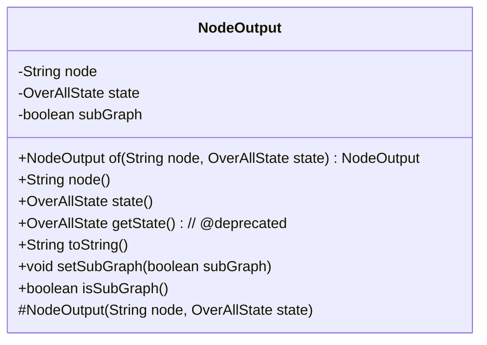
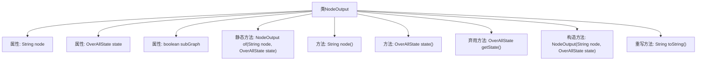

# 基础信息

|      |      |
|------|------|
| 名称 | NodeOutput |
| 编码语言 | .java |
| 代码路径 | spring-ai-alibaba/spring-ai-alibaba-graph/spring-ai-alibaba-graph-core/src/main/java/com/alibaba/cloud/ai/graph/NodeOutput.java |
| 包名 | com.alibaba.cloud.ai.graph |
| 依赖项 | ['lombok.AccessLevel', 'lombok.Getter', 'lombok.Setter', 'com.alibaba.cloud.ai.graph.state.AgentState', 'java.lang.String.format'] |
| 概述说明 | NodeOutput类存储节点标识符和状态，支持子图标记，提供访问方法。 |

# 说明

NodeOutput类的主要功能是存储节点标识符及其状态，并支持子图标记。该类提供了访问节点和状态的方法，便于用户获取和管理节点信息。通过子图标记功能，可以更好地组织和区分不同子图中的节点及其状态。整体设计旨在增强节点管理的灵活性和效率。

# 类列表 Class Summary

| 名称   | 类型  | 说明 |
|-------|------|-------------|
| NodeOutput | class | NodeOutput类用于存储节点标识符及其状态，支持子图标记，提供节点和状态访问方法。 |

## 类 NodeOutput

|      |      |
|------|------|
| 访问范围 | public |
| 类型 | class |
| 名称 | NodeOutput |
| 说明 | NodeOutput类用于存储节点标识符及其状态，支持子图标记，提供节点和状态访问方法。 |

### UML类图

这段代码定义了一个 `NodeOutput` 类，用于表示节点的输出信息。该类包含节点的标识符 `node`、节点的状态 `state` 以及一个标记是否为子图的布尔值 `subGraph`。类提供了获取节点和状态的方法，以及一个标记为过时的 `getState` 方法。此外，类还包含一个静态工厂方法 `of` 用于创建 `NodeOutput` 实例，并重写了 `toString` 方法以提供对象的字符串表示。`subGraph` 字段通过 `@Setter` 和 `@Getter` 注解提供了设置和获取方法。

### 内部方法调用关系图

这段代码定义了一个名为 `NodeOutput` 的类，该类包含三个属性：`node`、`state` 和 `subGraph`。类中提供了一个静态工厂方法 `of` 用于创建 `NodeOutput` 实例，并提供了获取 `node` 和 `state` 的方法。`getState` 方法已被弃用，建议使用 `state` 方法。`toString` 方法被重写以返回对象的字符串表示。流程图展示了类的属性、方法和它们之间的关系。

### 字段列表 Field List

| 名称  | 类型  | 说明 |
|-------|-------|------|
| node | String | 声明一个私有不可变的字符串变量node。 |
| subGraph = false | boolean | 受保护的布尔类型subGraph，默认为false。 |
| state | OverAllState | 私有常量OverAllState类型变量state。 |

### 方法列表 Method List

| 名称  | 类型  | 说明 |
|-------|-------|------|
| node | String | 返回节点字符串的方法。 |
| state | OverAllState | 该方法返回当前状态值。 |
| getState | OverAllState | 弃用方法getState，建议使用state()替代。 |
| toString | String | 重写toString方法，返回节点和状态的格式化字符串。 |
| of | NodeOutput | 静态方法创建NodeOutput实例，包含节点和状态参数。 |

