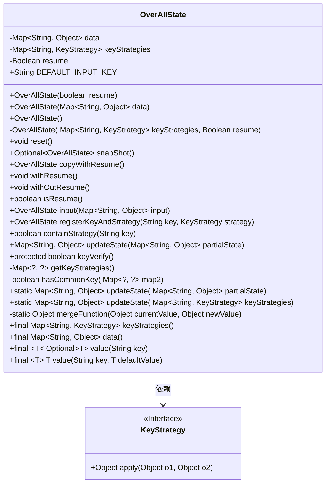

# 基础信息

|      |      |
|------|------|
| 名称 | OverAllState |
| 编码语言 | .java |
| 代码路径 | spring-ai-alibaba/spring-ai-alibaba-graph/spring-ai-alibaba-graph-core/src/main/java/com/alibaba/cloud/ai/graph/OverAllState.java |
| 包名 | com.alibaba.cloud.ai.graph |
| 依赖项 | ['lombok.ToString', 'org.springframework.util.CollectionUtils', 'java.io.Serializable', 'java.util', 'java.util.stream.Collectors', 'java.util.stream.Stream', 'java.util.Collections.unmodifiableMap', 'java.util.Optional.ofNullable'] |
| 概述说明 | OverAllState类管理状态数据，支持重置、快照、更新及策略注册，提供数据访问和验证功能。 |

# 说明

OverAllState类负责管理状态数据，具备重置、快照和更新功能，支持策略注册，同时提供数据访问和验证功能，确保状态数据的完整性和可控性。

# 类列表 Class Summary

| 名称   | 类型  | 说明 |
|-------|------|-------------|
| OverAllState | class | OverAllState类管理状态数据，支持重置、快照、更新及策略注册，提供数据访问和验证功能。 |

## 类 OverAllState

|      |      |
|------|------|
| 访问范围 | @ToString;public final |
| 类型 | class |
| 名称 | OverAllState |
| 说明 | OverAllState类管理状态数据，支持重置、快照、更新及策略注册，提供数据访问和验证功能。 |

### UML类图

### 描述
`OverAllState` 类是一个用于管理状态的核心类，包含两个主要数据结构：`data` 和 `keyStrategies`。`data` 用于存储键值对状态，`keyStrategies` 用于存储键与策略的映射。类提供了多种构造方法，允许通过不同的参数初始化状态。此外，类还提供了状态重置、快照、状态更新、策略注册等功能。`KeyStrategy` 是一个接口，定义了如何应用策略来更新状态。`OverAllState` 类依赖于 `KeyStrategy` 接口来实现状态的动态更新。

### 内部方法调用关系图

```mermaid
graph TD
    A["类OverAllState"]
    B["属性: Map<String, Object> data"]
    C["属性: Map<String, KeyStrategy> keyStrategies"]
    D["属性: Boolean resume"]
    E["常量: String DEFAULT_INPUT_KEY"]
    F["方法: void reset()"]
    G["方法: Optional<OverAllState> snapShot()"]
    H["构造方法: OverAllState(boolean resume)"]
    I["构造方法: OverAllState(Map<String, Object> data)"]
    J["构造方法: OverAllState()"]
    K["构造方法: OverAllState(Map<String, Object> data, Map<String, KeyStrategy> keyStrategies, Boolean resume)"]
    L["方法: OverAllState copyWithResume()"]
    M["方法: void withResume()"]
    N["方法: void withOutResume()"]
    O["方法: boolean isResume()"]
    P["方法: OverAllState input(Map<String, Object> input)"]
    Q["方法: OverAllState registerKeyAndStrategy(String key, KeyStrategy strategy)"]
    R["方法: boolean containStrategy(String key)"]
    S["方法: Map<String, Object> updateState(Map<String, Object> partialState)"]
    T["方法: boolean keyVerify()"]
    U["方法: Map<?, ?> getKeyStrategies()"]
    V["方法: boolean hasCommonKey(Map<?, ?> map1, Map<?, ?> map2)"]
    W["静态方法: Map<String, Object> updateState(Map<String, Object> state, Map<String, Object> partialState)"]
    X["静态方法: Map<String, Object> updateState(Map<String, Object> state, Map<String, Object> partialState, Map<String, KeyStrategy> keyStrategies)"]
    Y["静态方法: Object mergeFunction(Object currentValue, Object newValue)"]
    Z["方法: Map<String, KeyStrategy> keyStrategies()"]
    AA["方法: Map<String, Object> data()"]
    AB["方法: Optional<T> value(String key)"]
    AC["方法: T value(String key, T defaultValue)"]

    A --> B
    A --> C
    A --> D
    A --> E
    A --> F
    A --> G
    A --> H
    A --> I
    A --> J
    A --> K
    A --> L
    A --> M
    A --> N
    A --> O
    A --> P
    A --> Q
    A --> R
    A --> S
    A --> T
    A --> U
    A --> V
    A --> W
    A --> X
    A --> Y
    A --> Z
    A --> AA
    A --> AB
    A --> AC
```

该流程图展示了`OverAllState`类的结构，包括其属性、构造方法和各类方法。`OverAllState`类主要用于管理状态数据，提供了一系列方法来操作和查询状态，如`reset`、`snapShot`、`input`等。此外，类中还包含了多个构造方法，用于初始化不同的状态。通过该流程图，可以清晰地看到类中各方法之间的关系及其调用顺序。

### 字段列表 Field List

| 名称  | 类型  | 说明 |
|-------|-------|------|
| data | Map<String, Object> | 私有不可变映射，键为字符串，值为对象。 |
| resume | Boolean | 定义了一个私有布尔变量resume。 |
| keyStrategies | Map<String, KeyStrategy> | 私有映射存储键与策略的对应关系。 |
| DEFAULT_INPUT_KEY = "input" | String | 定义静态常量DEFAULT_INPUT_KEY，值为"input"。 |

### 方法列表 Method List

| 名称  | 类型  | 说明 |
|-------|-------|------|
| withResume | void | 方法withResume将resume属性设置为true。 |
| snapShot | Optional<OverAllState> | 方法返回包含当前数据和策略的可选总体状态对象。 |
| copyWithResume | OverAllState | 复制整体状态并恢复操作。 |
| mergeFunction | Object | 合并函数返回新值。 |
| keyStrategies | Map<String, KeyStrategy> | 返回不可修改的键策略映射。 |
| keyVerify | boolean | 该方法验证数据与密钥策略是否匹配。 |
| containStrategy | boolean | 该方法检查键是否存在于策略映射中。 |
| value | Optional<T> | 该方法返回指定键对应的值，若不存在则返回空。 |
| getKeyStrategies | Map<?, ?> | 该方法返回私有映射类型的键策略集合。 |
| data | Map<String, Object> | 该方法返回不可修改的Map类型数据。 |
| updateState | Map<String, Object> | 更新状态映射，合并部分状态并应用键策略。 |
| withOutResume | void | 方法withOutResume将resume属性设置为false。 |
| hasCommonKey | boolean | 检查两个映射是否有相同键。 |
| isResume | boolean | 该方法返回布尔值，表示简历是否存在。 |
| updateState | Map<String, Object> | 更新状态方法：合并两个Map，若partialState为空则返回原state。 |
| reset | void | reset方法清空数据集合。 |
| registerKeyAndStrategy | OverAllState | 注册键和策略，存储于keyStrategies中，返回当前状态。 |
| updateState | Map<String, Object> | 更新状态方法，根据键策略处理部分状态并返回完整数据。 |
| input | OverAllState | 方法`input`接收Map参数，非空时合并到`data`并返回当前对象。 |
| value | T | 该方法根据键获取值，若不存在则返回默认值。 |

