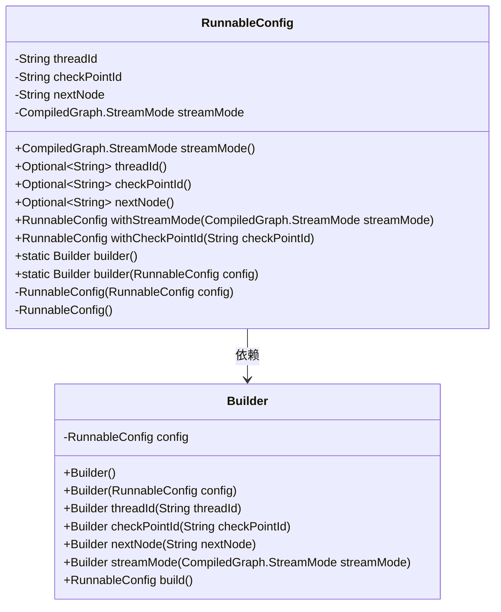

# 基础信息

|      |      |
|------|------|
| 名称 | RunnableConfig |
| 编码语言 | .java |
| 代码路径 | spring-ai-alibaba/spring-ai-alibaba-graph/spring-ai-alibaba-graph-core/src/main/java/com/alibaba/cloud/ai/graph/RunnableConfig.java |
| 包名 | com.alibaba.cloud.ai.graph |
| 依赖项 | ['java.util.Objects', 'java.util.Optional', 'lombok.ToString'] |
| 概述说明 | RunnableConfig类配置线程、检查点、下一节点和流模式，支持构建器模式和可选值操作。 |

# 说明

RunnableConfig类用于配置线程、检查点、下一节点和流模式，支持构建器模式和可选值操作。该类提供了一种灵活的方式来设置和管理运行时的各种配置参数，使得用户可以根据需求自定义线程行为、检查点机制、节点连接方式以及流处理模式。通过构建器模式，用户可以逐步构建和修改配置，同时支持可选值的操作，确保配置的灵活性和扩展性。

# 类列表 Class Summary

| 名称   | 类型  | 说明 |
|-------|------|-------------|
| RunnableConfig | class | RunnableConfig类用于配置线程、检查点、下一节点和流模式，支持构建器模式和可选值操作。 |

## 类 RunnableConfig

|      |      |
|------|------|
| 访问范围 | @ToString;public final |
| 类型 | class |
| 名称 | RunnableConfig |
| 说明 | RunnableConfig类用于配置线程、检查点、下一节点和流模式，支持构建器模式和可选值操作。 |

### UML类图

### 描述
`RunnableConfig` 类用于配置线程运行的参数，包括线程ID、检查点ID、下一个节点以及流模式。它提供了获取这些配置的方法，并支持通过 `Builder` 类进行配置的构建和修改。`Builder` 类采用构建者模式，允许链式调用设置配置属性，并最终构建 `RunnableConfig` 对象。`RunnableConfig` 类的构造函数是私有的，确保只能通过 `Builder` 类来创建和修改配置对象。

### 内部方法调用关系图

```mermaid
graph TD
    A["类RunnableConfig"]
    B["属性: String threadId"]
    C["属性: String checkPointId"]
    D["属性: String nextNode"]
    E["属性: CompiledGraph.StreamMode streamMode"]
    F["方法: CompiledGraph.StreamMode streamMode()"]
    G["方法: Optional<String> threadId()"]
    H["方法: Optional<String> checkPointId()"]
    I["方法: Optional<String> nextNode()"]
    J["方法: RunnableConfig withStreamMode(CompiledGraph.StreamMode streamMode)"]
    K["方法: RunnableConfig withCheckPointId(String checkPointId)"]
    L["静态方法: Builder builder()"]
    M["静态方法: Builder builder(RunnableConfig config)"]
    N["内部类Builder"]
    O["属性: RunnableConfig config"]
    P["构造方法: Builder()"]
    Q["构造方法: Builder(RunnableConfig config)"]
    R["方法: Builder threadId(String threadId)"]
    S["方法: Builder checkPointId(String checkPointId)"]
    T["方法: Builder nextNode(String nextNode)"]
    U["方法: Builder streamMode(CompiledGraph.StreamMode streamMode)"]
    V["方法: RunnableConfig build()"]
    W["构造方法: RunnableConfig(RunnableConfig config)"]
    X["构造方法: RunnableConfig()"]

    A --> B
    A --> C
    A --> D
    A --> E
    A --> F
    A --> G
    A --> H
    A --> I
    A --> J
    A --> K
    A --> L
    A --> M
    A --> N
    N --> O
    N --> P
    N --> Q
    N --> R
    N --> S
    N --> T
    N --> U
    N --> V
    A --> W
    A --> X
```

这段代码定义了一个名为`RunnableConfig`的类，用于配置线程、检查点和流模式等属性。类中包含多个方法用于获取和设置这些属性，并且使用了`Optional`来处理可能为空的属性值。此外，代码还定义了一个内部类`Builder`，用于通过构建者模式创建`RunnableConfig`对象。`Builder`类提供了链式调用的方法，使得配置过程更加灵活和直观。整体设计体现了高内聚和低耦合的原则，适合在复杂系统中使用。

### 字段列表 Field List

| 名称  | 类型  | 说明 |
|-------|-------|------|
| threadId | String | 定义了一个私有字符串变量threadId。 |
| checkPointId | String | 定义了一个私有字符串变量checkPointId。 |
| streamMode = CompiledGraph.StreamMode.VALUES | CompiledGraph.StreamMode | 私有流模式变量设置为值模式。 |
| nextNode | String | 定义了一个私有字符串变量nextNode。 |

### 方法列表 Method List

| 名称  | 类型  | 说明 |
|-------|-------|------|
| checkPointId | Optional<String> | 方法返回可空的检查点ID。 |
| threadId | Optional<String> | 返回线程ID的可选值。 |
| nextNode | Optional<String> | 方法返回下一个节点的可选值。 |
| builder | Builder | 静态方法`builder()`返回一个新的`Builder`实例。 |
| builder | Builder | 静态方法`builder`接收`RunnableConfig`参数，返回`Builder`实例。 |
| streamMode | CompiledGraph.StreamMode | 方法返回CompiledGraph的StreamMode属性值。 |
| withStreamMode | RunnableConfig | 方法返回配置对象，若流模式相同则返回当前对象，否则创建并返回新配置对象。 |
| withCheckPointId | RunnableConfig | 方法withCheckPointId更新RunnableConfig的checkPointId并返回新实例。 |

