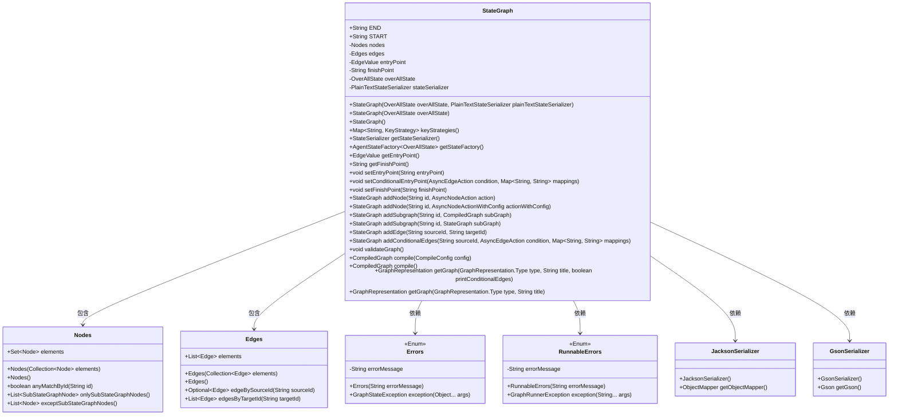

# 基础信息

|      |      |
|------|------|
| 名称 | StateGraph |
| 编码语言 | .java |
| 代码路径 | spring-ai-alibaba/spring-ai-alibaba-graph/spring-ai-alibaba-graph-core/src/main/java/com/alibaba/cloud/ai/graph/StateGraph.java |
| 包名 | com.alibaba.cloud.ai.graph |
| 依赖项 | ['java.util.ArrayList', 'java.util.Collection', 'java.util.LinkedHashSet', 'java.util.LinkedList', 'java.util.List', 'java.util.Map', 'java.util.Objects', 'java.util.Optional', 'java.util.Set', 'com.alibaba.cloud.ai.graph.checkpoint.config.SaverConfig', 'com.alibaba.cloud.ai.graph.checkpoint.constant.SaverConstant', 'com.alibaba.cloud.ai.graph.checkpoint.savers.MemorySaver', 'com.alibaba.cloud.ai.graph.serializer.plain_text.PlainTextStateSerializer', 'com.alibaba.cloud.ai.graph.serializer.plain_text.gson.GsonStateSerializer', 'com.alibaba.cloud.ai.graph.serializer.plain_text.jackson.JacksonStateSerializer', 'com.fasterxml.jackson.databind.ObjectMapper', 'com.google.gson.Gson', 'com.google.gson.GsonBuilder', 'lombok.Getter', 'com.alibaba.cloud.ai.graph.action.AsyncEdgeAction', 'com.alibaba.cloud.ai.graph.action.AsyncNodeAction', 'com.alibaba.cloud.ai.graph.action.AsyncNodeActionWithConfig', 'com.alibaba.cloud.ai.graph.internal.edge.Edge', 'com.alibaba.cloud.ai.graph.internal.edge.EdgeCondition', 'com.alibaba.cloud.ai.graph.internal.edge.EdgeValue', 'com.alibaba.cloud.ai.graph.internal.node.Node', 'com.alibaba.cloud.ai.graph.internal.node.SubCompiledGraphNode', 'com.alibaba.cloud.ai.graph.internal.node.SubStateGraphNode', 'com.alibaba.cloud.ai.graph.serializer.StateSerializer', 'com.alibaba.cloud.ai.graph.state.AgentStateFactory', 'lombok.Setter', 'java.lang.String.format'] |
| 概述说明 | StateGraph类管理状态图节点和边，含错误枚举、序列化器及图操作方法。 |

# 说明

StateGraph类是一个用于管理节点和边状态图的工具，它集成了错误枚举、序列化器以及图操作方法。该类的主要功能包括处理节点和边的状态，定义错误类型以应对异常情况，提供序列化功能以便于数据的存储和传输，同时还包含多种图操作方法，用于对状态图进行各种操作和管理。通过这些功能，StateGraph类能够有效地维护和操作复杂的状态图结构。

# 类列表 Class Summary

| 名称   | 类型  | 说明 |
|-------|------|-------------|
| StateGraph | class | StateGraph类管理节点和边的状态图，包含错误枚举、序列化器和图操作方法。 |

## 类 StateGraph

|      |      |
|------|------|
| 访问范围 | public |
| 类型 | class |
| 名称 | StateGraph |
| 说明 | StateGraph类管理节点和边的状态图，包含错误枚举、序列化器和图操作方法。 |

### UML类图

### 描述
`StateGraph` 类是一个状态图的核心类，用于管理和操作图中的节点和边。它包含节点集合 `Nodes` 和边集合 `Edges`，并提供了添加节点、边、子图等方法。`Errors` 和 `RunnableErrors` 枚举类用于处理图状态和运行时的错误。`JacksonSerializer` 和 `GsonSerializer` 是用于序列化和反序列化状态的工具类。该类通过验证图的状态，确保图的正确性，并提供了编译和生成图表示的功能。

### 内部方法调用关系图

```mermaid
graph TD
    A["类StateGraph"]
    B["枚举Errors"]
    C["枚举RunnableErrors"]
    D["属性: String END"]
    E["属性: String START"]
    F["属性: Nodes nodes"]
    G["属性: Edges edges"]
    H["属性: EdgeValue entryPoint"]
    I["属性: String finishPoint"]
    J["属性: OverAllState overAllState"]
    K["属性: PlainTextStateSerializer stateSerializer"]
    L["内部类JacksonSerializer"]
    M["内部类GsonSerializer"]
    N["方法: StateGraph(OverAllState, PlainTextStateSerializer)"]
    O["方法: StateGraph(OverAllState)"]
    P["方法: StateGraph()"]
    Q["方法: Map<String, KeyStrategy> keyStrategies()"]
    R["方法: StateSerializer getStateSerializer()"]
    S["方法: AgentStateFactory<OverAllState> getStateFactory()"]
    T["方法: EdgeValue getEntryPoint()"]
    U["方法: String getFinishPoint()"]
    V["方法: void setEntryPoint(String)"]
    W["方法: void setConditionalEntryPoint(AsyncEdgeAction, Map<String, String>)"]
    X["方法: void setFinishPoint(String)"]
    Y["方法: StateGraph addNode(String, AsyncNodeAction)"]
    Z["方法: StateGraph addNode(String, AsyncNodeActionWithConfig)"]
    AA["方法: StateGraph addSubgraph(String, CompiledGraph)"]
    AB["方法: StateGraph addSubgraph(String, StateGraph)"]
    AC["方法: StateGraph addEdge(String, String)"]
    AD["方法: StateGraph addConditionalEdges(String, AsyncEdgeAction, Map<String, String>)"]
    AE["方法: void validateGraph()"]
    AF["方法: CompiledGraph compile(CompileConfig)"]
    AG["方法: CompiledGraph compile()"]
    AH["方法: GraphRepresentation getGraph(GraphRepresentation.Type, String, Boolean)"]
    AI["方法: GraphRepresentation getGraph(GraphRepresentation.Type, String)"]
    AJ["内部类Nodes"]
    AK["内部类Edges"]

    A --> B
    A --> C
    A --> D
    A --> E
    A --> F
    A --> G
    A --> H
    A --> I
    A --> J
    A --> K
    A --> L
    A --> M
    A --> N
    A --> O
    A --> P
    A --> Q
    A --> R
    A --> S
    A --> T
    A --> U
    A --> V
    A --> W
    A --> X
    A --> Y
    A --> Z
    A --> AA
    A --> AB
    A --> AC
    A --> AD
    A --> AE
    A --> AF
    A --> AG
    A --> AH
    A --> AI
    A --> AJ
    A --> AK
```

这段代码定义了一个`StateGraph`类，用于管理状态图中的节点和边。它包含了两个枚举类`Errors`和`RunnableErrors`，用于定义各种错误消息。`StateGraph`类还包含了多个内部类和方法，用于添加节点、边、子图，以及验证和编译图。代码结构清晰，功能模块化，便于扩展和维护。

### 字段列表 Field List

| 名称  | 类型  | 说明 |
|-------|-------|------|
| edges = new Edges() | Edges | 创建新的Edges对象实例。 |
| entryPoint | EdgeValue | 私有EdgeValue类型变量entryPoint声明。 |
| nodes = new Nodes() | Nodes | 创建名为nodes的Nodes类新实例。 |
| stateSerializer | PlainTextStateSerializer | 私有不可变的PlainTextStateSerializer状态序列化器。 |
| START = "__START__" | String | 定义静态字符串常量START，值为"__START__"。 |
| END = "__END__" | String | 定义了一个静态字符串常量END，值为"__END__"。 |
| finishPoint | String | 标记为废弃，计划移除的私有字符串变量finishPoint。 |
| overAllState | OverAllState | 定义私有变量overAllState，并生成其getter和setter方法。 |

### 方法列表 Method List

| 名称  | 类型  | 说明 |
|-------|-------|------|
| getStateSerializer | StateSerializer | 获取状态序列化器的方法。 |
| setFinishPoint | void | 已弃用的设置终点方法。 |
| getStateFactory | AgentStateFactory<OverAllState> | 获取整体状态工厂的方法。 |
| getGraph | GraphRepresentation | 获取指定类型、标题和条件的图表示。 |
| compile | CompiledGraph | 编译图方法，验证配置非空并检查图状态，返回编译结果。 |
| validateGraph | void | 验证图结构，确保边和节点符合要求。 |
| addSubgraph | StateGraph | 方法addSubgraph用于添加子图，检查ID有效性并防止重复节点。 |
| addSubgraph | StateGraph | 添加子图方法，验证并合并状态策略，确保节点唯一性。 |
| getEntryPoint | EdgeValue | 已弃用方法，获取入口点并返回目标值。 |
| setConditionalEntryPoint | void | 该方法已弃用，用于设置条件入口点，调用addConditionalEdges方法。 |
| keyStrategies | Map<String, KeyStrategy> | 方法返回整体状态中的键策略映射。 |
| getFinishPoint | String | 标记为弃用并计划移除的getFinishPoint方法。 |
| setEntryPoint | void | 废弃方法setEntryPoint，用于添加起始点到指定入口点的边。 |
| getGraph | GraphRepresentation | 该方法根据类型和标题生成图形表示，并返回新的图形表示对象。 |
| addNode | StateGraph | 方法addNode用于添加节点，接受ID和异步操作参数。 |
| addNode | StateGraph | 添加节点方法，检查ID有效性，防止重复，最终返回当前图状态。 |
| addEdge | StateGraph | 添加边到状态图，处理重复边并返回当前图实例。 |
| compile | CompiledGraph | 编译方法配置序列化器和存储器，返回编译结果。 |
| addConditionalEdges | StateGraph | 为状态图添加条件边，检查源ID和映射，防止重复边。 |

