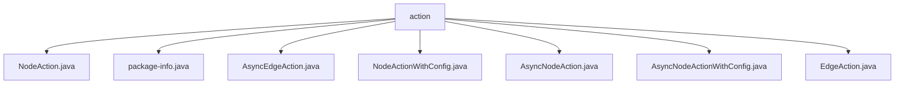

# 基础信息

|      |      |
|------|------|
| 名称 | action |
| 编码语言 | .java |
| 代码路径 | spring-ai-alibaba/spring-ai-alibaba-graph/spring-ai-alibaba-graph-core/src/main/java/com/alibaba/cloud/ai/graph/action |
| 包名 | spring-ai-alibaba.spring-ai-alibaba-graph.spring-ai-alibaba-graph-core.src.main.java.com.alibaba.cloud.ai.graph.action |
| 概述说明 | 提供的文件内容为空，无法生成总结描述。 |

# 说明

## 概述
该代码模块属于 `spring-ai-alibaba` 项目中的 `spring-ai-alibaba-graph-core` 模块，主要处理与图（Graph）相关的操作。模块的核心功能集中在 `com.alibaba.cloud.ai.graph.action` 包下，包含了一系列与节点（Node）和边（Edge）相关的操作类。这些操作类分为同步和异步两种类型，并且部分类支持配置（Config）的扩展。

## 主要业务场景
1. **节点操作**：
   - `NodeAction` 和 `AsyncNodeAction` 分别提供了同步和异步的节点操作功能，用于对图中的节点进行处理。
   - `NodeActionWithConfig` 和 `AsyncNodeActionWithConfig` 在节点操作的基础上，增加了对配置的支持，允许在操作时传入自定义配置。

2. **边操作**：
   - `EdgeAction` 和 `AsyncEdgeAction` 分别提供了同步和异步的边操作功能，用于对图中的边进行处理。

3. **异步处理**：
   - 该模块支持异步操作，通过 `AsyncNodeAction` 和 `AsyncEdgeAction` 等类，能够在高并发场景下提高处理效率。

4. **扩展性**：
   - 通过 `WithConfig` 后缀的类，模块支持在操作中引入自定义配置，增强了灵活性和扩展性。

该模块的设计适用于需要处理图数据结构，并且对性能和扩展性有较高要求的业务场景，例如图计算、推荐系统、社交网络分析等。

### 包内部结构视图

该流程图展示了`action`文件夹下的文件层级关系。`action`作为根节点，包含了多个Java文件，如`NodeAction.java`、`package-info.java`、`AsyncEdgeAction.java`等。每个文件都直接隶属于`action`文件夹，没有进一步的子文件夹层级。

# 文件列表 File List

| 名称   | 类型  | 说明 |
|-------|------|-------------|
| [EdgeAction.java](EdgeAction.md) | file | 无内容，无法生成概要描述。 |
| [AsyncNodeAction.java](AsyncNodeAction.md) | file | 无内容，无法生成概要描述。 |
| [NodeActionWithConfig.java](NodeActionWithConfig.md) | file | 信息为空，无法生成概要描述。 |
| [package-info.java](package-info.md) | file | 输入内容为空，无法生成概要描述。 |
| [NodeAction.java](NodeAction.md) | file | 信息为空，无法生成概要描述。 |
| [AsyncNodeActionWithConfig.java](AsyncNodeActionWithConfig.md) | file | 内容为空，无法生成概要描述。 |
| [AsyncEdgeAction.java](AsyncEdgeAction.md) | file | 信息为空，无法生成概要描述。 |

