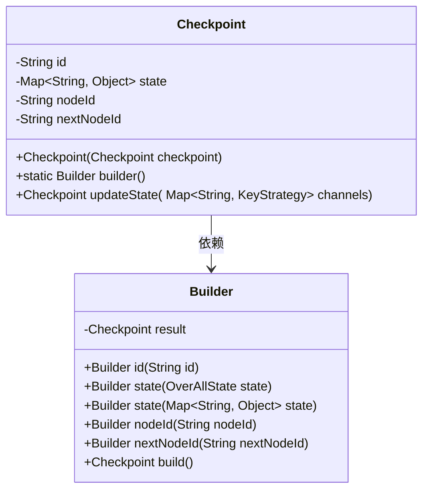
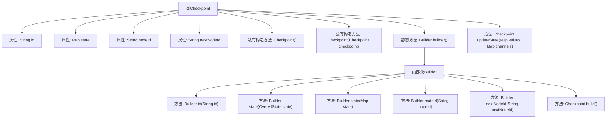

# 基础信息

|      |      |
|------|------|
| 名称 | Checkpoint |
| 编码语言 | .java |
| 代码路径 | spring-ai-alibaba/spring-ai-alibaba-graph/spring-ai-alibaba-graph-core/src/main/java/com/alibaba/cloud/ai/graph/checkpoint/Checkpoint.java |
| 包名 | com.alibaba.cloud.ai.graph.checkpoint |
| 依赖项 | ['java.io.Serializable', 'java.util.Map', 'java.util.Objects', 'java.util.UUID', 'com.alibaba.cloud.ai.graph.KeyStrategy', 'com.alibaba.cloud.ai.graph.OverAllState', 'com.alibaba.cloud.ai.graph.state.AgentState', 'com.alibaba.cloud.ai.graph.state.Channel', 'lombok.Data', 'lombok.ToString'] |
| 概述说明 | Checkpoint类实现序列化，含ID、状态、节点ID及下一节点ID，支持构建与状态更新。 |

# 说明

Checkpoint类实现了序列化功能，包含四个主要属性：ID、状态、节点ID和下一节点ID。该类提供了构建器功能，用于创建Checkpoint对象，并具备状态更新功能，允许在对象创建后修改其状态。这些功能共同确保Checkpoint类能够有效地管理和维护检查点信息，支持序列化和状态变更操作。

# 类列表 Class Summary

| 名称   | 类型  | 说明 |
|-------|------|-------------|
| Checkpoint | class | Checkpoint类实现序列化，包含ID、状态、节点ID和下一节点ID，提供构建器和状态更新功能。 |

## 类 Checkpoint

|      |      |
|------|------|
| 访问范围 | @Data;@ToString;public |
| 类型 | class |
| 名称 | Checkpoint |
| 说明 | Checkpoint类实现序列化，包含ID、状态、节点ID和下一节点ID，提供构建器和状态更新功能。 |

### UML类图

这段代码定义了一个`Checkpoint`类，用于表示某个检查点，包含唯一的ID、状态、节点ID和下一个节点ID等信息。`Checkpoint`类提供了一个`Builder`内部类，用于通过链式调用构建`Checkpoint`对象。`Checkpoint`类还提供了一个`updateState`方法，用于更新状态并返回一个新的`Checkpoint`对象。`Builder`类负责验证并构建`Checkpoint`对象，确保所有必要字段不为空。

### 内部方法调用关系图

这段代码定义了一个名为`Checkpoint`的类，该类包含多个属性和方法，用于管理检查点的状态和构建检查点对象。类中定义了一个内部类`Builder`，用于通过链式调用的方式构建`Checkpoint`对象。`Checkpoint`类还提供了一个`updateState`方法，用于更新检查点的状态。整个流程展示了类的结构、属性和方法之间的关系，以及`Builder`类的构建过程。

### 字段列表 Field List

| 名称  | 类型  | 说明 |
|-------|-------|------|
| state = null | Map<String, Object> | 私有Map类型变量state初始化为null。 |
| nextNodeId = null | String | 私有字符串变量nextNodeId初始化为null。 |
| id = UUID.randomUUID().toString() | String | 生成唯一ID并赋值给私有字符串变量id。 |
| nodeId = null | String | 定义私有字符串变量nodeId并初始化为null。 |

### 方法列表 Method List

| 名称  | 类型  | 说明 |
|-------|-------|------|
| updateState | Checkpoint | 更新检查点状态，返回新检查点对象。 |
| builder | Builder | 静态方法`builder()`返回一个新的`Builder`实例。 |

