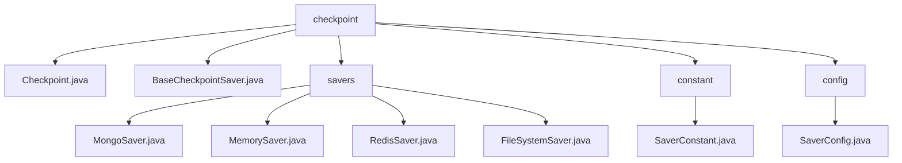

# 基础信息

|      |      |
|------|------|
| 名称 | checkpoint |
| 编码语言 | .java |
| 代码路径 | spring-ai-alibaba/spring-ai-alibaba-graph/spring-ai-alibaba-graph-core/src/main/java/com/alibaba/cloud/ai/graph/checkpoint |
| 包名 | spring-ai-alibaba.spring-ai-alibaba-graph.spring-ai-alibaba-graph-core.src.main.java.com.alibaba.cloud.ai.graph.checkpoint |
| 概述说明 | Checkpoint类实现序列化，管理检查点信息，支持状态更新和多种存储方式。 |

# 说明

## 概述

该代码模块主要围绕检查点（Checkpoint）数据的管理和存储展开，提供了从序列化到存储的完整解决方案。模块的核心功能包括检查点的创建、状态更新以及多种存储方式的实现，支持MongoDB、内存、Redis和文件系统等多种存储介质。通过统一的接口设计和灵活的配置机制，模块能够满足不同业务场景下的检查点管理需求，确保数据的高效、安全和可靠存储。

## 主要业务场景

1. **检查点管理**：`Checkpoint`类实现了检查点的序列化功能，支持检查点的创建和状态更新。通过构建器模式和状态更新功能，确保检查点信息能够被有效管理和维护，适用于需要记录和跟踪任务进度的场景。

2. **MongoDB存储**：`MongoSaver`类通过MongoDB管理检查点数据，适用于需要持久化存储且数据量较大的场景。它提供了增删改查操作，确保数据的有效管理和维护，适合需要高可靠性和数据持久化的应用。

3. **内存存储**：`MemorySaver`类主要用于管理线程检查点，适用于对性能要求较高且数据量较小的场景。它通过读写锁机制确保了多线程环境下的数据安全性，适合需要快速访问和操作的场景。

4. **Redis存储**：`RedisSaver`类利用RedissonClient与Redis进行交互，适用于需要高并发访问和分布式存储的场景。它提供了检查点的列出、获取、添加和清除功能，适合需要高效且可靠的检查点管理的应用。

5. **文件系统存储**：`FileSystemSaver`类继承自`MemorySaver`，支持将检查点数据序列化并存储到文件系统中，适用于需要长期保存和备份的场景。它提供了数据的持久化存储，适合需要数据恢复和离线访问的应用。

6. **配置管理**：`SaverConfig`类负责管理`BaseCheckpointSaver`实例的注册、获取和配置。通过集中化的配置机制，简化了存储实例的管理和维护过程，确保不同存储方式能够按照预定的设置运行。

通过这些功能，该模块能够灵活应对多样化的业务需求，确保检查点数据在不同场景下的高效管理和安全存储。

### 包内部结构视图

该流程图展示了`checkpoint`目录下的层级结构。`checkpoint`目录包含多个子目录和文件，其中`savers`目录下包含四种不同的保存器实现，`constant`和`config`目录分别包含常量定义和配置类。每个节点仅显示路径的最后一级元素，清晰地展示了文件与目录之间的关系。

# 文件列表 File List

| 名称   | 类型  | 说明 |
|-------|------|-------------|
| [BaseCheckpointSaver.java](BaseCheckpointSaver.md) | file | 无内容提供，无法生成概要描述。 |
| [Checkpoint.java](Checkpoint.md) | file | Checkpoint类实现序列化，含ID、状态、节点ID及下一节点ID，支持构建与状态更新。 |
| [constant](constant/_module.md) | package | 信息为空，无法生成概要描述。 |
| [config](config/_module.md) | package | SaverConfig类管理BaseCheckpointSaver实例，支持注册、获取和配置构建。 |
| [savers](savers/_module.md) | package | MongoSaver通过MongoDB管理检查点，MemorySaver确保线程安全，RedisSaver利用Redis管理检查点，FileSystemSaver支持文件存储。 |

