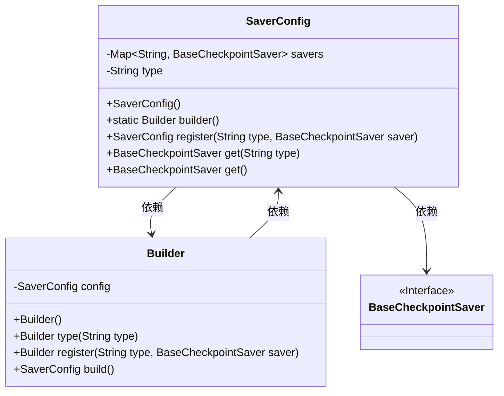
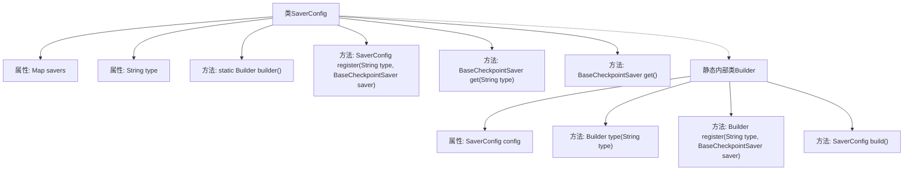

# 基础信息

|      |      |
|------|------|
| 名称 | SaverConfig |
| 编码语言 | .java |
| 代码路径 | spring-ai-alibaba/spring-ai-alibaba-graph/spring-ai-alibaba-graph-core/src/main/java/com/alibaba/cloud/ai/graph/checkpoint/config/SaverConfig.java |
| 包名 | com.alibaba.cloud.ai.graph.checkpoint.config |
| 依赖项 | ['java.util.Map', 'java.util.concurrent.ConcurrentHashMap', 'com.alibaba.cloud.ai.graph.checkpoint.BaseCheckpointSaver', 'jodd.util.StringUtil', 'lombok.Getter', 'lombok.Setter', 'com.alibaba.cloud.ai.graph.checkpoint.constant.SaverConstant.MEMORY'] |
| 概述说明 | SaverConfig类管理BaseCheckpointSaver实例，支持注册、获取和配置构建。 |

# 说明

SaverConfig类的主要功能是管理BaseCheckpointSaver实例，提供注册、获取和构建配置的支持。该类通过注册机制，允许用户添加新的BaseCheckpointSaver实例，并能够在需要时获取已注册的实例。此外，SaverConfig类还负责构建和配置这些实例，确保它们能够按照预定的设置运行。通过这种方式，SaverConfig类为BaseCheckpointSaver实例的管理提供了集中化的解决方案，简化了配置和维护过程。

# 类列表 Class Summary

| 名称   | 类型  | 说明 |
|-------|------|-------------|
| SaverConfig | class | SaverConfig类用于管理BaseCheckpointSaver实例，支持注册、获取和构建配置。 |

## 类 SaverConfig

|      |      |
|------|------|
| 访问范围 | public |
| 类型 | class |
| 名称 | SaverConfig |
| 说明 | SaverConfig类用于管理BaseCheckpointSaver实例，支持注册、获取和构建配置。 |

### UML类图

这段代码定义了一个`SaverConfig`类，用于管理和配置不同类型的`BaseCheckpointSaver`实例。`SaverConfig`类通过`ConcurrentHashMap`存储不同类型的`BaseCheckpointSaver`，并提供了注册和获取`BaseCheckpointSaver`的方法。`Builder`类用于构建`SaverConfig`实例，支持链式调用设置配置。`BaseCheckpointSaver`是一个接口，表示检查点保存器的基类。

### 内部方法调用关系图

这段代码定义了一个名为`SaverConfig`的类，用于管理和配置不同类型的`BaseCheckpointSaver`对象。类中包含一个`ConcurrentHashMap`来存储这些对象，并提供了注册和获取`BaseCheckpointSaver`的方法。此外，`SaverConfig`还包含一个静态内部类`Builder`，用于通过链式调用来构建`SaverConfig`实例。代码通过`register`方法注册不同类型的`BaseCheckpointSaver`，并通过`get`方法根据类型或默认类型获取相应的`BaseCheckpointSaver`。

### 字段列表 Field List

| 名称  | 类型  | 说明 |
|-------|-------|------|
| savers = new ConcurrentHashMap<>() | Map<String, BaseCheckpointSaver> | 私有并发哈希映射存储检查点保存器。 |
| type = MEMORY | String | 使用Setter和Getter方法管理私有字符串变量type，默认值为MEMORY。 |

### 方法列表 Method List

| 名称  | 类型  | 说明 |
|-------|-------|------|
| builder | Builder | 静态方法`builder()`返回一个新的`Builder`实例。 |
| get | BaseCheckpointSaver | 获取指定类型的检查点保存器，若类型为空则抛出异常。 |
| register | SaverConfig | 注册类型与保存器，若类型不存在则添加保存器。 |
| get | BaseCheckpointSaver | 获取BaseCheckpointSaver实例，根据savers大小和类型返回相应值。 |

